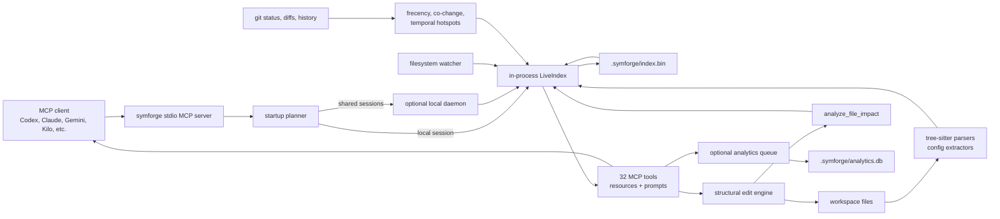

SymForge is a local-first MCP server for AI coding agents. It gives an agent a
fast, symbol-aware view of a repository so it can ask precise questions instead
of reading whole files, running broad grep commands, or editing code with blind
text replacement.

It is written in Rust, indexes code with tree-sitter, keeps the active workspace
in memory, and exposes 32 canonical MCP tools plus resources and prompts for
repo orientation, code reading, search, reference tracing, impact analysis, and
structural edits.

> [!IMPORTANT]
> SymForge is for code intelligence and code editing.
>
> Use it before raw file reads, broad text search, or manual string edits when
> the task is about source code. Use shell commands for builds, tests, package
> managers, Docker, and process/runtime work. Use exact file reads when literal
> docs or config text is the thing being inspected.

## What It Does

- Builds a live index of source files, symbols, references, file contents, and
  git-derived ranking signals.
- Answers MCP requests from agents through structured tools like
  `get_file_context`, `search_symbols`, `find_references`, `edit_plan`, and
  `replace_symbol_body`.
- Watches the workspace and can reindex files after edits through
  `analyze_file_impact`.
- Keeps output bounded with token-aware summaries and explicit truncation
  markers.
- Reports machine-readable result status metadata for core tool responses:
  found, not found, ambiguous, invalid request, empty result, and internal
  failure.
- Provides health output for index state, watcher state, parser resilience,
  sidecar state, runtime identity, ranking capability state, and tool-routing
  evidence.
- Supports optional local analytics for tool-call metadata through a bounded
  queue and SQLite store.
- Ships through npm as a wrapper that downloads the right Rust binary for the
  current platform.

## How It Works



The read path is intentionally local. SymForge serves queries from an in-process
index whenever possible, because symbol spans depend on the exact bytes in the
current workspace and agents need low-latency answers.

## Supported Inputs

SymForge parses 19 source languages:

Rust, Python, JavaScript, TypeScript, Go, Java, C, C++, C#, Ruby, PHP, Swift,
Perl, Kotlin, Dart, Elixir, HTML, CSS, and SCSS.

It also indexes common project formats:

- JSON
- TOML
- YAML
- dotenv/env files
- Markdown
- GitHub Actions workflow YAML facts, including workflow names, triggers,
  permissions, env keys, jobs, needs, runners, matrix strategy, and step fields

Malformed files are isolated. A bad parse can degrade that file, but it should
not poison the whole run.

## Install

Prerequisite: Node.js 18+.

```bash
npm install -g symforge
```

The npm package installs a JavaScript launcher and downloads the platform binary
to `~/.symforge/bin/symforge` or `~/.symforge/bin/symforge.exe` on Windows.
Set `SYMFORGE_HOME` to use a different home directory.

Prebuilt binaries are produced for:

- Windows x64
- Linux x64
- macOS arm64
- macOS x64

## Configure A Client

Global install tries to configure home-scoped clients when their config
directories already exist:

- Claude Code
- Claude Desktop
- Codex
- Gemini CLI

You can rerun setup manually:

```bash
symforge init
symforge init --client claude
symforge init --client claude-desktop
symforge init --client codex
symforge init --client gemini
symforge init --client all
```

Kilo Code is workspace-local. Run this from the repository you want to use:

```bash
symforge init --client kilo-code
```

That writes workspace-local MCP configuration under `.kilocode/` and `.symforge/`.

## CLI

```bash
symforge --help
symforge init --help
symforge daemon --help
symforge analytics --help
```

Top-level commands:

| Command | Purpose |
|---|---|
| `init` | Install MCP client configuration for supported clients |
| `daemon` | Run a shared local daemon for multiple sessions |
| `hook` | Hook subcommands used by Claude Code and compatible workflows |
| `trust` | Trust-control commands for project-local SymForge configuration |
| `analytics` | Inspect, summarize, export, or reset local analytics storage |

Analytics subcommands:

| Command | Purpose |
|---|---|
| `analytics status` | Show whether local analytics storage exists and can be read |
| `analytics summary` | Summarize local analytics records without exporting event rows |
| `analytics export` | Export recent bounded, redacted JSON rows |
| `analytics reset` | Delete only the local analytics database and SQLite sidecar files |

## MCP Tools

SymForge exposes 32 canonical tools through MCP `tools/list`. They are grouped
by how an agent should use them.

### Orient

| Tool | Use |
|---|---|
| `health` | Check index health, watcher state, parse resilience, runtime identity, sidecar state, and capability state |
| `health_compact` | Smaller health summary for prompt budgets |
| `get_repo_map` | Get a bounded repository map |
| `explore` | Explore a concept across symbols, files, and patterns |
| `ask` | Ask a natural-language codebase question and route internally |
| `conventions` | Detect local coding and test conventions |
| `context_inventory` | See what context has already been loaded |
| `investigation_suggest` | Find likely gaps in the current investigation |

### Read

| Tool | Use |
|---|---|
| `get_file_context` | Start here for source files. Returns outline, imports, references, consumers, and git activity |
| `get_file_content` | Exact raw file content, line ranges, chunks, match excerpts, or symbol excerpts |
| `get_symbol` | Full source for one or more symbols |
| `get_symbol_context` | Symbol body plus callers, callees, type dependencies, and edit-prep context |
| `inspect_match` | Deep-dive one search match with enclosing symbol context |

### Search

| Tool | Use |
|---|---|
| `search_symbols` | Find functions, structs, classes, methods, types, modules, and other symbols |
| `search_text` | Search text with enclosing symbol context; supports literal terms, OR terms, regex, and AST structural search |
| `search_files` | Find and rank paths, resolve ambiguous paths, and optionally use frecency or co-change ranking |

### Trace Impact

| Tool | Use |
|---|---|
| `find_references` | Find call sites, imports, type usages, implementations, and qualified usages |
| `find_dependents` | Show file-level dependency relationships |
| `what_changed` | Show changed files since a ref, timestamp, or current uncommitted state |
| `diff_symbols` | Compare symbols between git refs |
| `analyze_file_impact` | Reindex a changed file and report affected dependents |
| `validate_file_syntax` | Report parser diagnostics with line and column locations |

### Edit

| Tool | Use |
|---|---|
| `edit_plan` | Inspect impact and choose the right edit tool before modifying code |
| `replace_symbol_body` | Replace a function, class, struct, method, or similar symbol body |
| `edit_within_symbol` | Perform scoped find/replace inside one symbol |
| `insert_symbol` | Insert code before or after a named symbol |
| `delete_symbol` | Delete a symbol and its attached docs |
| `batch_edit` | Apply multiple symbol-scoped edits atomically |
| `batch_insert` | Insert before or after multiple symbols |
| `batch_rename` | Rename a symbol and update references project-wide |

### Indexing

| Tool | Use |
|---|---|
| `index_folder` | Reindex a repository from scratch |
| `checkpoint_now` | Atomically write the current in-memory index to `.symforge/index.bin` |

### Recovery

SymForge does not expose placeholder v1 run-lifecycle tools. `repair_index` is
intentionally retired until a real repair workflow has durable state and
machine-readable status. `get_index_run` and `cancel_index_run` remain retired.
No durable run IDs are exposed.

Current replacement workflow:

1. Run `checkpoint_now(verify_after_write=true)` to force a byte-exact snapshot
   write and verification attempt.
2. Use `health` or `health_compact` to inspect snapshot load source, background
   verification state, mismatch counts, and mismatch paths.
3. Inspect `.symforge/quarantine/index-snapshots/` when a corrupt or
   version-incompatible snapshot is detected.
4. Use `index_folder` reset to rebuild from source when health, verification,
   or quarantine evidence shows the snapshot should not be reused.

The deprecated daemon compatibility name `trace_symbol` is not granted by
generated client allow-lists. Use `get_symbol_context` or `find_references`.

## MCP Resources And Prompts

SymForge also exposes protocol resources and prompts. These are current shipped
surfaces, not future-only design notes.

Static resources:

| Resource | Use |
|---|---|
| `symforge://repo/health` | Current runtime and index health |
| `symforge://repo/outline` | Compact file-level repository outline |
| `symforge://repo/map` | Directory and symbol map |
| `symforge://repo/changes/uncommitted` | Current uncommitted-change view |

Resource templates:

| Template | Use |
|---|---|
| `symforge://file/context` | File outline, references, imports, consumers, and git activity |
| `symforge://file/content` | Exact file content and contextual excerpts |
| `symforge://symbol/detail` | Symbol definition body |
| `symforge://symbol/context` | Symbol context with grouped references |

Prompts:

| Prompt | Use |
|---|---|
| `symforge-review` | Code review planning with SymForge context |
| `symforge-architecture` | Architecture mapping |
| `symforge-triage` | Failure triage |
| `symforge-onboard` | Codebase onboarding |
| `symforge-refactor` | Refactor planning |
| `symforge-debug` | Debugging plan |

## Ranking And Search Signals

`search_files` ranks path matches by default. It can also use optional signals
when explicitly requested:

```json
{
  "query": "routes",
  "rank_by": "path+cochange",
  "anchor_path": "src/auth/routes.rs"
}
```

```json
{
  "query": "cache",
  "rank_by": "frecency"
}
```

Frecency favors files recently and repeatedly touched through commitment tools.
Co-change ranking uses git history to surface files that tend to move together.
If a requested capability is unavailable, stale, disabled, or still preparing,
the response says that explicitly and falls back to path ranking.

Use `debug_ranking=true` on `search_files` when you need to inspect why files
were ordered the way they were.

## Structural Edits And Worktrees

The edit tools operate by symbol and validate targets before writing. They also
report edit status and affected paths so callers can tell whether the operation
actually changed code.

All edit tools accept an optional `working_directory` pointing at a sibling git
worktree. Supplying it is explicit routing consent: SymForge validates the
worktree, maps the indexed path into that worktree, writes there, and reports
the indexed path and actual write path.

```json
{
  "path": "src/lib.rs",
  "name": "hello",
  "new_body": "fn hello() { println!(\"hi\"); }",
  "working_directory": "/abs/path/to/sibling/worktree"
}
```

## Local State

SymForge is local-first. Runtime state lives under `.symforge/` in the
workspace, and home-level binaries/config live under `SYMFORGE_HOME`.

Common files:

| Path | Purpose |
|---|---|
| `.symforge/index.bin` | Warm-start snapshot for the live index |
| `.symforge/quarantine/index-snapshots/` | Preserved corrupt or version-incompatible snapshots with metadata |
| `.symforge/frecency.db` | Optional persistent frecency signal store |
| `.symforge/coupling.db` | Optional co-change coupling store |
| `.symforge/analytics.db` | Optional local analytics store |
| `.symforge/sidecar.*` | Local sidecar metadata such as PID and port |

Analytics are local and bounded. Disabled analytics should not create a
database. Exported records are capped and redacted.

## Environment

Common configuration variables:

| Variable | Effect |
|---|---|
| `SYMFORGE_HOME` | Home directory for the installed binary and daemon metadata |
| `SYMFORGE_AUTO_INDEX` | Enables startup project discovery and indexing |
| `SYMFORGE_NO_DAEMON` | Forces local in-process mode instead of daemon routing |
| `SYMFORGE_SIDECAR_BIND` | Bind host for local sidecar state |
| `SYMFORGE_DAEMON_BIND` | Bind host for shared daemon state; loopback hosts are accepted by default |
| `SYMFORGE_DAEMON_ALLOW_NON_LOOPBACK` | Explicit truthy opt-in required before the daemon binds a non-loopback host |
| `SYMFORGE_DAEMON_AUTH_TOKEN` | Optional local bearer token for daemon project, session, tool, and sidecar routes |
| `SYMFORGE_RECONCILE_INTERVAL` | Watcher reconciliation interval in seconds; `0` disables periodic sweeps |
| `SYMFORGE_CHECKPOINT_INTERVAL_SECS` | Optional periodic snapshot interval for local in-process mode; unset/`0`/false disables it, nonzero values are bounded to 30-3600 seconds |
| `SYMFORGE_CB_THRESHOLD` | Parse-failure circuit-breaker threshold |
| `SYMFORGE_FRECENCY` | Frecency policy: session-only by default, persistent when truthy, disabled when false/off/disabled |
| `SYMFORGE_COUPLING` | Co-change policy: lazy by default, warm on startup when truthy, disabled when false/off/disabled |
| `SYMFORGE_DEBUG_RANKING` | Ranking diagnostics policy |
| `SYMFORGE_WORKTREE_AWARE` | Worktree routing policy for edit calls |
| `SYMFORGE_ANALYTICS_DB_PATH` | Override analytics database location |
| `SYMFORGE_FRECENCY_DB_PATH` | Override frecency database location |
| `SYMFORGE_COUPLING_DB_PATH` | Override co-change database location |
| `SYMFORGE_PROJECT_CONFIG_TRUST_MODE` | Trust behavior for project-local SymForge configuration |

Daemon HTTP is a local coordination surface, not a remote production API.
The default bind path is loopback-only. If `SYMFORGE_DAEMON_BIND` names a
non-loopback host, SymForge rejects startup unless
`SYMFORGE_DAEMON_ALLOW_NON_LOOPBACK` is truthy; that opt-in emits a warning.
When `SYMFORGE_DAEMON_AUTH_TOKEN` is non-empty, project, session, tool, and
sidecar routes require `Authorization: Bearer <token>`. `/health` remains
unauthenticated so local readiness and compatibility checks can still discover
the daemon, but health output reports only whether auth is required and never
prints the token.

Automatic stale-daemon cleanup is conservative. SymForge only terminates an
incompatible recorded daemon when the pid file matches `/health`, the reported
executable name matches the current SymForge executable, and platform safety
checks pass. On Linux, cleanup also verifies `/proc/<pid>/status` ownership and
`/proc/<pid>/exe` against the daemon's health report before sending a signal. On
Windows and other platforms, where SymForge does not have a portable owner check,
it falls back to the pid plus executable-name guard and logs/cleans stale
metadata instead of terminating when those checks fail.

## Develop

```bash
cargo fmt --check
cargo check
cargo clippy --all-targets -- -D warnings
cargo test --all-targets -- --test-threads=1
cargo build --release
```

The npm wrapper has its own tests:

```bash
cd npm
npm test
```

The Rust toolchain is pinned by `rust-toolchain.toml` to Rust 1.95.0 with
`rustfmt` and `clippy`; the crate uses Rust edition 2024. PR and push CI run
version sync, formatting, `cargo check`, clippy with warnings denied, the full
Rust test suite, a release build, and npm tests.

Scheduled and manual CI also run bounded ignored performance evidence:

```bash
cargo test --release --test live_index_integration test_load_perf_1000_files -- --ignored --test-threads=1
cargo test --release --test coupling_calibration calibrate_current_repo_smoke -- --ignored --test-threads=1 --nocapture
```

The full real-repo coupling calibration remains operator-triggered. Provide a
portable corpus with `SYMFORGE_CALIBRATION_REPOS`, for example
`symforge=/repos/symforge;tokio=/repos/tokio;magika=/repos/magika`, then run:

```bash
cargo test --release --test coupling_calibration calibrate_against_real_repos -- --ignored --test-threads=1 --nocapture
```

The release workflow is driven by Release Please on `main`. When a release is
created, GitHub Actions builds platform binaries, builds the npm tarball, uploads
release assets, and publishes the npm package.

## Project Notes

The live implementation backlog is tracked in
[docs/live-code-backlog.md](./docs/live-code-backlog.md). Historical plans,
reviews, and local agent artifacts were pruned from the repository; the README
is the public starting point, and the backlog file is the implementation queue.

## License

SymForge is licensed under the
[PolyForm Noncommercial License 1.0.0](./LICENSE). You may inspect, study, and
use the source code for noncommercial purposes. Commercial use requires a
separate license.
