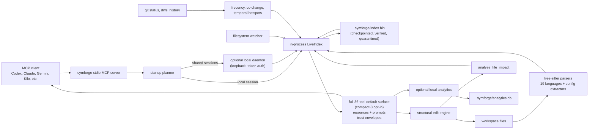
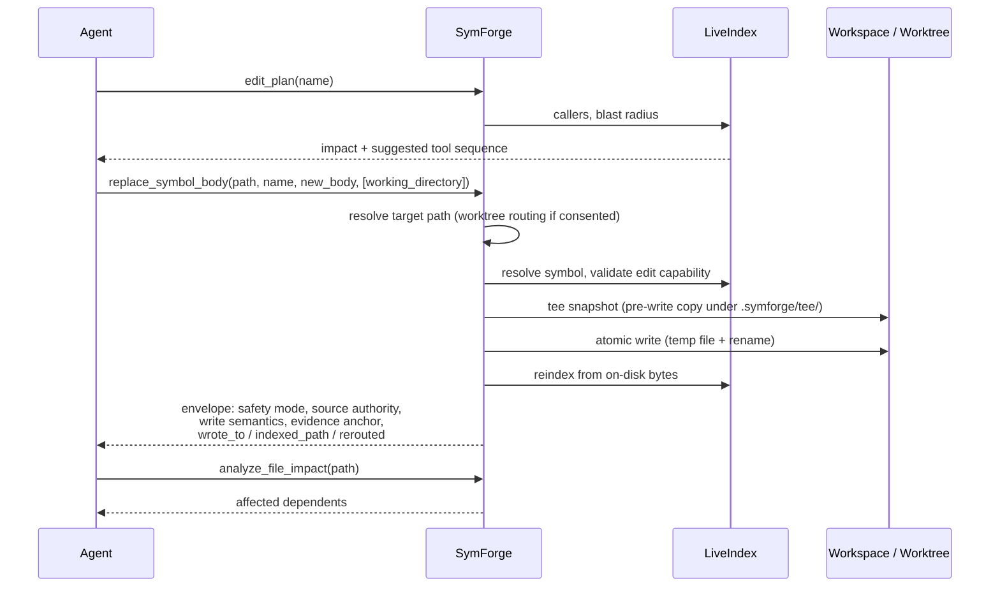

<div align="center">


# SymForge

**Symbol-aware code intelligence and structural editing for AI coding agents — local-first, trust-labeled, token-efficient.**

[](https://www.npmjs.com/package/symforge)
[](https://github.com/special-place-ai-heaven/symforge/actions/workflows/ci.yml)
[](./LICENSE)
[](./rust-toolchain.toml)
[](https://modelcontextprotocol.io)
[](#install)

[Install](#install) · [How It Works](#how-it-works) · [Tools](#mcp-tools) · [Innovations](#innovations) · [Wiki](https://github.com/special-place-ai-heaven/symforge/wiki)

</div>

---

SymForge is a local-first [MCP](https://modelcontextprotocol.io) server for AI coding agents. It gives an agent a fast, symbol-aware view of a repository so it can ask precise questions instead of reading whole files, running broad grep commands, or editing code with blind text replacement.

It is written in Rust, indexes code with tree-sitter, keeps the active workspace in memory, and by default exposes the full **36-tool MCP surface**; the **compact 3-tool surface** (`symforge`, `symforge_edit`, `status`) is a documented opt-in escape hatch via `SYMFORGE_SURFACE=compact`. Either way it ships resources and prompts for repo orientation, code reading, search, reference tracing, impact analysis, and structural edits.

> [!IMPORTANT]
> SymForge is for **code intelligence and code editing**.
>
> Use it before raw file reads, broad text search, or manual string edits when the task is about source code. Use shell commands for builds, tests, package managers, Docker, and process/runtime work. Use exact file reads when literal docs or config text is the thing being inspected.

> [!TIP]
> The README is the fast product entry point. The **[SymForge Wiki](https://github.com/special-place-ai-heaven/symforge/wiki)** is the long-form reference: [Architecture and How It Works](https://github.com/special-place-ai-heaven/symforge/wiki/Architecture-and-How-It-Works), [Tool Reference](https://github.com/special-place-ai-heaven/symforge/wiki/Tool-Reference), [Runtime Model](https://github.com/special-place-ai-heaven/symforge/wiki/Runtime-Model), [Benchmarks and Token Savings](https://github.com/special-place-ai-heaven/symforge/wiki/Benchmarks-and-Token-Savings), [Supported Languages](https://github.com/special-place-ai-heaven/symforge/wiki/Supported-Languages-and-Config-Formats), [Environment Setup Scripts](https://github.com/special-place-ai-heaven/symforge/wiki/Environment-Setup-Scripts), and the [Agent Setup Prompt](https://github.com/special-place-ai-heaven/symforge/wiki/Agent-Setup-Prompt).

## Contents

- [Why SymForge](#why-symforge)
- [Features](#features)
- [Innovations](#innovations)
- [How It Works](#how-it-works)
- [The Life Of An Edit](#the-life-of-an-edit)
- [Supported Inputs](#supported-inputs)
- [Install](#install)
- [Configure A Client](#configure-a-client)
- [CLI](#cli)
- [MCP Tools](#mcp-tools)
- [MCP Resources And Prompts](#mcp-resources-and-prompts)
- [Ranking And Search Signals](#ranking-and-search-signals)
- [Structural Edits And Worktrees](#structural-edits-and-worktrees)
- [Recovery](#recovery)
- [Local State](#local-state)
- [Environment](#environment)
- [Develop](#develop)
- [License](#license)

## Why SymForge

Coding agents burn most of their context window on *finding* code, not changing it. A whole-file read to inspect one function, a grep that returns 400 raw lines, a rename done with blind string replacement — each of these costs tokens, invites mistakes, and erodes trust in the result.

SymForge answers the same questions from an in-memory, symbol-level index:

| Instead of | Use | Typical effect |
|---|---|---|
| Reading a 2,000-line file | `get_file_context` (outline, imports, consumers) | 70–95% fewer tokens (mean range from tested cases) for the same decision |
| Broad `grep -r` | `search_text` with enclosing-symbol grouping | Matches arrive with structure, not raw lines |
| Guessing who calls a function | `find_references` / `get_symbol_context` | Exact call sites, imports, and type usages |
| Find-and-replace refactors | `replace_symbol_body`, `batch_rename` | Structural edits validated against the index |

Every response carries a machine-readable **trust envelope** so the agent knows exactly how much to believe it — and every truncation is disclosed with the real cost, never silently applied.

**Token economics (measured, honest)**: The full 36-tool surface carries ~7k tokens of schema/description overhead. The 70–95% savings figures (e.g. for `get_file_context`) are mean ranges from actual test runs on code, not theoretical best-case. When used for code with the right tools (outlines first, compact modes, targeted symbols), net context usage is lower than naive full-file reads + greps because large irrelevant source is avoided. Trivial or prose-only work can lose on the overhead. See `grok-symforge-analysis-report.md` and the wiki benchmarks for the data. For lower overhead use `SYMFORGE_SURFACE=compact`.

Measured numbers also live in the wiki: [Benchmarks and Token Savings](https://github.com/special-place-ai-heaven/symforge/wiki/Benchmarks-and-Token-Savings).

## Features

- **Live repository index:** Builds and maintains an in-memory index of source files, symbols, references, file contents, and git-derived ranking signals so agents can query the codebase without repeatedly scanning the filesystem.
- **Symbol-aware reading:** Lets agents inspect file outlines, imports, consumers, exact source excerpts, full symbol bodies, and symbol context before deciding whether they need a raw file read.
- **Search and exploration:** Searches symbols, text, file paths, natural-language concepts, and AST-shaped patterns with bounded output and ranking reasons.
- **Reference and impact tracing:** Finds call sites, imports, type usages, implementations, file dependents, symbol diffs, and changed files so agents can understand blast radius before editing.
- **Structural editing:** Replaces, inserts, deletes, batch-edits, and renames symbols by indexed structure instead of blind string replacement, then reports edit status and affected paths.
- **Safe retry semantics:** Supports optional idempotency keys for indexing and structural edit mutations. Replaying the same key with the same canonical request returns the stored result; reusing the key for a different request fails deterministically.
- **Snapshot and recovery safeguards:** Writes byte-exact index snapshots through explicit checkpoints, verifies snapshots when requested, and quarantines corrupt or version-incompatible snapshots instead of silently serving them.
- **Malformed-file diagnostics:** Isolates parser failures to the affected file and exposes `validate_file_syntax` for line-and-column diagnostics when source or config files are malformed.
- **Local daemon mode:** Can run a shared local daemon for multiple agent sessions while keeping the query path local-first and workspace-aware.
- **Resources and prompts:** Exposes MCP resources for repo health, outlines, maps, changes, file context, file content, and symbol context, plus prompts for review, architecture, triage, onboarding, refactoring, and debugging.
- **Embeddable engine:** Ships an engine-only build (`--no-default-features --features embed`) behind a semver-stable flat facade, so other agentic platforms can compile the indexing and search core without the server, daemon, or CLI surfaces.
- **Local analytics:** Optionally records bounded, local-only tool-call metadata in SQLite so operators can inspect usage without exporting source code.
- **npm binary distribution:** Installs as an npm package with a JavaScript launcher plus a platform-specific optional package. It does not run a postinstall downloader or bootstrap client configs during install.

## Innovations

The engineering decisions that distinguish SymForge from "grep over MCP". Long-form discussion lives in the wiki's [Architecture and How It Works](https://github.com/special-place-ai-heaven/symforge/wiki/Architecture-and-How-It-Works) and [Runtime Model](https://github.com/special-place-ai-heaven/symforge/wiki/Runtime-Model) pages.

### Trust envelopes on every answer

Query responses open with a machine-readable header that states the **match type** (exact / constrained / heuristic), the **source authority** (current index, disk-refreshed, worktree target), the **parse state**, the **completeness** (full, budget-limited, truncated-by-cap — always with the real numbers), the **scope** that was searched, and **evidence anchors** (`file:line`) the agent can jump to. An LLM never has to guess whether a result was exhaustive or approximate — the envelope says so.

### Honest routing, honest fallbacks

`ask` routes natural-language questions to the right tool and reports its **route confidence** (`exact` vs `inferred`), its rationale, and a suggested next step. When a compound question forces it to guess, it *downgrades its own confidence* instead of returning a confident false negative. The same philosophy runs through ranking: when an optional capability (frecency, co-change) is unavailable or gated off, the response names the precise reason and falls back visibly — never silently.

### Sound parse quarantine (neutralize-and-reparse)

Some valid code trips upstream tree-sitter grammar limitations (for example, TypeScript `import('rxjs').Subscription[]`, or Angular `@if (a > b)` control flow in templates). SymForge classifies these as *expected* partials only after a proof: it neutralizes **only** the suspected construct (token-preservingly) and re-parses the whole file — the file is excused **iff** the re-parse comes back fully clean. A genuinely broken file can never hide behind a known grammar limitation. Verdicts are memoized by content hash, so health checks and renders do not re-pay the parse cost.

### Ranking signals that cannot lie to themselves

- **Frecency** favors files you actually work on (7-day half-life decay). Discovery tools deliberately **never bump** the signal — searching for a file is not the same as working on it, and self-bumping searches would corrupt the ranking through a positive feedback loop. Only commitment tools (reads of a known file, edits) bump.
- **Co-change coupling** mines git history so files that ship together rank together. Promotion is gated behind an **anchor-confidence floor** (the query must plausibly name the anchor) and chore files (lockfiles, changelogs, workflows) are excluded as anchors.
- `search_files(debug_ranking=true)` exposes the full scoring rationale on demand.

### Worktree-aware structural edits

Every edit tool accepts an optional `working_directory` pointing at a sibling git worktree. Supplying it is **explicit routing consent**: SymForge validates the worktree, maps the indexed path into it, writes there, and reports both the indexed path and the actual write path (`wrote_to`, `indexed_path`, `rerouted`). Parallel agent sessions can each edit their own worktree against one shared index.

### Safe mutations: idempotency, tee snapshots, write-back invariants

Mutating tools accept an `idempotency_key`; a retry with the same key and same canonical request replays the stored result without writing twice, and the same key with a different request returns a deterministic conflict. Before every edit lands, a **tee snapshot** preserves the pre-write file under `.symforge/tee/`. After every write, the index is rebuilt from the **persisted on-disk bytes**, never the in-memory buffer — if the OS wrote something different, the index reflects reality.

### A daemon that fails closed

Multiple sessions can share one local daemon. The daemon binds loopback-only by default, requires an explicit opt-in plus warning to bind anything else, and supports bearer-token auth on all project/session/tool routes. `health` warns loudly when a stale daemon (older than the front-end binary) is serving — the failure mode that quietly masks fixes — and stale-daemon cleanup refuses to kill anything it cannot positively identify as its own.

### An engine other platforms can embed

`symforge::embed` is a flat, semver-public facade over the indexing/search/parsing core. A compile-time contract test pins every exported name and full function signature, so a breaking change fails SymForge's own build — not a downstream integrator's. CI builds the engine-only feature for glibc **and musl** targets, which is how SymForge stays both an independent product and an easily integrated library for other agentic platforms.

## How It Works



The read path is intentionally local. SymForge serves queries from an in-process index whenever possible, because symbol spans depend on the exact bytes in the current workspace and agents need low-latency answers. The full runtime story — sessions, the sidecar, hook adoption, generation tracking — is on the wiki: [Runtime Model](https://github.com/special-place-ai-heaven/symforge/wiki/Runtime-Model).

## The Life Of An Edit

What happens between "replace this function" and a trustworthy receipt:



> [!NOTE]
> Edits are validated against indexed structure *before* anything touches disk: unknown symbols, ambiguous selectors, and unsupported-language targets fail closed with actionable errors instead of writing garbage.

## Supported Inputs

SymForge parses **19 source languages**:

Rust, Python, JavaScript, TypeScript, Go, Java, C, C++, C#, Ruby, PHP, Swift, Perl, Kotlin, Dart, Elixir, HTML, CSS, and SCSS.

Grammar choices are evidence-driven: Dart, for example, uses the spec-native [nielsenko `tree-sitter-dart`](https://crates.io/crates/tree-sitter-dart) grammar after corpus measurement over 2,800+ real Flutter files — full Dart 3.0–3.12 syntax (records, patterns, sealed classes, dot shorthands, null-aware elements, private named parameters) parses cleanly, with extraction driven by grammar `name` fields. The selection methodology and falsification record live in [docs/dart-parser-investigation.md](./docs/dart-parser-investigation.md).

It also indexes common project formats:

- JSON, TOML, YAML
- dotenv/env files
- Markdown
- GitHub Actions workflow YAML facts, including workflow names, triggers, permissions, env keys, jobs, needs, runners, matrix strategy, and step fields

Malformed files are isolated. A bad parse can degrade that file, but it should not poison the whole run. Use `validate_file_syntax` for parser diagnostics with line and column locations when a config or source file looks malformed. Per-language details: [Supported Languages and Config Formats](https://github.com/special-place-ai-heaven/symforge/wiki/Supported-Languages-and-Config-Formats).

## Install

Prerequisite: Node.js 18+ and npm.

```bash
npm install -g symforge
```

The npm package installs a JavaScript launcher plus a platform-specific optional dependency that carries the native binary. The binary also runs as the daemon, so there is no separate daemon to install. npm automatically selects the correct platform package for your OS and CPU.

> [!NOTE]
> There is no postinstall step: install does not download anything, stop processes, or auto-configure MCP clients.

The command above works on every platform, with one requirement: `symforge` must install into the npm global prefix that belongs to the OS you are running, and that prefix's `bin` directory must be on your `PATH`. Confirm the install with:

```bash
symforge --version    # prints the installed version
```

Prebuilt native binaries are produced for **Windows x64**, **Linux x64**, **macOS arm64 (Apple Silicon)**, and **macOS x64 (Intel)**. Ready-made setup scripts per environment: [Environment Setup Scripts](https://github.com/special-place-ai-heaven/symforge/wiki/Environment-Setup-Scripts).

### Windows

```powershell
npm install -g symforge
```

Run it from PowerShell or Windows Terminal. npm's default global prefix (`%APPDATA%\npm`) is already on `PATH`, so no extra setup is needed.

### macOS and Linux

```bash
npm install -g symforge
```

> [!WARNING]
> If `npm install -g` fails with a permissions error, do **not** use `sudo`. Point npm at a user-writable prefix once, then reinstall:
>
> ```bash
> npm config set prefix "$HOME/.npm-global"
> export PATH="$HOME/.npm-global/bin:$PATH"   # add to ~/.profile or ~/.zshrc to persist
> npm install -g symforge
> ```

### WSL (Windows Subsystem for Linux)

> [!CAUTION]
> A WSL shell often inherits the Windows `PATH` and a shared Windows npm prefix (for example a `C:\Users\<you>\.npmrc` containing `prefix=C:\Users\<you>\.npm-global`). When that happens, `npm install -g symforge` lands in the Windows prefix and pulls the **Windows** binary, which cannot run under Linux — the launcher then reports a missing `symforge-linux-x64` package.

Give WSL its own Linux npm prefix, then install:

```bash
npm config set prefix "$HOME/.npm-global"
export PATH="$HOME/.npm-global/bin:$PATH"    # ahead of any /mnt/* entries; add to ~/.profile to persist
hash -r
npm install -g symforge
which symforge        # expect /home/<you>/.npm-global/bin/symforge, not /mnt/c/...
symforge --version
```

### Update

Update the npm-managed install explicitly:

```bash
symforge update
```

This runs the same package-manager path as `npm install -g symforge@latest`. `symforge --version` prints the installed version and, when npm can be reached quickly, reports when a newer npm release is available.

## Configure A Client

`npm install -g symforge` only installs the launcher and native platform package. Configure MCP clients explicitly after install or update:

```bash
symforge init                       # interactive
symforge init --client claude       # Claude Code
symforge init --client claude-desktop
symforge init --client codex
symforge init --client gemini
symforge init --client all
```

Cursor and other desktop harnesses that do not have a SymForge-specific init target should use their global MCP configuration and point the command at the installed `symforge` binary. Do not rely on npm install hooks to mutate editor configuration.

Kilo Code is workspace-local. Run this from the repository you want to use:

```bash
symforge init --client kilo-code
```

That writes workspace-local MCP configuration under `.kilocode/` and `.symforge/`.

> [!TIP]
> To teach an agent how to use SymForge well (which tool when, what the trust envelopes mean), drop the wiki's [Agent Setup Prompt](https://github.com/special-place-ai-heaven/symforge/wiki/Agent-Setup-Prompt) into your agent's instructions.

## CLI

```bash
symforge --help
symforge init --help
symforge daemon --help
symforge analytics --help
symforge update
```

| Command | Purpose |
|---|---|
| `init` | Install MCP client configuration for supported clients |
| `daemon` | Run a shared local daemon for multiple sessions |
| `hook` | Hook subcommands used by Claude Code and compatible workflows |
| `trust` | Trust-control commands for project-local SymForge configuration |
| `analytics` | Inspect, summarize, export, or reset local analytics storage |
| `update` | Explicitly update the npm-managed global install |

| Analytics subcommand | Purpose |
|---|---|
| `analytics status` | Show whether local analytics storage exists and can be read |
| `analytics summary` | Summarize local analytics records without exporting event rows |
| `analytics export` | Export recent bounded, redacted JSON rows |
| `analytics reset` | Delete only the local analytics database and SQLite sidecar files |

## MCP Tools

By default SymForge exposes the full **36-tool** surface below through MCP `tools/list`, advertising every tool individually. The **compact 3-tool surface** — `symforge` (read/search/navigate), `symforge_edit` (structural edits), and `status` (index health + honest economics) — is a documented opt-in escape hatch: set `SYMFORGE_SURFACE=compact` to collapse to it for token-sensitive setups. The tools are grouped by how an agent should use them. Exact parameters, output shapes, and worked examples for every tool: [Tool Reference](https://github.com/special-place-ai-heaven/symforge/wiki/Tool-Reference).

### Orient

| Tool | Use |
|---|---|
| `health` | Check index health, watcher state, parse resilience, runtime identity, sidecar state, and capability state |
| `health_compact` | Smaller health summary for prompt budgets |
| `get_repo_map` | Get a bounded repository map |
| `explore` | Explore a broad concept across symbols, files, and patterns with noise filtering and ranking reasons |
| `ask` | Ask a natural-language codebase question and see route confidence, rationale, and the selected invocation |
| `conventions` | Detect local coding and test conventions |
| `context_inventory` | See what context has already been loaded |
| `investigation_suggest` | Find likely gaps in the current investigation |

`ask` is a routing envelope for natural-language questions. It reports the chosen tool, route confidence, invocation, and rationale before the routed result so callers can see why the request did or did not become a narrow symbol or reference lookup. It also answers tool-meta questions ("which tool should I use for impact analysis?") from a workflow-grouped catalog, also exposed as the `symforge://tools/catalog` resource.

`explore` is the broad concept-discovery tool. It ranks by concept match, symbol-token alignment, path proximity, and caller density, and it hides vendor, generated, test, and personal-tooling noise by default.

### Read

| Tool | Use |
|---|---|
| `get_file_context` | Start here for source files. Returns outline, imports, references, consumers, and git activity |
| `get_file_content` | Exact raw file content, line ranges, chunks, match excerpts, or symbol excerpts |
| `get_symbol` | Full source for one or more symbols (batch mode supported) |
| `get_symbol_context` | Symbol body plus callers, callees, type dependencies, and edit-prep context |
| `inspect_match` | Deep-dive one search match with enclosing symbol context |

> [!TIP]
> Read tools accept `max_tokens` budgets and `estimate=true` for cost previews. Budget-limited output is always disclosed with the actual vs. requested token count — truncation is never silent.

### Search

| Tool | Use |
|---|---|
| `search_symbols` | Find functions, structs, classes, methods, types, modules, and other symbols |
| `search_text` | Search text with enclosing symbol context; supports literal terms, OR terms, regex, and AST structural search |
| `search_files` | Find and rank paths, resolve ambiguous paths, and optionally use frecency or co-change ranking |

### Trace Impact

| Tool | Use |
|---|---|
| `find_references` | Find call sites, imports, type usages, implementations, and qualified usages |
| `find_dependents` | Show file-level dependency relationships |
| `what_changed` | Show changed files since a ref, timestamp, or current uncommitted state |
| `diff_symbols` | Compare symbols between git refs |
| `analyze_file_impact` | Reindex a changed file and report affected dependents |
| `validate_file_syntax` | Report parser diagnostics with line and column locations |

### Edit

| Tool | Use |
|---|---|
| `edit_plan` | Inspect impact and choose the right edit tool before modifying code |
| `replace_symbol_body` | Replace a function, class, struct, method, or similar symbol body |
| `edit_within_symbol` | Perform scoped find/replace inside one symbol |
| `insert_symbol` | Insert code before or after a named symbol |
| `delete_symbol` | Delete a symbol and its attached docs |
| `batch_edit` | Apply multiple symbol-scoped edits atomically |
| `batch_insert` | Insert before or after multiple symbols |
| `batch_rename` | Rename a symbol and update references project-wide |

### Indexing

| Tool | Use |
|---|---|
| `index_folder` | Reindex a repository from scratch, with optional idempotency for safe retries |
| `checkpoint_now` | Atomically write the current in-memory index to `.symforge/index.bin`, optionally verifying after write |

> [!NOTE]
> The deprecated daemon compatibility name `trace_symbol` remains available through v7.x with an explicit deprecation warning and is planned for removal in v8.0. Generated client allow-lists do not grant it by default. Use `get_symbol_context` or `find_references`.

## MCP Resources And Prompts

SymForge also exposes protocol resources and prompts. These are current shipped surfaces, not future-only design notes.

| Static resource | Use |
|---|---|
| `symforge://repo/health` | Current runtime and index health |
| `symforge://repo/outline` | Compact file-level repository outline |
| `symforge://repo/map` | Directory and symbol map |
| `symforge://repo/changes/uncommitted` | Current uncommitted-change view |
| `symforge://tools/catalog` | Workflow-grouped index of SymForge's tools |

| Resource template | Use |
|---|---|
| `symforge://file/context` | File outline, references, imports, consumers, and git activity |
| `symforge://file/content` | Exact file content and contextual excerpts |
| `symforge://symbol/detail` | Symbol definition body |
| `symforge://symbol/context` | Symbol context with grouped references |

| Prompt | Use |
|---|---|
| `symforge-review` | Code review planning with SymForge context |
| `symforge-architecture` | Architecture mapping |
| `symforge-triage` | Failure triage |
| `symforge-onboard` | Codebase onboarding |
| `symforge-refactor` | Refactor planning |
| `symforge-debug` | Debugging plan |

## Ranking And Search Signals

`search_files` ranks path matches by default. It can also use optional signals when explicitly requested:

```json
{
  "query": "routes",
  "rank_by": "path+cochange",
  "anchor_path": "src/auth/routes.rs"
}
```

```json
{
  "query": "cache",
  "rank_by": "frecency"
}
```

### Frecency ranking

Frecency favors files recently and repeatedly touched through commitment tools, decaying on a 7-day half-life. Search and guidance tools such as `search_symbols`, `search_text`, `search_files`, `ask`, `explore`, and `investigation_suggest` do **not** bump frecency; even `search_files(rank_by="frecency")` reads that signal without creating it. This avoids a positive feedback loop where searched-but-ignored files drift upward as if they were actually used. With `SYMFORGE_FRECENCY` unset, history is session-scoped; set it truthy for the persistent `.symforge/frecency.db`.

### Co-change coupling

Co-change ranking uses git history to surface files that tend to move together. An anchor must clear a path-confidence floor before promotion applies, and chore files (lockfiles, changelogs, workflows) never act as anchors. If a requested capability is unavailable, stale, disabled, or still preparing, the response says that explicitly — with the precise reason — and falls back to path ranking.

> [!TIP]
> Use `debug_ranking=true` on `search_files` when you need to inspect why files were ordered the way they were, or set `SYMFORGE_DEBUG_RANKING=1` to default the diagnostics on.

## Structural Edits And Worktrees

The edit tools operate by symbol and validate targets before writing. They also report edit status and affected paths so callers can tell whether the operation actually changed code.

Edit mutations accept an optional `idempotency_key` where advertised. A retry with the same key and the same canonical request returns the stored result without writing again; the same key with a different request returns an idempotency conflict. Dry runs do not reserve replay state.

### Worktree awareness

All edit tools accept an optional `working_directory` pointing at a sibling git worktree. Supplying it is explicit routing consent: SymForge validates the worktree, maps the indexed path into that worktree, writes there, and reports the indexed path and actual write path.

```json
{
  "path": "src/lib.rs",
  "name": "hello",
  "new_body": "fn hello() { println!(\"hi\"); }",
  "working_directory": "/abs/path/to/sibling/worktree"
}
```

The response self-describes the routing:

```text
working_directory: /abs/path/to/sibling/worktree
rerouted: true
wrote_to: /abs/path/to/sibling/worktree/src/lib.rs
indexed_path: /abs/path/to/indexed/repo/src/lib.rs
```

This is how parallel agent sessions isolate concurrent changes: one shared index, one worktree per session, every routed write receipted. The `SYMFORGE_WORKTREE_AWARE` policy variable can disable routing entirely; omitting `working_directory` always preserves plain indexed-path behavior.

## Recovery

SymForge does not expose placeholder v1 run-lifecycle tools. `repair_index` is intentionally retired until a real repair workflow has durable state and machine-readable status. `get_index_run` and `cancel_index_run` remain retired. No durable run IDs are exposed.

Current replacement workflow:

1. Run `checkpoint_now(verify_after_write=true)` to force a byte-exact snapshot write and verification attempt.
2. Use `health` or `health_compact` to inspect snapshot load source, background verification state, mismatch counts, and mismatch paths.
3. Inspect `.symforge/quarantine/index-snapshots/` when a corrupt or version-incompatible snapshot is detected.
4. Use `index_folder` reset to rebuild from source when health, verification, or quarantine evidence shows the snapshot should not be reused.

> [!WARNING]
> `index_folder` reset is explicit and destructive to the snapshot: run the serving process with `SYMFORGE_INDEX_FOLDER_RESET=1`, then call `index_folder` for the project root. The reset deletes only `.symforge/index.bin` and `.symforge/index.bin.tmp` before reloading source files. The tool response and subsequent `health` or `health_compact` output include `reset_state=current_project:pN` and `index_state=index_folder_reset`; ordinary `index_folder` reloads report `reset_state=none`.

## Local State

SymForge is local-first. Runtime state lives under `.symforge/` in the workspace, and home-level binaries/config live under `SYMFORGE_HOME`.

| Path | Purpose |
|---|---|
| `.symforge/index.bin` | Warm-start snapshot for the live index |
| `.symforge/quarantine/index-snapshots/` | Preserved corrupt or version-incompatible snapshots with metadata |
| `.symforge/idempotency/` | Retry records and quarantined corrupt idempotency records for mutating tools |
| `.symforge/tee/` | Pre-write copies of files preserved before each structural edit |
| `.symforge/frecency.db` | Optional persistent frecency signal store |
| `.symforge/coupling.db` | Optional co-change coupling store |
| `.symforge/analytics.db` | Optional local analytics store |
| `.symforge/sidecar.*` | Local sidecar metadata such as PID and port |

> [!NOTE]
> Analytics are local and bounded. Disabled analytics should not create a database. Exported records are capped and redacted. Nothing leaves the machine.

## Environment

Common configuration variables:

| Variable | Effect |
|---|---|
| `SYMFORGE_HOME` | Home directory for the installed binary and daemon metadata |
| `SYMFORGE_AUTO_INDEX` | Enables startup project discovery and indexing |
| `SYMFORGE_NO_DAEMON` | Forces local in-process mode instead of daemon routing |
| `SYMFORGE_SIDECAR_BIND` | Bind host for local sidecar state |
| `SYMFORGE_DAEMON_BIND` | Bind host for shared daemon state; loopback hosts are accepted by default |
| `SYMFORGE_DAEMON_ALLOW_NON_LOOPBACK` | Explicit truthy opt-in required before the daemon binds a non-loopback host |
| `SYMFORGE_DAEMON_IDLE_SHUTDOWN_SECS` | Idle lifetime for the shared daemon; detached auto-spawn defaults to 600 seconds, while an explicit `symforge daemon` stays persistent when unset; nonzero values clamp to at least 60 seconds and `0` disables shutdown |
| `SYMFORGE_DAEMON_AUTH_TOKEN` | Optional local bearer token for daemon project, session, tool, and sidecar routes |
| `SYMFORGE_RECONCILE_INTERVAL` | Watcher reconciliation interval in seconds; `0` disables periodic sweeps |
| `SYMFORGE_CHECKPOINT_INTERVAL_SECS` | Optional periodic snapshot interval for local in-process mode; unset/`0`/false disables it, nonzero values are bounded to 30-3600 seconds |
| `SYMFORGE_CB_THRESHOLD` | Parse-failure circuit-breaker threshold |
| `SYMFORGE_FRECENCY` | Frecency policy: session-only by default, persistent when truthy, disabled when false/off/disabled |
| `SYMFORGE_COUPLING` | Co-change policy: lazy by default, warm on startup when truthy, disabled when false/off/disabled |
| `SYMFORGE_DEBUG_RANKING` | Ranking diagnostics policy |
| `SYMFORGE_WORKTREE_AWARE` | Worktree routing policy for edit calls |
| `SYMFORGE_EXCLUDE_UNTRACKED` | Opt-in: demote untracked recognized-extension files to metadata-only indexing |
| `SYMFORGE_ANALYTICS_DB_PATH` | Override analytics database location |
| `SYMFORGE_FRECENCY_DB_PATH` | Override frecency database location |
| `SYMFORGE_COUPLING_DB_PATH` | Override co-change database location |
| `SYMFORGE_PROJECT_CONFIG_TRUST_MODE` | Trust behavior for project-local SymForge configuration |

> [!WARNING]
> Daemon HTTP is a local coordination surface, not a remote production API. The default bind path is loopback-only. If `SYMFORGE_DAEMON_BIND` names a non-loopback host, SymForge rejects startup unless `SYMFORGE_DAEMON_ALLOW_NON_LOOPBACK` is truthy; that opt-in emits a warning. When `SYMFORGE_DAEMON_AUTH_TOKEN` is non-empty, project, session, tool, and sidecar routes require `Authorization: Bearer <token>`. `/health` remains unauthenticated so local readiness and compatibility checks can still discover the daemon, but health output reports only whether auth is required and never prints the token.

Automatic stale-daemon cleanup is conservative. SymForge only terminates an incompatible recorded daemon when the pid file matches `/health`, the reported executable name matches the current SymForge executable, and platform safety checks pass. On Linux, cleanup also verifies `/proc/<pid>/status` ownership and `/proc/<pid>/exe` against the daemon's health report before sending a signal. On Windows and other platforms, where SymForge does not have a portable owner check, it falls back to the pid plus executable-name guard and logs/cleans stale metadata instead of terminating when those checks fail.

## Develop

```bash
cargo fmt --check
cargo check
cargo clippy --all-targets -- -D warnings
cargo test --all-targets -- --test-threads=1
cargo build --release
```

The npm wrapper has its own tests:

```bash
cd npm
npm test
```

The engine-only embed build (what integrating platforms compile):

```bash
cargo build --no-default-features --features embed
cargo test --no-default-features --features embed --lib -- --test-threads=1
```

The Rust toolchain is pinned by `rust-toolchain.toml` (currently Rust 1.96.0, with `rustfmt` and `clippy`) — that file is the single source of toolchain truth for local builds, CI, and release workflows alike; the crate uses Rust edition 2024. PR and push CI run version sync, formatting, `cargo check`, clippy with warnings denied, the full Rust test suite, the engine-only embed build (including a musl cross-compile gate), a release build, and npm tests.

Scheduled and manual CI also run bounded ignored performance evidence:

```bash
cargo test --release --test live_index_integration test_load_perf_1000_files -- --ignored --test-threads=1
cargo test --release --test coupling_calibration calibrate_current_repo_smoke -- --ignored --test-threads=1 --nocapture
```

The full real-repo coupling calibration remains operator-triggered. Provide a portable corpus with `SYMFORGE_CALIBRATION_REPOS`, for example `symforge=/repos/symforge;tokio=/repos/tokio;magika=/repos/magika`, then run:

```bash
cargo test --release --test coupling_calibration calibrate_against_real_repos -- --ignored --test-threads=1 --nocapture
```

The release workflow is driven by Release Please on `main`. When a release is created, GitHub Actions builds platform binaries, builds the npm tarball, uploads release assets, and publishes the npm package.

## Project Notes

The live implementation backlog is tracked in [docs/live-code-backlog.md](./docs/live-code-backlog.md). The forward architecture direction — tree-sitter as the permanent universal Tier-0 index, with per-language semantic engines (LSP, SCIP) as optional lazily-activated depth backends — is documented in [docs/semantic-tier-roadmap.md](./docs/semantic-tier-roadmap.md). Historical plans, reviews, and local agent artifacts were pruned from the repository; the README is the public starting point, the [wiki](https://github.com/special-place-ai-heaven/symforge/wiki) is the long-form reference, and the backlog file is the implementation queue.

## License

SymForge is licensed under the [PolyForm Noncommercial License 1.0.0](./LICENSE).

> [!CAUTION]
> You may inspect, study, and use the source code for **noncommercial purposes**. Commercial use requires a separate license.
