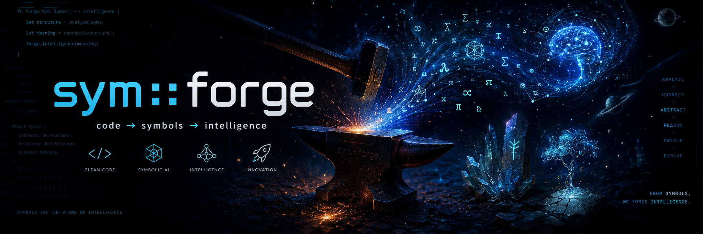
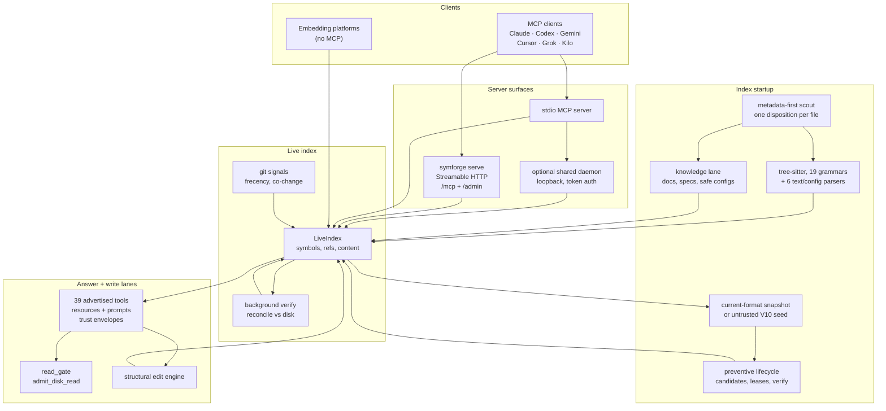
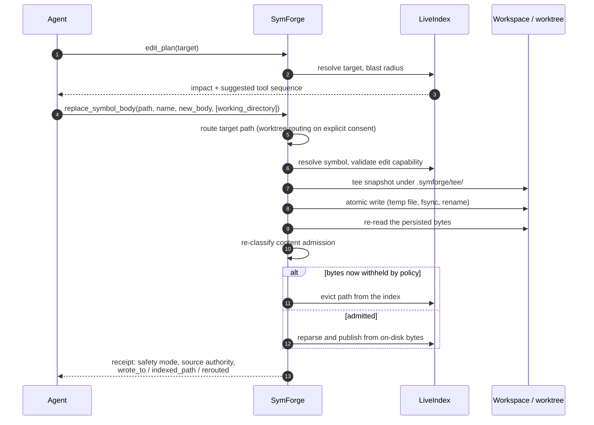

<div align="center">



# SymForge

**Symbol-aware code intelligence and structural editing for AI coding agents — local-first, trust-labeled, token-efficient.**

[](https://www.npmjs.com/package/symforge)
[](https://github.com/special-place-ai-heaven/symforge/actions/workflows/ci.yml)
[](./LICENSE)
[](./rust-toolchain.toml)
[](https://modelcontextprotocol.io)
[](#install)

[Install](#install) · [How it works](#how-it-works) · [Tools](#the-tool-surface) · [Embed](#embed-the-engine) · [Wiki](https://github.com/special-place-ai-heaven/symforge/wiki)

</div>

---

SymForge is a local-first [MCP](https://modelcontextprotocol.io) server that gives an AI coding agent a symbol-level view of a repository, so it can ask precise questions instead of reading whole files, running broad greps, or editing code with blind string replacement.

It is written in Rust, parses with tree-sitter, holds the active workspace in memory, and answers over MCP — either on stdio or over Streamable HTTP. Every answer carries a machine-readable **trust envelope**: what kind of match this was, how authoritative the source was, whether the result was complete, and where the evidence lives. When SymForge cannot answer exhaustively, it says so rather than guessing confidently.

The same engine also compiles **without the server**, as a library other agentic platforms embed directly. See [Embed the engine](#embed-the-engine).

> [!IMPORTANT]
> SymForge is for **code intelligence and code editing**. Use it before raw file reads, broad text search, or manual string edits when the task is about source code. Use shell commands for builds, tests, package managers, and process work. Use exact file reads when literal docs or config text is the thing being inspected.

## Contents

- [Why SymForge](#why-symforge)
- [What it gives an agent](#what-it-gives-an-agent)
- [How it works](#how-it-works)
- [Index lifecycle (V11)](#index-lifecycle-v11)
- [The life of an edit](#the-life-of-an-edit)
- [What makes it different](#what-makes-it-different)
- [Embed the engine](#embed-the-engine)
- [Install](#install)
- [Configure a client](#configure-a-client)
- [CLI](#cli)
- [The tool surface](#the-tool-surface)
- [Configuration](#configuration)
- [Develop](#develop)
- [License](#license)

## Why SymForge

Coding agents burn most of their context window on *finding* code, not changing it. A whole-file read to inspect one function, a grep that returns 400 raw lines, a rename done with blind string replacement — each costs tokens, invites mistakes, and erodes trust in the result.

SymForge answers the same questions from an in-memory, symbol-level index:

| Instead of | Use | What changes |
|---|---|---|
| Reading a 2,000-line file | `get_file_context` | Outline, imports, consumers — decide before you read |
| Broad `grep -r` | `search_text` | Matches arrive grouped by enclosing symbol, not as raw lines |
| Guessing who calls a function | `find_references`, `get_symbol_context` | Exact call sites, imports, type usages |
| Find-and-replace refactors | `replace_symbol_body`, `batch_rename` | Structural edits validated against the index |
| Re-reading docs to recover a past decision | `search_knowledge` | Doc and spec evidence with heading context and `file:line` |

Measured token savings, with their method and date, live on the wiki: [Benchmarks and Token Savings](https://github.com/special-place-ai-heaven/symforge/wiki/Benchmarks-and-Token-Savings).

## What it gives an agent

| Capability | What it means in practice |
|---|---|
| **Live repository index** | Symbols, references, file contents, and git-derived ranking signals held in memory and kept current by a filesystem watcher |
| **Symbol-aware reading** | Outlines, imports, consumers, symbol bodies, and targeted excerpts — a raw file read becomes the exception |
| **Search and exploration** | Symbols, text, paths, natural-language concepts, and AST-shaped structural patterns, with bounded output and stated ranking reasons |
| **Repository knowledge** | Docs, specs, plans, ADRs, and safe configs indexed as a scope *separate* from code, so prose never contaminates symbol or reference results |
| **Knowledge hygiene** | Read-only dossiers that separate implemented reality from declared intent; curation is preview-first and only ever writes a policy ledger, never your documents |
| **Impact tracing** | Call sites, dependents, symbol diffs, changed files, and blast radius seeded from the symbols that actually changed |
| **Structural editing** | Replace, insert, delete, batch-edit, and rename by indexed structure, with a pre-write snapshot and a receipt naming exactly what was written where |
| **Snapshot warm start** | A current-format snapshot can skip the parse phase; a V10-format file is an untrusted seed (it never confers authority) and is copied under `.symforge/v11/` while the original bytes stay in place for rollback |
| **Preventive index lifecycle** | One bad observation cannot publish mixed or false-current state. Candidates promote only when complete; queries run under a strict lease; answers that are not current say so |
| **Content admission** | One gate decides what may be read, parsed, or disclosed — secret-bearing files fail closed to metadata-only under a versioned detector |
| **Local daemon and HTTP serve** | Share one index across sessions, or run an operator server with a dashboard at `/admin` |
| **Embeddable engine** | The indexing/search/parsing core compiles without the server behind a semver-stable facade |

## How it works


```mermaid
%%{init: {"flowchart": {"htmlLabels": false}}}%%
flowchart TD
    accTitle: SymForge architecture
    accDescr: MCP clients reach the server over stdio or HTTP. Startup restores a current-format snapshot or treats a V10 file as an untrusted seed, then the preventive lifecycle and admission scout feed the live index.

    subgraph Clients["Clients"]
        MCP["MCP clients\nClaude · Codex · Gemini\nCursor · Grok · Kilo"]
        LIB["Embedding platforms\n(no MCP)"]
    end

    subgraph Surfaces["Server surfaces"]
        STDIO["stdio MCP server"]
        HTTP["symforge serve\nStreamable HTTP\n/mcp + /admin"]
        DAEMON["optional shared daemon\nloopback, token auth"]
    end

    subgraph Startup["Index startup"]
        SNAP["current-format snapshot\nor untrusted V10 seed"]
        SCOUT["metadata-first scout\none disposition per file"]
        PARSE["tree-sitter, 19 grammars\n+ 6 text/config parsers"]
        KNOW["knowledge lane\ndocs, specs, safe configs"]
        LIFE["preventive lifecycle\ncandidates, leases, verify"]
    end

    subgraph Core["Live index"]
        IDX["LiveIndex\nsymbols, refs, content"]
        SIG["git signals\nfrecency, co-change"]
        VERIFY["background verify\nreconcile vs disk"]
    end

    subgraph Lanes["Answer + write lanes"]
        TOOLS["39 advertised tools\nresources + prompts\ntrust envelopes"]
        GATE["read_gate\nadmit_disk_read"]
        EDITS["structural edit engine"]
    end

    MCP --> STDIO
    MCP --> HTTP
    STDIO --> DAEMON
    DAEMON --> IDX
    HTTP --> IDX
    STDIO --> IDX
    LIB --> IDX

    SNAP --> LIFE --> IDX
    SCOUT --> PARSE --> IDX
    SCOUT --> KNOW --> IDX
    SIG --> IDX
    IDX --> VERIFY --> IDX
    IDX --> SNAP

    IDX --> TOOLS
    TOOLS --> GATE
    TOOLS --> EDITS
    EDITS --> IDX
```

The read path is deliberately local. Symbol spans depend on the exact bytes in the current workspace, so SymForge serves from an in-process index whenever it can. Two consequences worth knowing:

**Every raw-disk read goes through one gate.** Any lane that reopens a file from disk — rather than serving bytes already in the index — routes through `admit_disk_read` in `src/protocol/read_gate.rs`. The gate owns the read: it classifies the exact buffer it just read and hands that buffer back only on a permit. No caller can classify one set of bytes and render another.

**Warm start skips the parse phase only for a current-format snapshot.** `symforge serve`, the stdio path, and the daemon consult the persisted snapshot through the same loader. A matching format can skip the parse and then reconcile against disk in the background while already serving — with `SnapshotRestore` / `Pending` trust labels until verification completes. A prior-format (V10) `index.bin` is an untrusted seed: it is not restored as authority, the original file is left in place so a 10.x binary can still read it, and a copy is quarantined under `.symforge/v11/quarantine/index-snapshots/`. The cold pipeline a miss falls back to was measured on this repository at roughly 9.9 s to listening (parse 4.60 s, runtime 3.59 s, publication 2.67 s, trigram 0.61 s); method and numbers are recorded in [specs/026-serve-snapshot-restore/spec.md](./specs/026-serve-snapshot-restore/spec.md).

Depth: [Architecture and How It Works](https://github.com/special-place-ai-heaven/symforge/wiki/Architecture-and-How-It-Works) and [Runtime Model](https://github.com/special-place-ai-heaven/symforge/wiki/Runtime-Model).

## Index lifecycle (V11)

The 11.x binary runs the **preventive index lifecycle**. There is no flag to turn V10 behavior back on. MCP tools, resources, and prompts are the same 39/40 surface; what changed is the crate doors and what a snapshot is allowed to prove.

Operator-visible rules, from the live restore path and the embed contract:

- **V10 snapshots confer no authority.** Format 8 is current. An older `index.bin` stays on disk for rollback; 11.x copies it under `.symforge/v11/` and does not restore it as current. Install a 10.x binary to read the V10 store again; it ignores `.symforge/v11/`.
- **Corrupt current-format snapshots** still go to `.symforge/quarantine/index-snapshots/` with metadata, same as before.
- **Embedders lost the raw index handle.** Open one `EmbeddedSourceHandle` through `ProcessIndexRuntime`. Search returns claims with provenance; refresh returns a receipt; refusals are `SourceRefusalKind`.
- **Incomplete observations must not publish as current.** That is the reason the lifecycle exists. The live snapshot gate today is whole-file format admission (current vs prior); richer per-entry re-proof is not on the restore path yet.

Embedders and anyone reaching into the crate: the raw V10 modules (`symforge::live_index`, `::parsing`, authorityless search, `update_file_from_disk`, snapshot loaders) are gone from the public surface. The two doors are `symforge::embed` and `symforge::server_api`. Narrative plus compile-fix crib: [docs/migrations/v11-index-lifecycle.md](./docs/migrations/v11-index-lifecycle.md).

## The life of an edit

What happens between "replace this function" and a trustworthy receipt:


```mermaid
sequenceDiagram
    accTitle: Structural edit flow
    accDescr: The agent plans, SymForge resolves and validates the target, snapshots the file, writes atomically, re-reads from disk, re-classifies the bytes, and returns a receipt.
    autonumber
    participant A as Agent
    participant S as SymForge
    participant I as LiveIndex
    participant FS as Workspace / worktree

    A->>S: edit_plan(target)
    S->>I: resolve target, blast radius
    I-->>A: impact + suggested tool sequence

    A->>S: replace_symbol_body(path, name, new_body, [working_directory])
    S->>S: route target path (worktree routing on explicit consent)
    S->>I: resolve symbol, validate edit capability
    S->>FS: tee snapshot under .symforge/tee/
    S->>FS: atomic write (temp file, fsync, rename)
    S->>FS: re-read the persisted bytes
    S->>S: re-classify content admission
    alt bytes now withheld by policy
        S->>I: evict path from the index
    else admitted
        S->>I: reparse and publish from on-disk bytes
    end
    S-->>A: receipt: safety mode, source authority,<br/>wrote_to / indexed_path / rerouted
```

> [!NOTE]
> Edits are validated against indexed structure *before* anything touches disk: unknown symbols, ambiguous selectors, and unsupported-language targets fail closed with an error naming the problem, instead of writing garbage. After the write, the index is rebuilt from the bytes that actually landed on disk — never from the in-memory buffer — and those bytes are re-scanned, so an edit that introduces a credential is withheld instead of silently published.

## What makes it different

The decisions that separate SymForge from "grep over MCP".

**A preventive lifecycle behind the MCP tools.** The agent still calls `search_symbols` and `get_file_context`. Incomplete observations cannot become current, and an answer you did not obtain through a current selection is not served as a hit. There is no configuration switch back to the V10 raw index handle.

**Trust envelopes on every answer.** Responses open with a header stating match type (exact / constrained / heuristic), source authority, parse state, completeness with the real numbers, the scope searched, and `file:line` evidence anchors. As of 10.0.0 the compact-versus-loud form of that header is derived from a measured freshness status at every envelope site — it used to be decided by a string comparison that every code-navigation caller satisfied by passing a literal, which meant the loud form was unreachable on the one lane agents navigate by.

**A gate that owns its read.** `admit_disk_read` is the single admission point for raw-disk content. It refuses on the current path rule, on a recorded content demotion, and on bytes it could not have scanned — and it distinguishes "withheld by policy" from "withheld unscanned", because the recovery action differs.

**Admission reasons that do not lie.** A file demoted to metadata-only reports *why* with a specific reason — `PolicyWithheld`, `UnsupportedTextEncoding`, `UnsupportedPath`, `LfsPointer`, `Unreadable`, `DependencyLockfile`, `GeneratedOutput` — instead of collapsing eleven unrelated causes into "unsupported language". `PolicyWithheld` is deliberately neutral about *which* rule fired: withholding a reason and asserting a false one are not the same thing.

**Sound parse quarantine.** Some valid code trips upstream tree-sitter grammar limits. SymForge classifies these as *expected* partials only after a proof: it neutralizes only the suspected construct, token-preservingly, and re-parses the whole file — the file is excused if and only if the re-parse comes back clean. A genuinely broken file cannot hide behind a known grammar limitation. Verdicts are memoized by content hash.

**Ranking signals that cannot inflate themselves.** Frecency favors files you actually work on, on a 7-day half-life. Discovery tools deliberately never bump it — searching for a file is not working on it, and self-bumping searches would corrupt the ranking through a feedback loop. Co-change coupling mines git history, gated behind an anchor-confidence floor, with chore files excluded as anchors. When a signal is unavailable, stale, or disabled, the response names the precise reason and falls back visibly.

**Worktree-aware edits.** Every edit tool accepts an optional `working_directory` pointing at a sibling git worktree. Supplying it is explicit routing consent: SymForge validates the worktree, maps the indexed path into it, writes there, and reports `wrote_to`, `indexed_path`, and `rerouted`. Parallel agent sessions each edit their own worktree against one shared index.

**Renames that stay sound on ambiguous names.** `batch_rename` never rewrites a same-named symbol it cannot prove belongs to the target. When the index holds several definitions of a name, bare references are surfaced as uncertain instead of written; a qualified reference stays writable only when its qualifier matches the resolved target's owner and that owner is unique among the candidates. This is Tier-0 syntactic qualifier matching, not type inference, and it is honest about the difference.

**A daemon that fails closed.** It binds loopback-only by default, requires an explicit opt-in plus warning for anything else, and supports bearer-token auth. Stale-daemon cleanup refuses to kill what it cannot positively identify as its own — and, since 10.0.0, refuses to *delete the discovery records* of a daemon it declined or failed to kill, which previously left orphaned daemons serving their own index while being neither discoverable nor stoppable.

**Repository knowledge as a separate, trust-labeled scope.** One metadata-first scout gives every in-scope file exactly one terminal disposition, so a multi-gigabyte model is cataloged by metadata and never read. Knowledge units carry separate lifecycle, authority, code-evidence, and retrieval axes: `review_knowledge` can only call a current-implementation claim diverged on exact proof — a missing path or symbol, or a structured-value mismatch — while age and mtime are review signals, never staleness proof, and a declared proposal or ADR stays labeled intent. Curation is ledger-only and preview-first.

## Embed the engine

SymForge is also a library. Building with `--no-default-features --features embed` compiles the parsing, indexing, search, and git core **without** the daemon, sidecar, protocol server, or CLI — and without their heavy dependencies. Server-side breakage structurally cannot reach an embedding consumer, because those modules are not in the build.

The V11 cut is a breaking change to this facade. Depend on 11.x and open one handle; do not import `symforge::live_index`.

```toml
symforge = { version = "11", default-features = false, features = ["embed"] }
```

```rust
use symforge::embed::{EmbeddedSourceSpec, ProcessIndexRuntime};

let runtime = ProcessIndexRuntime::acquire()?;
let handle = runtime.open_embedded_source(
    EmbeddedSourceSpec::current_worktree(root_path),
)?;
```

`symforge::embed` is the only public coupling surface in the embed cell. Through the handle you get:

- **Typed search** — `SymbolSearchRequest` / `TextSearchRequest`. Hits arrive as `Claim`s with provenance you can audit, not as a raw index dump.
- **Refresh as a receipt** — request a refresh; completion is an `OperationReceipt`, staleness is `RetryAdvice`, never a silent stale serve. Deletions are observations, not `remove_file` commands.
- **Engine identity** — `engine_info()` returns crate version, snapshot format version, secret-policy version, and every supported grammar as compile-time constants, in one call with no I/O.
- **Typed refusal** — match `SourceRefusalKind`. Do not scrape error strings.

Snapshot restore is engine-internal. You do not call a loader. A pre-existing file may accelerate re-proof; it never confers authority by itself.

The facade is **semver-public**: a compile-time contract test names every exported type and binds every exported function to its full signature, so a rename, removal, or signature drift fails SymForge's own build rather than a downstream integrator's. CI compiles the engine-only feature for both glibc and musl on every PR.

Server integrators use `symforge::server_api::run(argv)` (feature `server`, the default). The binary is a shim over that door. Exit is `ServerExit`; bootstrap failure is opaque `ServerBootstrapError` (full cause chain via `Display`, not exhaustively matchable).

`CHANGELOG.md` carries a hand-maintained **Embedder API** section above the release entries, tracking every change to this facade specifically. Migration table and crib sheet: [docs/migrations/v11-index-lifecycle.md](./docs/migrations/v11-index-lifecycle.md).

Parameter-level reference: [Embedding the Engine](https://github.com/special-place-ai-heaven/symforge/wiki/Embedding-the-Engine).

## Install

Prerequisite: Node.js 18+ and npm.

```bash
npm install -g symforge
```

The package installs a JavaScript launcher plus a platform-specific optional dependency carrying the native binary. npm picks the right one for your OS and CPU. Prebuilt binaries: **Windows x64**, **Linux x64**, **macOS arm64**, **macOS x64**. The same binary also runs the daemon and the HTTP server, so there is nothing else to install.

> [!NOTE]
> There is no postinstall step. Installing does not download anything, stop processes, or auto-configure MCP clients.

```bash
symforge --version
```

`symforge` must land in the npm global prefix belonging to the OS you are running, and that prefix's `bin` must be on `PATH`. On Windows the default prefix (`%APPDATA%\npm`) already is. On macOS and Linux, if `npm install -g` fails with a permissions error, do not use `sudo` — point npm at a user-writable prefix (`npm config set prefix "$HOME/.npm-global"`) and reinstall.

> [!CAUTION]
> **WSL:** a WSL shell often inherits the Windows `PATH` and a shared Windows npm prefix. When that happens the global install lands in the Windows prefix and pulls the **Windows** binary, which cannot run under Linux — the launcher then reports a missing `symforge-linux-x64` package. Give WSL its own Linux prefix first, put it ahead of any `/mnt/*` entries on `PATH`, then install and confirm with `which symforge`.

Per-environment setup scripts: [Environment Setup Scripts](https://github.com/special-place-ai-heaven/symforge/wiki/Environment-Setup-Scripts). Update in place with `symforge update`.

## Configure a client

Installing does not touch editor configuration. Configure clients explicitly:

```bash
symforge init                          # interactive
symforge init --client claude          # also: claude-desktop, codex, gemini,
symforge init --client all             #       grok, cursor, kilo-code
```

Kilo Code is workspace-local — run `symforge init --client kilo-code` from the repository you want to use, and it writes configuration under `.kilocode/` and `.symforge/`.

Already have MCP configs scattered around? `symforge init --scan` reports per-client attach status without writing anything; adding `--apply --serve-url <url>` writes an HTTP attach entry into each discovered config.

> [!TIP]
> To teach an agent *how* to use SymForge well — which tool when, what the trust envelopes mean — drop the wiki's [Agent Setup Prompt](https://github.com/special-place-ai-heaven/symforge/wiki/Agent-Setup-Prompt) into your agent's instructions.

## CLI

| Command | Purpose |
|---|---|
| `init` | Install or scan MCP client configuration |
| `daemon` | Run a shared local daemon for multiple sessions |
| `serve` | Serve MCP over Streamable HTTP at `/mcp`, with the operator dashboard at `/admin` (default `127.0.0.1:8787`) |
| `setup` | Guided operator wizard: scan harnesses, configure, start the dashboard |
| `admin` | Open the running operator dashboard, starting a server if none is reachable |
| `hook` | Hook subcommands for Claude Code events (read, edit, write, grep, session-start, prompt-submit, pre-tool) |
| `trust` | Trust control for project-local SymForge configuration |
| `analytics` | Inspect, summarize, export, or reset local analytics (`status`, `summary`, `export`, `reset`) |
| `update` | Update the npm-managed global install |

## The tool surface

SymForge advertises **39 tools** over MCP `tools/list`. Forty are registered; the fortieth is the compact-surface `symforge` facade, which the full profile filters out because `symforge_retrieve` is its full-surface equivalent. A client reporting 39 is correct.

| Group | Tools |
|---|---|
| **Orient** | `health` · `health_compact` · `status` · `get_repo_map` · `explore` · `ask` · `conventions` · `context_inventory` · `investigation_suggest` |
| **Read** | `get_file_context` · `get_file_content` · `get_symbol` · `get_symbol_context` · `inspect_match` |
| **Search** | `search_symbols` · `search_text` · `search_files` · `symforge_retrieve` |
| **Knowledge** | `search_knowledge` · `review_knowledge` · `curate_knowledge` |
| **Trace impact** | `find_references` · `find_dependents` · `what_changed` · `diff_symbols` · `analyze_file_impact` · `detect_impact` · `validate_file_syntax` |
| **Edit** | `edit_plan` · `replace_symbol_body` · `edit_within_symbol` · `insert_symbol` · `delete_symbol` · `batch_edit` · `batch_insert` · `batch_rename` · `symforge_edit` |
| **Index** | `index_folder` · `checkpoint_now` |

Parameters, output shapes, and worked examples for every tool: [Tool Reference](https://github.com/special-place-ai-heaven/symforge/wiki/Tool-Reference).

Alongside the tools, SymForge ships six MCP **resources** (repo health, outline, map, uncommitted changes, tool catalog, and a glossary of the surface's own vocabulary), four resource **templates** for file and symbol lookups, and seven **prompts** covering review, architecture, triage, onboarding, refactoring, debugging, and knowledge hygiene.

**Protocol.** Built on rmcp 3.1.0, serving MCP **2026-07-28** alongside every legacy revision back to 2024-11-05. The advertised set is a frozen allow-list, so protocol exposure changes only by deliberate edit — never by a dependency bump. Static list surfaces carry SEP-2549 cache hints; `resources/read` is pinned uncacheable and private.

**Compact surface.** Setting `SYMFORGE_SURFACE=compact` collapses the surface to three tools (`symforge`, `symforge_edit`, `status`). It is a documented escape hatch for token-sensitive setups, not the default, and not recommended for general agent use. For scale: the full 39-tool `tools/list` payload measures 85,349 B and the compact-3 payload 4,800 B, both measured over real JSON-RPC stdio and pinned by tests that fail if inert schema bytes return.

## Configuration

SymForge is local-first. Workspace state lives under `.symforge/` — the index snapshot and its quarantine directory, pre-write `tee/` copies, idempotency records, and the optional frecency, coupling, and analytics databases. Home-level binaries and daemon metadata live under `SYMFORGE_HOME`. Nothing leaves the machine.

The variables you are most likely to want:

| Variable | Effect |
|---|---|
| `SYMFORGE_HOME` | Home directory for the installed binary and daemon metadata |
| `SYMFORGE_SURFACE` | `compact` collapses `tools/list` to the 3-tool surface; default is full |
| `SYMFORGE_NO_DAEMON` | Force local in-process mode instead of daemon routing |
| `SYMFORGE_DAEMON_AUTH_TOKEN` | Bearer token required on daemon project, session, tool, and sidecar routes |
| `SYMFORGE_DAEMON_ALLOW_NON_LOOPBACK` | Explicit opt-in before the daemon binds a non-loopback host |
| `SYMFORGE_FRECENCY` | Session-only by default; truthy persists to `.symforge/frecency.db`; `false` disables |
| `SYMFORGE_COUPLING` | Lazy by default; truthy warms co-change on startup; `false` disables |
| `SYMFORGE_INDEXING_THREADS` | Cap the parse thread pool — for tight-RAM or PID-1 embedders |
| `SYMFORGE_WORKTREE_AWARE` | Worktree routing policy for edit calls |
| `SYMFORGE_DEBUG_RANKING` | Default ranking diagnostics on |

Full list with defaults and bounds: [Runtime Model](https://github.com/special-place-ai-heaven/symforge/wiki/Runtime-Model).

> [!WARNING]
> Daemon and `serve` HTTP are local coordination surfaces, not remote production APIs. The default bind is loopback-only; a non-loopback `SYMFORGE_DAEMON_BIND` is rejected unless explicitly allowed, and that opt-in warns. `/health` stays unauthenticated so local readiness checks can discover the daemon, and reports only *whether* auth is required — never the token.

**When a snapshot goes wrong:** `checkpoint_now(verify_after_write=true)` forces a byte-exact write and verification; `health` or `health_compact` report the load source, verification state, and mismatch paths; corrupt or version-incompatible snapshots are preserved under `.symforge/quarantine/index-snapshots/` with metadata rather than silently served. A V10-format `index.bin` is additionally copied under `.symforge/v11/quarantine/index-snapshots/` and never restored as current. Rebuilding from source is deliberately explicit — run the serving process with `SYMFORGE_INDEX_FOLDER_RESET=1`, then call `index_folder`. `repair_index` is intentionally retired; `get_index_run` and `cancel_index_run` remain retired. No durable run IDs are exposed: recovery is a sequence you drive, not a job you poll. Use `index_folder` reset when health, verification, or quarantine evidence shows the snapshot is not a valid recovery source.

## Develop

SymForge parses **19 source languages** — Rust, Python, JavaScript, TypeScript, Go, Java, C, C++, C#, Ruby, PHP, Swift, Perl, Kotlin, Dart, Elixir, HTML, CSS, SCSS — plus JSON, TOML, YAML, dotenv, Markdown, and plain text, for **25 grammars** total. It also extracts GitHub Actions workflow facts (names, triggers, permissions, jobs, needs, runners, matrix, step fields).

Grammar choices are evidence-driven and the falsification record is kept. Dart, for example, uses the spec-native [nielsenko `tree-sitter-dart`](https://crates.io/crates/tree-sitter-dart) grammar after corpus measurement over 2,800+ real Flutter files; the methodology is in [docs/dart-parser-investigation.md](./docs/dart-parser-investigation.md). Per-language detail: [Supported Languages and Config Formats](https://github.com/special-place-ai-heaven/symforge/wiki/Supported-Languages-and-Config-Formats).

The toolchain is pinned by [`rust-toolchain.toml`](./rust-toolchain.toml) (Rust 1.96.0 with `rustfmt` and `clippy`); the crate is edition 2024.

```bash
cargo fmt --check
cargo clippy --all-targets -- -D warnings
cargo test --lib --bins --tests -- --test-threads=1
cargo bench --bench observed_refresh_gate_v1 -- --test
cargo build --release

cd npm && npm test

# the engine-only build integrating platforms compile
cargo build --no-default-features --features embed
cargo test --no-default-features --features embed --lib -- --test-threads=1
```

Do not pass `--all-targets` to `cargo test` with `--test-threads=1`: that flag is forwarded into the criterion bench harness (`observed_refresh_gate_v1`), which rejects it. Smoke the bench separately as above. Run the embed-feature suite in its own pass; interleaving it with the default-feature suite in one `target/` can corrupt artifacts.

PR and push CI run version sync, formatting, clippy with warnings denied, the full Rust suite, the embed build including a musl cross-compile gate, a release build, and npm tests. Scheduled runs add bounded performance smoke coverage. Releases are driven by Release Please on `main`.

The forward architecture direction — tree-sitter as the permanent universal Tier-0 index, with per-language semantic engines (LSP, SCIP) as optional lazily-activated depth backends — is in [docs/semantic-tier-roadmap.md](./docs/semantic-tier-roadmap.md).

## License

SymForge is licensed under the [PolyForm Noncommercial License 1.0.0](./LICENSE).

> [!CAUTION]
> You may inspect, study, and use the source code for **noncommercial purposes**. Commercial use requires a separate license.
