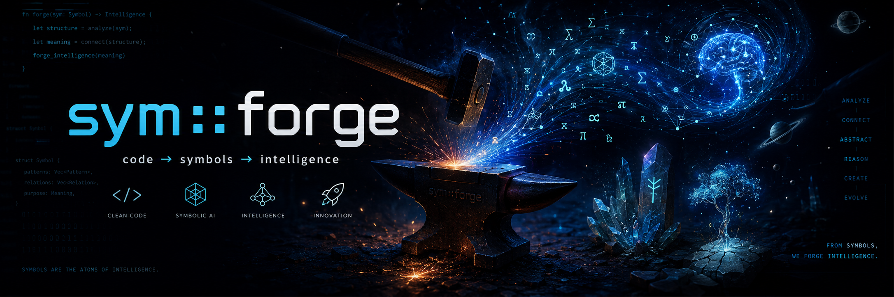
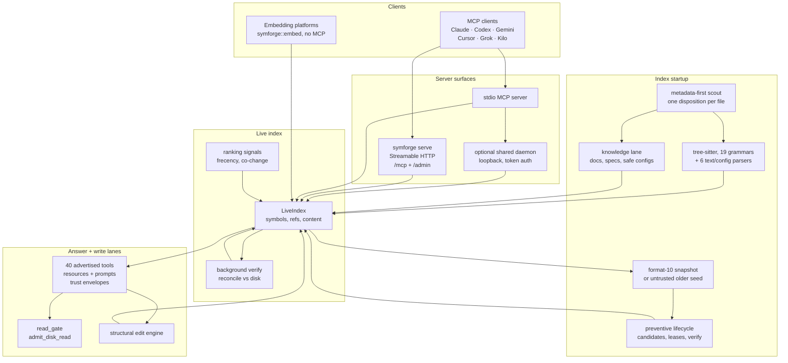

<div align="center">



# SymForge

**Symbol-aware code intelligence and structural editing for AI coding agents — local-first, trust-labeled, token-efficient.**

[](https://www.npmjs.com/package/symforge)
[](https://github.com/special-place-ai-heaven/symforge/actions/workflows/ci.yml)
[](./LICENSE)
[](./rust-toolchain.toml)
[](https://modelcontextprotocol.io)
[](#install-and-quick-start)

[Install](#install-and-quick-start) · [How it works](#how-it-works) · [Tools](#tools) · [Embed](#embedding) · [Wiki](https://github.com/special-place-ai-heaven/symforge/wiki)

</div>

---

SymForge is a local-first [MCP](https://modelcontextprotocol.io) server that gives an AI coding agent a symbol-level view of a repository, so it can ask precise questions instead of reading whole files, running broad greps, or editing code with blind string replacement. It is written in Rust, parses with tree-sitter, holds the active workspace in memory, and answers over stdio or Streamable HTTP. The same engine also compiles without the server, as a library.

Every answer carries a machine-readable **trust envelope**: what kind of match it was, how authoritative the source was, whether the result was complete, and where the evidence lives. When SymForge cannot answer exhaustively, it says so rather than guessing confidently.

> [!IMPORTANT]
> SymForge is for **code intelligence and code editing**. Use it before raw file reads, broad text search, or manual string edits when the task is about source code. Use the shell for builds, tests, package managers, and process work, and exact file reads when literal docs or config text is the thing being inspected.

## Why SymForge

Coding agents spend most of their context window *finding* code, not changing it. SymForge answers those questions from an in-memory, symbol-level index:

- **Read by symbol.** Outlines, imports, consumers, and symbol bodies, so a whole-file read becomes the exception.
- **Search with structure.** Text matches arrive grouped by enclosing symbol; symbol, path, concept, and AST-pattern search come with bounded output and stated ranking reasons.
- **Trace impact.** Call sites, dependents, symbol diffs, and blast radius seeded from the symbols that actually changed.
- **Edit structurally.** Replace, insert, delete, and rename by indexed structure, validated before anything touches disk, with a pre-write snapshot and a receipt naming what was written where.
- **Keep knowledge separate.** Docs, specs, ADRs, and safe configs are indexed as their own scope, so prose never contaminates code results.
- **Fail closed on secrets.** One admission gate decides what may be read or disclosed; secret-bearing files drop to metadata-only.

Details: [Home, Why SymForge](https://github.com/special-place-ai-heaven/symforge/wiki/Home#why-symforge) and [What it gives an agent](https://github.com/special-place-ai-heaven/symforge/wiki/Home#what-it-gives-an-agent).

## How it works


```mermaid
%%{init: {"flowchart": {"htmlLabels": false, "wrappingWidth": 400}}}%%
flowchart TD
    accTitle: SymForge architecture
    accDescr: MCP clients reach the server over stdio or HTTP, embedders call the engine in-process. Startup restores a current-format snapshot or treats an older file as an untrusted seed, then the preventive lifecycle and admission scout feed the live index, which backs the tool, read-gate, and edit lanes.

    subgraph Clients["Clients"]
        MCP["MCP clients\nClaude · Codex · Gemini\nCursor · Grok · Kilo"]
        LIB["Embedding platforms\nsymforge::embed, no MCP"]
    end

    subgraph Surfaces["Server surfaces"]
        STDIO["stdio MCP server"]
        HTTP["symforge serve\nStreamable HTTP\n/mcp + /admin"]
        DAEMON["optional shared daemon\nloopback, token auth"]
    end

    subgraph Startup["Index startup"]
        SNAP["format-10 snapshot\nor untrusted older seed"]
        SCOUT["metadata-first scout\none disposition per file"]
        PARSE["tree-sitter, 19 grammars\n+ 6 text/config parsers"]
        KNOW["knowledge lane\ndocs, specs, safe configs"]
        LIFE["preventive lifecycle\ncandidates, leases, verify"]
    end

    subgraph Core["Live index"]
        IDX["LiveIndex\nsymbols, refs, content"]
        SIG["ranking signals\nfrecency, co-change"]
        VERIFY["background verify\nreconcile vs disk"]
    end

    subgraph Lanes["Answer + write lanes"]
        TOOLS["40 advertised tools\nresources + prompts\ntrust envelopes"]
        GATE["read_gate\nadmit_disk_read"]
        EDITS["structural edit engine"]
    end

    MCP --> STDIO
    MCP --> HTTP
    STDIO --> DAEMON
    DAEMON --> IDX
    HTTP --> IDX
    STDIO --> IDX
    LIB --> IDX

    SNAP --> LIFE --> IDX
    SCOUT --> PARSE --> IDX
    SCOUT --> KNOW --> IDX
    SIG --> IDX
    IDX --> VERIFY --> IDX
    IDX --> SNAP

    IDX --> TOOLS
    TOOLS --> GATE
    TOOLS --> EDITS
    EDITS --> IDX
```

The read path is deliberately local: symbol spans depend on the exact bytes in the workspace, so SymForge serves from an in-process index whenever it can. Every lane that reopens a file from disk goes through one gate, `admit_disk_read`, which classifies the exact buffer it read and returns it only on a permit. A current-format snapshot lets startup skip the parse phase and reconcile against disk in the background; answers carry `SnapshotRestore` / `Pending` trust labels until that verification completes. After an edit, the index is rebuilt from the bytes that actually landed on disk, never from the in-memory buffer.

Details: [Architecture, How it works](https://github.com/special-place-ai-heaven/symforge/wiki/Architecture-and-How-It-Works#how-it-works), [The life of an edit](https://github.com/special-place-ai-heaven/symforge/wiki/Architecture-and-How-It-Works#the-life-of-an-edit), and [What makes it different](https://github.com/special-place-ai-heaven/symforge/wiki/Architecture-and-How-It-Works#what-makes-it-different).

## Install and quick start

Prerequisite: Node.js 18+ and npm.

```bash
npm install -g symforge
symforge --version
symforge init            # register every supported client already installed
```

npm installs a JavaScript launcher plus the native binary for your platform: **Windows x64**, **Linux x64**, **macOS arm64**, **macOS x64**. There is no postinstall step; installing downloads nothing and configures no client. Update in place with `symforge update`. `cargo install symforge` builds from source instead; it needs a C compiler, because the tree-sitter grammars, the vendored libgit2, and the bundled SQLite are C code compiled through the `cc` crate.

> [!CAUTION]
> **WSL:** if the shell inherits the Windows npm prefix, the install pulls the Windows binary and the launcher reports a missing `symforge-linux-x64` package. Give WSL its own Linux npm prefix ahead of any `/mnt/*` entries on `PATH`, then reinstall.

To teach your agent which tool to use when, paste the [Agent Setup Prompt](https://github.com/special-place-ai-heaven/symforge/wiki/Agent-Setup-Prompt#the-prompt) into its instructions.

Details: [Install and Client Setup, Install](https://github.com/special-place-ai-heaven/symforge/wiki/Install-and-Client-Setup#install) and [Troubleshooting](https://github.com/special-place-ai-heaven/symforge/wiki/Install-and-Client-Setup#troubleshooting).

## Clients

`symforge init` knows 13 clients: `claude`, `claude-desktop`, `codex`, `gemini`, `grok`, `kilo-code`, `cursor`, `omp`, `cline`, `roo`, `vscode`, `copilot`, `continue`. Plain `init` means `--client all`: it registers the user-level clients already present, prints a `skipped:` line for each one it passes over, and always prints a `skipped: Kilo Code ...` line. Kilo Code, Roo, VS Code, and Continue are workspace-local: `all` never writes their project files, and it prints nothing at all for Roo, VS Code, and Continue, so run `symforge init --client <name>` from the repository. Naming a client always registers it. `symforge init --scan` reports attach status without writing anything.

The same binary also runs `serve` (Streamable HTTP at `/mcp` plus an operator dashboard at `/admin`, default `127.0.0.1:8787`), a shared local `daemon`, `setup`, `admin`, `hook`, `trust`, `analytics`, and `update`.

Details: [Configure a client](https://github.com/special-place-ai-heaven/symforge/wiki/Install-and-Client-Setup#configure-a-client), [Workspace-local clients](https://github.com/special-place-ai-heaven/symforge/wiki/Install-and-Client-Setup#workspace-local-clients), and [Commands](https://github.com/special-place-ai-heaven/symforge/wiki/Install-and-Client-Setup#commands).

## Tools

SymForge advertises **40 tools** over MCP `tools/list`; 41 are registered. The forty-first is the compact-surface `symforge` facade, which the full profile filters out because `symforge_retrieve` is its full-surface equivalent. A client reporting 40 is correct.

| Group | Tools |
|---|---|
| **Orient** | `health` · `health_compact` · `status` · `get_repo_map` · `explore` · `ask` · `conventions` · `context_inventory` · `investigation_suggest` |
| **Read** | `get_file_context` · `get_file_content` · `get_symbol` · `get_symbol_context` · `inspect_match` |
| **Search** | `search_symbols` · `search_text` · `search_files` · `symforge_retrieve` |
| **Knowledge** | `search_knowledge` · `review_knowledge` · `curate_knowledge` |
| **Trace impact** | `find_references` · `find_dependents` · `what_changed` · `diff_symbols` · `analyze_file_impact` · `detect_impact` · `validate_file_syntax` |
| **Edit** | `edit_plan` · `replace_symbol_body` · `edit_within_symbol` · `insert_symbol` · `delete_symbol` · `batch_edit` · `batch_insert` · `batch_rename` · `symforge_edit` · `secret_remediate` |
| **Index** | `index_folder` · `checkpoint_now` |

Alongside the tools: six resources, four resource templates, and eight prompts. The protocol layer is rmcp 3.5.0, serving MCP 2026-07-28 plus every legacy revision back to 2024-11-05 from a frozen allow-list. `SYMFORGE_SURFACE=compact` collapses the surface to three tools (`symforge`, `symforge_edit`, `status`); it is an escape hatch for token-sensitive setups, not the default.

The seven structural edit tools (`replace_symbol_body`, `edit_within_symbol`, `insert_symbol`, `delete_symbol`, `batch_edit`, `batch_insert`, `batch_rename`) accept an optional `working_directory` naming a sibling git worktree; `symforge_edit` accepts and forwards it without advertising it in its schema. Passing it is explicit routing consent: SymForge validates the worktree, writes there, and reports `wrote_to`, `indexed_path`, and `rerouted`, so parallel agents can each edit their own worktree against one index.

Details: [Tool Reference](https://github.com/special-place-ai-heaven/symforge/wiki/Tool-Reference#the-tool-surface), [Protocol](https://github.com/special-place-ai-heaven/symforge/wiki/Tool-Reference#protocol), [Compact surface](https://github.com/special-place-ai-heaven/symforge/wiki/Tool-Reference#compact-surface), and [Runtime Model, Worktree-aware editing](https://github.com/special-place-ai-heaven/symforge/wiki/Runtime-Model#worktree-aware-editing).

## Embedding

Building with `--no-default-features --features embed` compiles the parsing, indexing, search, editing, and git core without the daemon, sidecar, protocol server, or CLI, so server-side breakage cannot reach an embedder.

```toml
symforge = { version = "11", default-features = false, features = ["embed"] }
```

Open one `EmbeddedSourceHandle` through `ProcessIndexRuntime`: search returns claims with provenance, refresh returns a receipt, and refusals are a typed `SourceRefusalKind`. `symforge::embed` is semver-public and pinned by a compile-time contract test. `symforge::embed::parity` (versioned by its own `API_VERSION`) serves every MCP tool, resource, and prompt natively; known differences are in the [parity census](./docs/reviews/2026-10-10-embed-parity-gap-matrix.md). Moving from 10.x: [docs/migrations/v11-index-lifecycle.md](./docs/migrations/v11-index-lifecycle.md).

Details: [Embedding the Engine, Build and dependency](https://github.com/special-place-ai-heaven/symforge/wiki/Embedding-the-Engine#build-and-dependency) and [MCP parity](https://github.com/special-place-ai-heaven/symforge/wiki/Embedding-the-Engine#mcp-parity-embedparity).

## Index lifecycle and recovery

The 11.x binary runs the **preventive index lifecycle**: incomplete observations cannot publish as current, candidates promote only when complete, and an answer that is not current says so. Snapshot format 10 is current. A snapshot written by 10.x (format 7), or any older format, is an untrusted seed and is never restored as current. On load a copy lands under `.symforge/v11/quarantine/index-snapshots/`; the first snapshot write after that moves the original into `.symforge/quarantine/index-snapshots/` and refuses that one write. Rolling back to 10.x means copying a preserved `.bin` back to `.symforge/index.bin`.

**When a snapshot goes wrong:** `checkpoint_now(verify_after_write=true)` forces a byte-exact write and verification; `health` or `health_compact` report the load source, verification state, and mismatch paths; corrupt or version-incompatible snapshots are preserved under `.symforge/quarantine/index-snapshots/` with metadata rather than served. Rebuilding from source is deliberately explicit: run the serving process with `SYMFORGE_INDEX_FOLDER_RESET=1`, then call `index_folder`; while the variable is set every `index_folder` call resets, so unset it afterwards. Use `index_folder` reset when health, verification, or quarantine evidence shows the snapshot is not a valid recovery source. `repair_index` is intentionally retired; `get_index_run` and `cancel_index_run` remain retired. No durable run IDs are exposed: recovery is a sequence you drive, not a job you poll.

Details: [Runtime Model, Index lifecycle (V11)](https://github.com/special-place-ai-heaven/symforge/wiki/Runtime-Model#index-lifecycle-v11) and [Recovery](https://github.com/special-place-ai-heaven/symforge/wiki/Runtime-Model#recovery).

## Configuration

Workspace state lives under `.symforge/`: the snapshot and its quarantine, pre-write `tee/` copies, idempotency records, and the optional frecency and coupling databases. The 11.7.0 server records no analytics and creates no analytics database. Nothing leaves the machine. The variables you are most likely to want:

| Variable | Effect |
|---|---|
| `SYMFORGE_HOME` | Home for the installed binary and daemon metadata (default `~/.symforge`) |
| `SYMFORGE_SURFACE` | `compact` collapses `tools/list` to three tools; default `full`. `symforge init` writes it into each client's `env` block, which wins over the shell |
| `SYMFORGE_NO_DAEMON` | Any value other than empty or `0` forces local in-process mode; `symforge init` sets it to `1` for Codex on Linux |
| `SYMFORGE_DAEMON_AUTH_TOKEN` | Bearer token the daemon requires on every route except `/health`; generated at daemon start when unset |
| `SYMFORGE_INDEXING_THREADS` | Cap the parse thread pool, for tight-RAM hosts and PID-1 embedders; default is rayon's |
| `SYMFORGE_WORKTREE_AWARE` | Worktree routing for edit calls that pass `working_directory`; enabled when unset, and any value other than empty, `1`, `true`, `yes`, `on`, or `explicit` turns it off |

> [!WARNING]
> The daemon and `serve` HTTP are local coordination surfaces, not remote production APIs. The daemon binds loopback only unless `SYMFORGE_DAEMON_ALLOW_NON_LOOPBACK` is set, and that opt-in warns.

Details: [Environment Setup Scripts, Variable reference](https://github.com/special-place-ai-heaven/symforge/wiki/Environment-Setup-Scripts#variable-reference), [Network exposure](https://github.com/special-place-ai-heaven/symforge/wiki/Environment-Setup-Scripts#network-exposure), and [Runtime Model, Serving modes](https://github.com/special-place-ai-heaven/symforge/wiki/Runtime-Model#serving-modes).

## Benchmarks

The recorded evidence is thin, and the wiki says so. The only token measurement from the 11.x line, a five-pair cohort dated 2026-10-05, during the 11.x line, is inconclusive: in total the SymForge-available sessions used 603,609 fewer tokens (3,198,434 against 2,594,825), but the paired median was -40,011 and three of five pairs cost more, so the predeclared rule (positive total and positive median) returns `NO_WIN`. The one positive end-to-end result, 24.8% fewer tokens, was measured on 8.14.1, and its own report limits what it proves. No general percentage is claimed.

Details: [Benchmarks and Token Savings, What is recorded](https://github.com/special-place-ai-heaven/symforge/wiki/Benchmarks-and-Token-Savings#what-is-recorded) and [Where the evidence says it does not help](https://github.com/special-place-ai-heaven/symforge/wiki/Benchmarks-and-Token-Savings#where-the-evidence-says-it-does-not-help).

## Development

SymForge parses 19 languages with tree-sitter grammars plus 6 text and config formats with native parsers. The toolchain is pinned by [`rust-toolchain.toml`](./rust-toolchain.toml) (Rust 1.96.0, edition 2024).

```bash
cargo fmt --check
cargo clippy --all-targets -- -D warnings
cargo test --lib --bins --tests -- --test-threads=1
cargo bench --bench observed_refresh_gate_v1 -- --test
cargo build --release
cd npm && npm test
```

Do not pass `--all-targets` to `cargo test` with `--test-threads=1`; the criterion bench rejects the flag. Run the embed-feature suite in its own pass. PR CI also runs version sync, the embed build for glibc and musl, a macOS serve-port test, a `windows-native` job, npm tests, and the tool-correctness harness against the release binary. Releases are driven by Release Please on `main`.

Details: [Supported Languages, Language table](https://github.com/special-place-ai-heaven/symforge/wiki/Supported-Languages-and-Config-Formats#language-table), [Development, Test](https://github.com/special-place-ai-heaven/symforge/wiki/Development#test), [CI gates on pull requests](https://github.com/special-place-ai-heaven/symforge/wiki/Development#ci-gates-on-pull-requests), and [Releases](https://github.com/special-place-ai-heaven/symforge/wiki/Development#releases).

## License

SymForge is licensed under the [PolyForm Noncommercial License 1.0.0](./LICENSE).

> [!CAUTION]
> You may inspect, study, and use the source code for **noncommercial purposes**. Commercial use requires a separate license.
