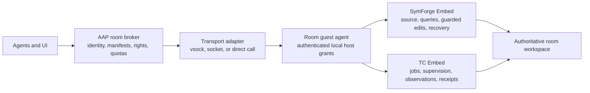

# Native Embed room integration — draft v1

As of 2026-10-10. This document describes the intended integration and the current local implementation. It is not a release claim. Full capability and final verification gates remain open. The existing signed flat V11 contract is unchanged; additions live under `symforge::embed::parity`.

## Recommended placement

Use AAP's existing guest agent to own one native SymForge engine and one native Terminal Commander engine for each admitted room source. Reuse those engines across the room's agents and calls. Route requests through AAP's control plane and existing authenticated room envelope. This fits the current code and avoids duplicating an index or execution supervisor for every LLM agent.

The broker can be shared across many rooms. Mutable engines default to the room that owns the filesystem and execution namespace. A shared engine host is an optional placement only when it sees the exact authoritative source bytes, shares the admitted trust scope, and has an explicit component binding. A host cannot safely serve or edit a private guest overlay merely because it knows the guest path. No mirroring or host-execution fallback is assumed.

Within one admitted process, `HostRuntimeOwner` can open room bindings on one bounded SymForge runtime. Bindings with the same canonical source root and exact source scope reuse the admitted source; runtime source settings are owner-wide. Each room retains its own grant, session, limits and replay scope; only the runtime owner can shut down the shared runtime. Native fixtures verify room isolation, sibling survival on close, last-room source lease cleanup and refusal of new admissions after shutdown. Separate virtual machines need their own source-local runtime unless an explicitly admitted service has access to their authoritative filesystems.

Share binaries, base images and validated immutable artifacts before sharing mutable indexes or job state across rooms. Measure resident memory, cold and warm startup, active source counts, idle teardown and response sizes before adding cross-room mutable sharing. Derived cache reuse requires content/config/version identity and source admission; a cache hit is not source authority.

## Evidence from the current AAP checkout

Inspected read-only with SymForge against `C:/AI_STUFF/PROGRAMMING/Agent_Army_Professionals`, branch `integrate/rooms-execution-into-main`.

- `crates/aap-core/src/room_config.rs:242`: component kinds include NativePort, Sidecar, McpServer and ProvisionStep. `RoomComponent` at line 281 includes phase, required status, capabilities, resource cost, probe and opaque `secret_refs`. RoomSpec carries environment, components, permissions and provisioning policy.
- `crates/aap-guest-agent/src/code_intel.rs:71`: GuestCodeIntel constructs a NativeSymForgeCodeIntelBridge in the guest and eagerly indexes its configured project. Current adoption uses the older internal API identified in CODEX-REPORT-24-SYMFORGE.md.
- `crates/aap-workspace/src/vsock_client.rs:1110`: code-intelligence calls carry correlation and a bounded operation timeout. `send_request` at line 1348 calls `require_room_control`; `write_room_control_request` at line 1393 builds the room envelope with request identity and deadline before serialization.
- `crates/aap-terminal/src/room_runtime.rs:635`: RoomTerminalCommanderPort explicitly owns a guest-local TC boundary and forbids a second host fallback port. The reviewed `crates/aap-terminal/Cargo.toml` depends on portable-pty and thiserror, and does not establish a real TC Embed dependency. AAP still needs to wire the final TC contract.
- `crates/aap-workspace/src/overlay.rs`: room writable overlays and publication are already explicit. Their private bytes support the source-local placement; they do not establish host-visible source sharing.

These are current source observations, not assertions about next week's rewrite or deployed behavior. TC's separate coordination record independently proposes the same room-local engines and common control plane.

## Complementary engines

SymForge owns source admission, indexing, publication, code retrieval, guidance, guarded structural changes, knowledge and snapshot recovery. TC owns execution, process ownership, supervision, stream observation, combing, events, receipts and cleanup. Neither engine imports the other's private implementation or acquires a virtualization dependency.

Use common integration conventions with engine-specific typed payloads. API and build identity, engine instance, invocation correlation, room/source scope, cancellation/deadline, bounds, outcome certainty and recovery cursors must survive the host adapter. A TC job identifier is not a SymForge publication identifier. A serialized provenance description is not a local authority permit.

## Host and serialization boundary

An authenticated host validates room/session identity, manifest and permission generation, workspace fence, permitted operation and resource budget. It resolves the canonical local project root and stable scope, then constructs the native grant. Wire input cannot construct a source handle, mutation permit or checkpoint/close authority. Rust authority-bearing objects remain opaque and non-deserializable.

Preserve the full query result and correctness metadata: operation identity and canonical argument hash, source/runtime/engine identity, publication identity and generation, provenance and evaluation descriptions, partial/withheld counts, observations, truncation and any continuation offset. Pagination resumes only against the same publication; changed sources require a fresh query. Metadata-only file entries use absent content hash/length rather than fabricated values.

The host's source scope identifies the filesystem namespace, workspace incarnation and trust scope. Directory identities are local filesystem evidence, not globally unique identities across cloned virtual machines. Preserve a scope across an engine-process restart serving the same admitted workspace; issue a new scope when a replacement changes its authority. Use a binding incarnation in room identity when a human-facing room label is reused, so unrelated room lifetimes do not inherit replay keys. The authenticated outer adapter checks the current permission generation for every invocation.

Serving identities include a process-instance nonce. Frozen V11 publication counters can repeat after restart, so their raw values remain separate `source_capture_*` evidence and cannot authorize a continuation. The actual two-process regression now rejects a cursor from an earlier process even when its frozen counters match. A query's semantic operation and canonical request hash likewise remain separate from the source-capture receipt.

Request and response limits are host policy with explicit engine bounds. Clamping must be reported where it changes the effective request. Deadlines are local monotonic budgets after admission; the AAP adapter translates its authenticated deadline envelope. Cancellation stops cooperative read work and prevents an unstarted write. A timed-out response does not prove an effect stopped. Started effects require an inspected state and reconciliation before retry.

The host checks the encoded request cap before JSON deserialization and bounds the complete encoded response after serialization. An oversized read response returns `ResponseTooLarge`; it never trims provenance or recovery fields to make a success fit. For a mutation whose effects have already started or committed, a size refusal retains explicit outcome certainty, canonical request identity and a usable recovery route. The native host-wire fixture commits 70 files under a 4 KiB response cap, receives bound committed recovery evidence, then reopens with a larger frame and replays the exact original receipt without repeating writes. Query `max_bytes` is a separate decoded-content budget, so JSON escaping and envelope metadata can increase the encoded size. Configure both limits in the room component rather than treating them as interchangeable.

Tool `max_tokens` bounds the rendered context intended for an LLM. Typed evidence can contain additional structured rows; `QueryLimits` bounds that decoded payload and the host response cap bounds the complete encoded envelope. An adapter that forwards a whole typed response to an LLM must account for that additional content. Retained full context is retrieved through the source-bound session with its own limits.

Credential values stay in a host resolver or local secret store. Specs and serialized probes carry opaque credential references. Every probe executes with its admitted component identity, exact working directory, source/namespace scope and credential policy. A probe failure must distinguish unavailable component, authentication refusal, transport failure and engine refusal without exposing credentials. Engines do not select a global credential fallback.

## Durability and lifecycle

Git read preparation is trusted host lifecycle work. The planned native preparation API accepts an explicitly selected protected workspace and byte/file bounds; it does not choose system temporary storage or derive authority from a room request. It copies capability-opened Git bytes into a reusable immutable view, with refs and index evidence captured separately. Direct repository metadata under the admitted source uses that source authority; linked worktrees, parent repository metadata and alternates require explicit native admission. New objects or changed refs require refreshed preparation before the view can serve them.

Read-only rooms may query an already prepared view. Their existing permission for cochange-derived preparation remains separate. Memory-only sources can use explicitly authorized ephemeral Git storage while continuing to refuse durable snapshots. The source lifecycle cleans only its own workspace child. This contract is under implementation; packed repositories, replacement races, bounds, cancellation and cleanup require actual verification before adoption.

Sources open through an admitted host binding, expose loading/current/blocked state, and close through the owning host. Queries capture an immutable publication and exact admitted source set. A process/runtime teardown is not a persistence guarantee.

The existing V11 close and shutdown calls are synchronous. Their completion waits report an observed outcome; they do not preempt an in-progress join or impose a hard wall-clock bound on it. Hosts must account for that behavior when draining a process. Cooperative query cancellation and pre-write checks do not imply lifecycle preemption.

Checkpoint uses the same local snapshot writer and verification as the standalone engine. If the publication moves while persistence is being written, return explicit uncertainty/source movement instead of a false current-generation receipt. Memory-only placement refuses durable checkpoint. Corrupt or incompatible snapshots remain quarantined; source rebuild is explicit.

Replay binds key and canonical request to canonical project root and stable host scope. Reservation is transactional and owner-fenced. NotStarted, Started, Uncertain, Completed and Failed are distinct. Uncertain effects do not reexecute automatically. Reconciliation requires observed postimage evidence and current ownership/generation. Persisted outcomes are bounded and guarded; a refusal never truncates a success into a false replay result. Legacy unsafe/orphan records fail closed, and migration preserves their bytes.

Canonical path spelling alone does not prove source identity. Reads, source effects and replay attestations must use the admitted physical directory object. Durable replay also binds the opened root and state directory identities across restart, refusing copied replay state under a replacement directory even when its path and postimages match. The original-authority read fixture and the copied-state process-restart regression pass focused native checks. Complete source-write and state-placement verification remains open.

Replay and coordination state directories belong to the trusted host and must be protected from replacement by room callers. SQLite's Unix VFS resolves `/proc/self/fd` paths back to ambient paths; that spelling does not pin subsequent database, WAL or journal access. Before/after identity checks can detect a substitution but cannot prevent every concurrent privileged host rename. Capability-guarded source effects and the trusted state-directory boundary are separate requirements; deployments must preserve both. The Windows state directory handle strategy and complete state placement checks still require platform verification.

## Adoption after final verification

1. Pin the final SymForge/TC releases and documented toolchains. Replace AAP's private V10 imports with the supported native namespaces; preserve graph IDs/reference kinds and complete correctness metadata.
2. Make AAP's guest component construct local grants from its existing authenticated room envelope. Reuse the engine instances for the admitted source instead of creating them per call.
3. Map existing CodeIntelPort operations and graph projection to typed requests. Add the remaining current capabilities from the tested parity inventory. Keep rich filters, byte-exact ranges and explicit partial/refusal states.
4. Implement RoomTerminalCommanderPort with real TC Embed in the guest namespace, using the final TC identity, environment, policy, cancellation, observation and receipt contracts.
5. Add AAP integration fixtures for stale room/recovery generations, wrong scope, revoked rights, mismatched source publications, cancellation before and after effects, crash recovery, missing credentials and bounded serialization. Run them against actual guest-local engines.
6. Update room manifests, probes and frontend capability discovery from the verified native capability inventory. Do not advertise unavailable operations as implemented. AAP owns these changes; this SymForge task does not edit AAP implementation.

The architecture can support other virtualization or direct service deployment through a transport adapter. Only the host component that resolves authority and sees the actual filesystem/execution namespace changes.
