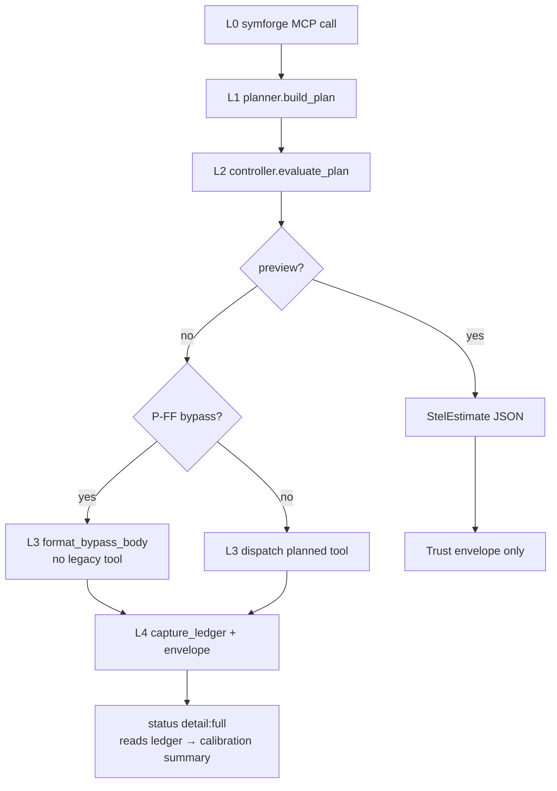

# Phase 1 STEL checkpoint (observational calibration)

**Branch:** `v8/stel-architecture`  
**Checkpoint commit:** `15c0685` — *Add Phase 1 STEL observational calibration summary*
**Status:** Phase 1 **L1–L4 + compact `status` + observational calibration** work on compact `symforge`; `symforge_edit` handler not started.

This document captures implementation state after the observational calibration slice. It does **not** change runtime behavior.

---

## Evidence anchors

| Anchor | Commit / artifact | Role |
|--------|-------------------|------|
| Phase 0 evidence bundle | `08f7d14` | §12A measurement artifacts (A-019 bundle `f26f28b`; remediation `e9f4102` / `c3581a5`) |
| Independent GO / signoff | `07b42a8` | *Record Phase 0 12A independent GO decision* — authorization to implement `src/stel/` |
| Phase 1 checkpoint doc (prior) | `467003d` | L4 ledger checkpoint narrative |
| Phase 1 tip (this checkpoint) | `15c0685` | Observational calibration summary via `status detail: full` |

**Deferred (not blocking this checkpoint):** `B-RESULTS` — RESULTS.md §8.7 post-8.0 baseline only.

---

## Phase 1 implementation commits

| Commit | Slice | Summary |
|--------|-------|---------|
| `d145699` | **S2** | Schema scaffolding — `src/stel/types.rs`, envelope, compact surface registry |
| `0f4c3d9` | **S3** | Compact `tools/list` — production list from `stel::compact_surface_tools()` when `SYMFORGE_SURFACE=compact` |
| `b3ee2a2` | **S4** | Compact `symforge` handler — trust envelope + legacy tool dispatch path |
| `e69b732` | **S4 exit** | Golden replay validation — five ask/planner-aligned rows in `tests/stel_golden_replay.rs` |
| `62d6bfd` | **L1** | Planner — `StelRequest` → single-step `StelPlan` |
| `20b4e17` | **L2** | Economics controller — `evaluate_plan` → `StelDecision` / `StelEstimate` metadata |
| `5038ac3` | **L3** | P-FF bypass enforcement — skip legacy dispatch when `StelBypassBody` present |
| `31d9bf1` | **L4** | Session ledger — in-memory `StelLedgerEvent` + envelope `ledger:` JSON line |
| `467003d` | **Doc** | Phase 1 checkpoint doc (L4 ledger state) |
| `3995643` | **Status** | Compact `status` handler — operational STEL/index headline |
| `15c0685` | **Calibration** | Observational calibration summary from in-memory ledger (read-only) |

Prior: `07b42a8` Phase 0 GO · `08f7d14` evidence anchor (pre-implementation).

---

## What is complete

### S2 — Schema scaffolding

- Wire types in [`stel-schema.md`](stel-schema.md): `StelRequest`, `StelPlan`, `StelDecision`, `StelLedgerEvent`, etc.
- `src/stel/envelope.rs` — `StelTrustEnvelope` text formatter
- `src/stel/surface.rs` + `surface_list.rs` — compact-3 registry

### S3 — Compact tools/list

- `SYMFORGE_SURFACE=compact` → three tools: `symforge`, `symforge_edit`, `status`
- Schema bytes validated under H1 budget (A-019 compact-3 winner)
- Phase 0 [`surface_probe.rs`](../src/protocol/surface_probe.rs) **frozen** for A-005/A-019 measurement

### S4 — Compact symforge handler + golden replay

- `symforge_facade_tool` → L1→L2→L3 path when compact (probe relay unchanged for Phase 0 harness)
- Five-row S4 exit corpus in [`docs/fixtures/routes.golden.jsonl`](fixtures/routes.golden.jsonl) — replay in `tests/stel_golden_replay.rs`

### L1 — Planner

- [`src/stel/planner.rs`](../src/stel/planner.rs) — `build_plan()`: intent buckets, query patterns, `smart_query` fallback
- Single-step plans only (multi-hop golden rows deferred)

### L2 — Economics metadata

- [`src/stel/controller.rs`](../src/stel/controller.rs) — conservative schema (45) + invoke (80) per call (A-006 path)
- P-FF detection → `bypass` + `StelBypassBody`
- Serve when predicted net > margin; preview via `StelEstimate`
- **No calibration-driven fudge or margin changes yet**

### L3 — P-FF bypass enforcement

- [`src/stel/executor.rs`](../src/stel/executor.rs) — `is_enforced_bypass()` gates legacy dispatch
- Bypass response: trust envelope + host-read instruction (no `Chosen tool:` line)
- Non-P-FF negative-net bypass metadata **not** enforced yet (still serves)

### L4 — Session ledger

- [`src/stel/ledger.rs`](../src/stel/ledger.rs) — `SessionLedger` on `SymForgeServer` (in-memory, no persistence)
- Records: plan id, route tool, decision, bypass flag, schema/invoke tokens, predicted net, legacy executed, output bytes/tokens
- Compact `ledger: {…}` JSON embedded in trust envelope
- Preview path does not append ledger rows (no L3 execution)

### Compact `status` handler

- [`src/stel/status.rs`](../src/stel/status.rs) — `status_stel_tool` when `SYMFORGE_SURFACE=compact`
- `detail: compact` (default) — operational headline: surface, Phase 0 anchors, L1–L4 availability, handler state, ledger event count, index readiness
- `detail: full` — adds project, symbol count, session tokens, last ledger decision/route, and calibration section

### Observational calibration (read-only)

- [`src/stel/calibration.rs`](../src/stel/calibration.rs) — `summarize_calibration()` over in-memory `SessionLedger` events
- **Derived only** from appended `StelLedgerEvent` rows; does not write back to L2 or alter serve/bypass decisions
- Summary fields: event totals, serve/bypass/P-FF counts, legacy-executed count, schema/invoke token totals, predicted net aggregate, predicted vs actual response tokens, tuning sufficiency note
- Exposed in `status detail: full` under `── calibration (observational) ──`
- **No persistence** across restarts; **no auto-tuning**; **no L2 margin or route decision changes**

---

## Runtime flow (compact `symforge`)

---

## L0 surface choice (unchanged)

**Compact-3** remains the selected Phase 1 L0 surface ([A-019](research/A-019-l0-surface-choice.md) **VALIDATED**).

| Tool | Shipped handler | Notes |
|------|-----------------|-------|
| `symforge` | **Yes** — full L1–L4 path | Production compact read/explore facade |
| `status` | **Yes** — operational + calibration (full) | Requires `SYMFORGE_SURFACE=compact` |
| `symforge_edit` | Schema only | Handler deferred |

---

## Test coverage at checkpoint

| Suite | What it proves |
|-------|----------------|
| `cargo test stel::` | Unit tests across types, planner, controller, executor, ledger, calibration, status, envelope, golden_replay helpers |
| `tests/stel_golden_replay.rs` | Classifies all 36 golden rows; replays **29 supported serve** + **4 P-FF bypass** rows; keeps S4 five-row minimum subset |
| `tests/stel_l3_enforcement.rs` | P-FF bypass skips legacy tools; serve still executes |
| `tests/stel_l4_ledger.rs` | Serve and P-FF rows produce envelope `ledger:` + session ledger events |
| `tests/stel_status.rs` | Compact guard, operational fields, full detail + calibration after serve |
| `cargo test --lib protocol::surface_probe` | Phase 0 measurement schemas unchanged |

Golden corpus has **36 rows** partitioned by `classify_golden_corpus()`:

| Category | Count | Notes |
|----------|-------|-------|
| Supported serve replay | 29 | L1 planner matches `must_call[0]`; trust envelope + `ledger:` validated |
| Supported P-FF bypass replay | 4 | L3 enforced bypass; no legacy tool execution |
| Deferred multi-hop | 3 | `DEFERRED_MULTI_HOP_ROW_IDS` — planner multi-step not shipped |
| Deferred planner mismatch | 0 | Narrow L1 route patterns cover remaining single-hop rows |

S4 minimum subset (`S4_EXIT_ROW_IDS`, five rows) remains a named floor inside supported serve replay.

---

## Preserved / unchanged

- Phase 0 **`surface_probe`** and `_probe_*` harness relay on `symforge`
- Compact-3 `tools/list` production path vs frozen probe schemas
- Serve execution semantics for non-P-FF paths
- Full 32-tool surface when `SYMFORGE_SURFACE=full`

---

## Explicitly out of scope at this checkpoint

| Item | Status |
|------|--------|
| Calibration auto-tuning (`CalibrationState` fudge → L2) | Not implemented — observational summary only |
| Calibration / ledger persistence | In-memory only |
| `symforge_edit` handler | Schema only |
| Multi-step planner / executor chains | L1 single-step only |
| Full 36-row golden replay | **13 serve + 4 P-FF** replayed; 3 multi-hop + 16 planner-mismatch deferred explicitly |
| H3–H8 battery gates on compact surface | Not claimed |
| `B-RESULTS` / RESULTS.md §8.7 | Deferred post-8.0 |
| Unrelated pre-existing `cargo test` failures | Separate from STEL slices; not fixed in Phase 1 commits |

---

## Suggested next boundaries (risk order)

1. **`symforge_edit` handler** — higher risk (edit semantics + safety); defer until replay confidence is sufficient
2. **Planner multi-hop** — replay the three `chain: multi` rows after L1 chained plans ship
3. **Planner mismatch rows** — close the 16 single-hop gaps without forcing golden `must_call` overreach
4. **Calibration persistence + auto-tuning** — only after observational summary is trusted; still no silent L2 changes without explicit gate
5. **`B-RESULTS` / §8.7** — operator-triggered after 8.0 tag baseline exists

---

## Source map

| Module | Layer |
|--------|-------|
| `src/stel/types.rs` | Wire types |
| `src/stel/surface.rs`, `surface_list.rs` | L0 registry |
| `src/stel/planner.rs` | L1 |
| `src/stel/controller.rs` | L2 |
| `src/stel/executor.rs` | L3 enforcement |
| `src/stel/ledger.rs` | L4 record |
| `src/stel/calibration.rs` | Observational calibration summary |
| `src/stel/status.rs` | Compact `status` handler |
| `src/stel/handler.rs`, `envelope.rs` | Envelope + preview |
| `src/stel/golden_replay.rs` | S4 validation helpers |
| `src/protocol/tools.rs` | `symforge_stel_handler` + `status_stel_tool` integration |
| `src/protocol/surface_probe.rs` | Phase 0 frozen measurement |

---

## Related docs

- [stel-schema.md](stel-schema.md) — normative types and controller algorithm
- [stel-architecture.md](stel-architecture.md) — charter and H1–H8 gates
- [v8-gap-closure-plan.md](v8-gap-closure-plan.md) — binding pre-flight and phase map
- [phase0-12a-review-signoff.md](research/phase0-12a-review-signoff.md) — GO decision record
