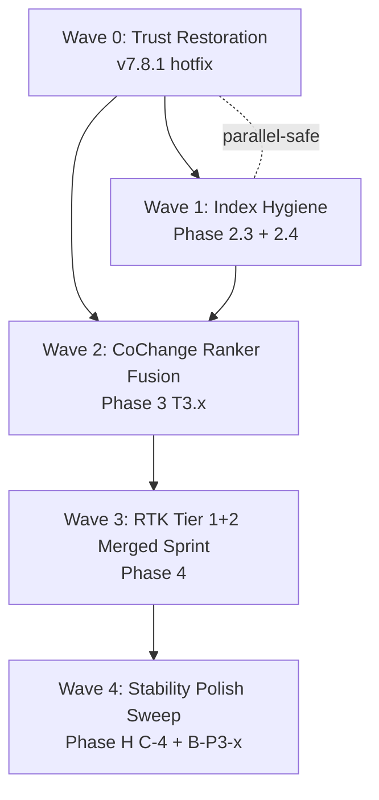

# SymForge Post-Phase-H Consolidated Roadmap

## Overview

Phase H (stability hotfix) shipped 2026-05-15 as v7.8.0 via release-please. Two new correctness bugs surfaced in same-day user dogfood. This plan consolidates every outstanding SymForge work item into a single hierarchical dependency-graph roadmap, foundation-first, with explicit waves and per-wave gate criteria. The user's specific direction is honored: **(a) join RTK Tier 1 and Tier 2 into one merged sprint**, **(b) hierarchical dependency graph with foundation-first ordering**, **(c) actionable output**.

This document supersedes the scattered tracking listed in `supersedes_tracking`. After ship, the wiki Todos page links back here as the single source of truth.

Main HEAD at plan authoring: `f5de473` (UTF-8 boundary hotfix on top of `f32485c` Phase H merge). `Cargo.toml` declares `7.7.0`; release-please bump for v7.8.0 expected via PR post-push. Origin/main already in sync with local HEAD as of this writing.

## Problem Frame

Outstanding SymForge work spans:

1. **Two fresh v7.8.0 correctness regressions** discovered 2026-05-15 in user dogfood on Agent_Army_Professionals. Both are P1/P2 hotfix candidates, NOT C-4-deferred — refactor decisions based on these tools' output get wrong blast-radius numbers.
2. **Two pre-Phase-H carryover bug fixes** (AAP audit 2026-05-09) that never landed because Phase H insertion bumped them: frecency contract violation in search ops (100% deterministic test failure), sidecar Windows TCP port-pool exhaustion (~10% flake).
3. **Phase 2.3 + 2.4** — `.gitignore` policy for `.claude/gsd-*` + verification gate, both small.
4. **Phase 3 T3.x** — CoChange T3.3 ranker fusion (the ADR 0013 6-rule contract), spans 6 tasks T3.1-T3.6 per master plan-doc.
5. **Phase 4 RTK Tier 1 + Tier 2 merged sprint** — joins 5 Tier 1 items + 6 Tier 2 items into one cross-sprint per user direction.
6. **Phase H C-4 sprint** — 5 P2 + 3 P3 bugs from the external evaluator catalog (B-P2-1 through B-P3-3), originally scoped as a 1-week sprint within 30 days of Phase 4 close.

Today the work is scattered across one master plan-doc, one hotfix plan-doc, three wiki notes, and a concept page. The user explicitly asked for one consolidated source.

## Requirements Trace

- **R1** — Surface the two v7.8.0 dogfood-discovered bugs at the front of the roadmap so they ship before any non-trust roadmap work proceeds (`mem_mp6yad6a_cc3812cbc7e1`, `mem_mp6yaicb_848df0e35283`).
- **R2** — Build a hierarchical dependency graph: foundation work first (trust restoration), then index hygiene, then ranker fusion, then RTK sprint, then C-4 sprint. Inside each wave, sub-order by file-touch collision graph and per-item dependency.
- **R3** — Join RTK Tier 1 and Tier 2 into one merged sprint with intra-sprint ordering by dependency (4.1 → 4.2 verifies macro pattern; 4.4 → 4.5 because 4.5 depends on the `edit_safety` module; T2.3 OnceLock audit + T2.6 `match_output` investigation slot in as Wave-3 research).
- **R4** — Every implementation unit declares allowed/forbidden files, regression test scenarios, and dependency edges.
- **R5** — Skip RTK 4.3 (build-time tree-sitter query embedding) — repo-research confirmed zero `.scm` files outside vendor/target; task is N/A.
- **R6** — Honor the Phase H push-gate convention: each wave closes with a software-side gate before the next wave dispatches. C-4 retains its calendar commitment (1-week sprint within 30 days of Phase 4 close).
- **R7** — Update wiki/Obsidian references after this plan lands so the Todos page, SymForge entity, and Phase H concept note all link back here as the single source of truth.

## Scope Boundaries

- **In scope:** Every SymForge work item enumerated in the input sources, including the two v7.8.0 hotfix items, pre-H carryover, Phase 2.3-2.4, Phase 3, RTK Tier 1+2 merged sprint, and Phase H C-4.
- **Not in scope:** AAP-side repo work, Obsidian vault tooling outside SymForge-touching notes, claude-code plugin development, any work in `Agent_Army_Professionals` or other downstream consumers.

### Deferred to Separate Tasks

- AAP workspace embed sync to v7.8.0+: deferred until user finishes AAP upgrade (per `mem_mp6xerad_c487d5a468c6`). Tracked separately in AAP backlog.
- ADR for RTK Tier 1 trust-gating (`.symforge/` SHA-256 hashing convention): write the ADR with the implementation in Wave 3 (per institutional learning #6 in research output).
- Claude Desktop / Codex / Gemini installer wrapper improvements beyond what Phase 4 RTK touches: keep in `npm/scripts/install.js` as discovered post-Phase-4 if needed.

## Context & Research

### Relevant Code and Patterns

Authoritative file:line anchors (verified at HEAD `f5de473`):

- `src/live_index/qualified_usages.rs:39` — `collect_qualified_usages` (Wave 0 fix target; H.5 shared-collector source of `truncate` false-positive regression)
- `src/live_index/rank_signals.rs:162-176` — `CoChangeSignal::score()` returns hardcoded `0.0` (Wave 2 T3.3 target)
- `src/live_index/rank_signals.rs:179` — `OnceLock<RwLock<...>>` registry pattern (T2.3 audit reference site)
- `src/live_index/query.rs:786-789` — `is_personal_tooling_path` (H.12 partner site; covers `.claude/gsd-` already)
- `src/live_index/query.rs:1397-1403` — `capture_search_files_view` (3-arg signature; T3.4 widens to 4-arg)
- `src/live_index/search.rs:350-411` — `NoisePolicy::classify_path` (H.12 actual surface; plan-doc allowed-files lists wrong file)
- `src/protocol/edit.rs:148` — `atomic_write_file` (RTK 4.4 tee snapshot wire site)
- `src/protocol/tools.rs:450-482` — `SearchFilesInput` (T3.4 adds `anchor_path` field)
- `src/protocol/tools.rs:2037` — truncation phrasing variant 1 (B-P3-2 unification target)
- `src/protocol/tools.rs:4478-4504` — existing `rank_by="frecency"` branch (template for T3.4 `path+cochange`)
- `src/sidecar/mod.rs:245,259` — truncation phrasing variant 2 (B-P3-2 unification target)
- `src/sidecar/server.rs:160` — sidecar ephemeral bind site (Wave 0 indirect AAP-0.2 target)
- `src/parsing/languages/mod.rs:1-19` — 19 manual `mod` decls (RTK 4.1 target)
- `src/parsing/config_extractors/mod.rs:1-5` — 5 manual `mod` decls (RTK 4.2 target)
- `tests/frecency_ranking.rs:370,393,411` — pre-H carryover test sites (Wave 0 AAP-0.1 target)
- `tests/sidecar_integration.rs:2433` — pre-H carryover test site (Wave 0 AAP-0.2 target; ~10% flake on Windows)

Closest existing patterns to follow:

- **Foundation-first sequencing**: Phase H `docs/plans/2026-05-12-symforge-stability-hotfix.md` — H.1a (additive API) before H.1b/c/d migration; H.5 shared-collector before H.7 (H.5 shipped the H.7 source fix as side effect).
- **`*_at_generation` fenced API**: H.1a precedent for adding telemetry counter (`rejected_stale_mutations`) on a primitive then surfacing in `health` output.
- **Push-gate + WSL fallback discipline**: documented in `docs/notes/2026-05-15-c2-final-verification.txt` and codified in C-2 close-out commit `99c777d`.
- **Conventional commits + release-please**: Phase H chain shows the pattern; this roadmap's commits should follow.

### Institutional Learnings

- **ADR 0012** (`docs/decisions/0012-edit-and-ranker-hook-architecture.md`) — trait-object safety invariant for `RankSignal` and `EditHook`. T3.3 must keep `combine()` returning byte-identical defaults until weighted-sum migration is dogfooded.
- **ADR 0013** (`docs/decisions/0013-coupling-signal-contract.md`) — 6 calibrated rules. Rule 5 (`Basename` anchor-confidence gate) is the ONLY provisional rule and requires query-level calibration during T3.3 before promotion to CALIBRATED. Rule 6 (relative-not-absolute thresholds) closed an 18x cross-repo score-scale trap.
- **ADR 0014** (`docs/decisions/0014-watcher-subsystem-spawn-blocking-discipline.md`) — three-layer convention. Any new `spawn_blocking` mutation site in the watcher subsystem follows the convention.
- **ADR 0011** (`docs/decisions/0011-frecency-bump-policy.md`) — discovery never bumps frecency. Wave 0 AAP-0.1 fix must preserve the policy: short-circuit `FrecencyStore::open` from discovery handlers.
- **Lesson `lsn_65493c93dd3fdde1`** (confidence 0.9) — Rust byte-index slicing on `&str` over arbitrary file content must guard `is_char_boundary` at BOTH ends. Already shipped fix in `qualified_usages.rs` for prec2; the Wave 0 method-call-disambiguation fix lands in the same file and must preserve the boundary guards.
- **Lesson `lsn_6ea4ce1ca7af23ad`** (confidence 0.85) — When pushing a feature branch with N commits whose docs reference SHAs, prefer `git merge origin/main` over rebase. Applies to every wave's close-out push.

### External References

External research not run for this plan. Local patterns are well-established for every wave's work (per repo-research: "Your codebase has solid patterns for this. Proceeding without external research.").

### Slack Context

Not requested.

## Key Technical Decisions

### D1: Wave 0 prepends to the campaign

The two v7.8.0 dogfood-discovered bugs (`find_references` method-call false positive + `edit_plan` symbol_line drift) and the two pre-H carryover bugs (Phase 0.1 frecency contract + Phase 0.2 sidecar port-pool) form a foundation wave. **Rationale:** every downstream wave uses SymForge MCP tools to do its own work. If SymForge tools lie, every plan-doc, refactor decision, and dependent investigation is compromised. Trust-tier comes first.

### D2: RTK Tier 1 and Tier 2 are one merged sprint (per user direction)

User explicitly asked. Intra-sprint shape: a research wave (T2.3 OnceLock audit + T2.6 `match_output` investigation, output is follow-up plans), then two parallel implementation batches of 2 items each (4.1+4.4, 4.2+4.6), then sequential close (4.5 after 4.4; T2.4 CI assertion), then the deeper items (T2.1 graceful degradation, T2.2 SQLite analytics if T2.6 confirms `match_output` exists, T2.5 CLI correction learning). RTK 4.3 (build-time tree-sitter query embedding) skipped per repo-research — no `.scm` files outside vendor/target; task is N/A.

### D3: H.12 plan-doc allowed-files is stale; fix at C-4 dispatch time

Phase H plan-doc lists `src/discovery/mod.rs` as the H.12 fix site; actual surface is `src/live_index/search.rs:350-411` plus `src/live_index/query.rs:786-789`. Wave 4 dispatch updates the allowed-files before H.12 starts.

### D4: B-P3-1, B-P3-2, B-P3-3 ride in Wave 4 alongside C-4

Phase H plan-doc carved them as out-of-scope but worth catching. Wave 4 absorbs them; they don't move the calendar commitment.

### D5: Phase 2.3 is a single-commit slot, sequenced before Phase 3 because the runtime predicate is already shipped

Phase 2.3 = `.gitignore` policy + `git rm -r --cached` for `.claude/gsd-*`. The runtime filter (`is_personal_tooling_path` + `include_personal_tooling` flag) shipped in v7.x. Net effect of 2.3 is repo-hygiene only — removes ~227 files / ~3400 symbols from the indexed tree, simplifying every Phase 3+4 search/audit task. Lands in Wave 1.

### D6: Phase 3 T3.x lands as one wave with T3.4 as the longest task; T3.3 ranker fusion is the load-bearing milestone

ADR 0013 Rule 5 promotion from PROVISIONAL to CALIBRATED is a non-skippable Wave 2 acceptance gate. Tests in `tests/cochange_fusion.rs` (new file) must cover rules 1, 2, 4, 6 minimum.

### D7: Each wave closes with a software-side gate (cargo test + cargo clippy + cargo check) before next wave dispatches

Same as Phase H gate. WSL fallback acceptable for libgit2 Class C lockfile flake and MSVC LNK1201/1140 toolchain flake per project policy.

### D8: Each wave ships as one release-please increment

Wave 0 = v7.8.1 (patch, two correctness bugs). Wave 1 = patch (hygiene). Wave 2 = minor (CoChange feature). Wave 3 = minor (RTK Tier 1+2 features). Wave 4 = patch (C-4 bug sweep). Lets users adopt incrementally without waiting for whole-roadmap landing.

## Open Questions

### Resolved During Planning

- **Where do the two pre-H carryover bugs (AAP-0.1, AAP-0.2) live in the dependency graph?** Wave 0, alongside the v7.8.0 dogfood-discovered bugs. Pre-Phase-H, zero dependency on Phase H work, both are trust-tier.
- **Should H.12 plan-doc allowed-files be updated before or during Wave 4 dispatch?** Wave 4 dispatch updates the allowed-files as the first step of H.12 work, in the same commit as the source change (per the `405aae0` H.2 plan-doc allowed-files expansion precedent in Phase H).
- **Does RTK 4.3 ship?** No. Repo-research confirmed zero `.scm` files outside vendor/target; task collapses to a `--allow-empty` "N/A" commit, which is omitted from the wave.
- **Is `match_output` short-circuit (T2.6) groundable?** No `match_output` symbol found in `src/`. Slots into Wave 3 research phase as an investigation; downstream T2.2 may collapse if T2.6 cannot find a real symbol to short-circuit.

### Deferred to Implementation

- **Exact fix shape for Wave 0 `find_references` method-call disambiguation.** The collector at `src/live_index/qualified_usages.rs:39` needs a method-call vs free-function vs path-segment distinction. Implementation-time investigation: does the scanner already track `.` context (yes, per the existing block-comment + string-literal state machine), and if so, add a precondition that a bare-identifier match at column `col` is suppressed when `col > 0 && line.as_bytes()[col - 1] == b'.'` (with `is_char_boundary` guard at `col - 1`). Confirm by exhaustive test against the `truncate` repro.
- **Wave 0 `edit_plan` vs `find_references` symbol_line drift root cause.** Either `edit_plan` reports one-past-end of doc-comment block while `find_references` expects the `fn` line, or one of them indexes an older snapshot. Investigation-time: cross-check via `get_symbol` (does it agree with `edit_plan` or `find_references`?), then trace the divergence. If both are correct against their respective intent, the API contract needs unification (likely target: `edit_plan` reports the `fn` line, not the doc-comment).
- **T3.3 anchor-confidence calibration data.** Will be produced by running `tests/coupling_calibration.rs` across the 3-repo corpus (SymForge, tokio, magika) once Rule 5 candidate threshold is implemented; numbers feed back into ADR 0013 promotion from PROVISIONAL to CALIBRATED.
- **T2.3 OnceLock audit scope.** Output is a follow-up plan; sites are not pre-enumerated. Investigation starts with `rg "OnceLock|Lazy<" src/`.

## Output Structure

Roadmap touches existing files only (no new top-level directory). New files land under:

```
docs/plans/
  2026-05-15-symforge-post-h-roadmap.md   # this file
docs/decisions/
  0015-rtk-trust-gating-symforge-config.md   # Wave 3 RTK 4.5 ADR
docs/notes/
  2026-05-XX-rtk-once-lock-audit.md          # Wave 3 T2.3 follow-up plan
  2026-05-XX-rtk-match-output-investigation.md   # Wave 3 T2.6 follow-up plan
  2026-05-XX-regression-suite-gap-2026.md    # Wave 4 H.13 audit doc
src/edit_safety/
  mod.rs                                       # Wave 3 RTK 4.4 new module
  tee.rs                                       # Wave 3 RTK 4.4
  trust.rs                                     # Wave 3 RTK 4.5
src/parsing/inline_tests.rs                    # Wave 3 RTK 4.6 framework
tests/
  cochange_fusion.rs                           # Wave 2 T3.4 (~6 integration tests)
  qualified_usages_method_call.rs              # Wave 0 fresh repro coverage
  edit_plan_symbol_line.rs                     # Wave 0 fresh repro coverage
  sidecar_port_pool.rs                         # Wave 0 AAP-0.2 stress coverage
```

## High-Level Technical Design

> *This illustrates the intended approach and is directional guidance for review, not implementation specification.*

### Wave dependency graph



Wave 0 → Wave 1 in sequence (W1 trivially depends on trust-restored tools). W1 → W2 in sequence (W2 uses W1-trimmed index). W2 → W3 in sequence (W3 lands new modules that consume the ranker substrate). W3 → W4 in sequence by calendar commitment ("1-week sprint within 30 days of Phase 4 close" — Wave 4 starts within 30 days of Wave 3 close).

### Intra-wave parallelism per CLAUDE.md §12

Max 2 CODEX agents in parallel. Wave 0 has 4 items; sequenced as: (A) `find_references` method-call disambiguation || (B) `edit_plan` line drift investigation → (C) AAP-0.1 frecency contract || (D) AAP-0.2 sidecar port-pool. Two parallel pairs.

Wave 3 has 11 items (after dropping 4.3); sequenced as four parallel-pair batches plus the deeper items.

## Implementation Units

---

### Wave 0 — Trust Restoration (v7.8.1 hotfix)

Foundation wave. Ships before any other roadmap work. Targets two fresh-from-dogfood regressions in v7.8.0 + two pre-Phase-H carryover bugs that block AAP-side workspace embed test re-enablement.

#### - [x] **Unit 0.1: `find_references` method-call false-positive fix**

**Goal:** Stop reporting method calls (`s.truncate()`, `digest.truncate()`) as references to free function `truncate`. Shared collector at `src/live_index/qualified_usages.rs::find_qualified_usages` needs method-call vs free-function discrimination.

**Requirements:** R1, R4

**Dependencies:** None

**Landed:** `cfc261f` (`fix: disambiguate rust method-call references`)

**Files:**
- Modify: `src/live_index/qualified_usages.rs` (collector path)
- Test: `tests/qualified_usages_method_call.rs` (new — covers the AAP `truncate` repro plus simpler synthetic fixtures)

**Approach:**
- Inside the line scanner, when a bare-identifier match begins at column `col`, suppress the match when `col > 0 && line.is_char_boundary(col - 1) && line.as_bytes()[col - 1] == b'.'` — the dot makes it a method call, not a free-function call.
- Preserve the existing `prec2 = "::"` qualified-path detection (that's the H.5 intent and still load-bearing).
- The collector already tracks block-comment + string-literal state machine; method-call dot detection is symmetric to those existing context guards.

**Execution note:** Test-first. Write the failing repro test for `truncate` (using a synthetic fixture mirroring the AAP shape) before applying the fix.

**Patterns to follow:**
- Existing `is_char_boundary` guard pattern in same file (5 sites; hotfix `f5de473` added the prec2 boundary guard)
- Block-comment / string-literal state machine logic at `find_qualified_usages` lines ~110-185

**Test scenarios:**
- Happy path: `truncate(s, 500)` in synthetic source at module scope → 1 reference
- Edge case (the real bug): `s.truncate(500)` → 0 references when search target is the free fn `truncate`
- Edge case: `String::truncate(s, 500)` → 0 references (qualified path on type, not the local helper)
- Edge case: `MyType::truncate(...)` → 0 references (different module's qualified path)
- Integration: full AAP-orchestrator repro fixture — file with both free-fn definition + method-call sites → reports exactly the free-fn definition's call sites, not the method calls
- UTF-8 boundary: method-call site preceded by multi-byte char (e.g., `é.truncate(0)`) must NOT panic and must NOT match (re-asserts hotfix `f5de473` invariant)

**Verification:**
- Targeted regression: `cargo test --test qualified_usages_method_call -- --test-threads=1` PASS
- Full lib + integration: `cargo test --all-targets -- --test-threads=1` PASS at C-2 baseline `1969+N` count
- WSL fallback acceptable for libgit2 Class C flake
- Cross-check on AAP repo: re-run `find_references` on `crates/aap-agents/src/actors/orchestrator.rs::truncate` after install. Confirm only the 1 known call site (in `sanitize_task_description`) is returned. Raw rg cross-check: `rg -n --pcre2 "(?<!\.)\btruncate\s*\(" crates/aap-agents/`.

#### - [x] **Unit 0.2: `edit_plan` vs `find_references` symbol_line drift fix**

**Goal:** Reconcile `edit_plan`'s reported symbol line with `find_references`'s `symbol_line` selector. Concrete AAP repro: `edit_plan` says `sha256_hex` is at line 4493; `find_references` with `symbol_line=4493` fails; with `4494` it works.

**Requirements:** R1, R4

**Dependencies:** None

**Landed:** `c8ba267` (`fix: align edit_plan symbol lines with selectors`). Released and installed as `symforge@7.8.1`.

**Files:**
- Investigate: `src/protocol/tools.rs` (the `edit_plan` and `find_references` handlers)
- Investigate: `src/live_index/query.rs` (symbol-line resolution path)
- Modify: TBD post-investigation; likely one of the above
- Test: `tests/edit_plan_symbol_line.rs` (new — asserts agreement between both tools' line-number reporting on a fixture)

**Approach:**
- Step 1 (investigation): Call `get_symbol` on the same target. Compare its `line` with both `edit_plan`'s `line` and the line that makes `find_references` work. Identify which tool has the off-by-one.
- Step 2 (decision): Pick one canonical convention (likely "first line of `fn` keyword, NOT first line of doc comment") and align the offending tool to it.
- Step 3 (fix): Apply the alignment. Likely a one-line change in whichever handler computes the symbol's reported `line` differently from the others.

**Execution note:** Investigation-first; do not implement until the divergence is pinpointed.

**Patterns to follow:**
- Existing `find_references` handler patterns at `src/protocol/tools.rs` (find via `symbol_line` selector resolution)
- `get_symbol_context` for the agreed-upon symbol-line convention

**Test scenarios:**
- Integration: pick a symbol in test fixture with a multi-line doc comment. Assert `edit_plan(file, name).line == find_references(file, name, symbol_line=X).working_X == get_symbol(file, name).line`. All three should return the same line.
- Integration: pick a symbol without doc comment. Assert same.
- Edge case: nested fn inside an impl block — assert all three tools agree on the inner fn's line.

**Verification:**
- `cargo test --test edit_plan_symbol_line -- --test-threads=1` PASS
- Cross-check on AAP repo: `edit_plan` line for `sha256_hex` should now match `find_references` selector-line working value.

#### - [x] **Unit 0.3: AAP audit fix — frecency contract violation in search ops (Phase 0.1)**

**Goal:** Discovery handlers (`search_files`, `search_text`, `search_symbols`) must NOT open or create the frecency DB. Per ADR 0011 + frecency-bump-policy doctrine, only commitment tools bump frecency.

**Requirements:** R1, R4

**Dependencies:** None (pre-Phase-H carryover; zero dependency on Phase H work)

**Landed:** `6ee9f6d` (`fix(frecency): avoid DB creation during search rerank`)

**Files:**
- Modify: `src/live_index/frecency.rs` (likely `FrecencyStore::open` short-circuit when `SYMFORGE_FRECENCY` is unset, OR equivalent gate at handler dispatch)
- Modify: `src/protocol/tools.rs` (handler-side gates if needed)
- Test: `tests/frecency_ranking.rs` — existing test sites at `:370, :393, :411` (un-ignore + verify pass at default parallelism)

**Approach:**
- Investigation (`superpowers:systematic-debugging`): trace each discovery handler's call chain looking for `FrecencyStore::open` or `db_path()` creation under default parallelism.
- Likely root cause per master plan-doc Phase 0 Task 0.1 (`docs/plans/2026-05-08-symforge-improvements-master.md:79-249`): `FrecencyStore::open` creates the DB file at open-time even with the flag off. Patch shape A: open returns early without touching disk when `SYMFORGE_FRECENCY != 1`. Patch shape B: search handler short-circuits before opening the store.

**Execution note:** Investigation-first; existing tests at `tests/frecency_ranking.rs:370,393,411` are the RED state. Fix flips them GREEN at default parallelism.

**Patterns to follow:**
- ADR 0011 (`docs/decisions/0011-frecency-bump-policy.md`) — the policy contract
- Existing `// intentionally no frecency bump here` comments in `search_files` / `search_text` / `search_symbols` handlers (3 sites total; preserve through any refactor)

**Test scenarios:**
- Happy path: `cargo test --test frecency_ranking -- search_files_does_not_bump --test-threads=2` PASS (currently fails at default parallelism)
- Same for `search_text_does_not_bump`, `search_symbols_does_not_bump`
- Edge case: with `SYMFORGE_FRECENCY=1` set, search ops still must not bump (only get + edit ops bump)

**Verification:**
- All three existing test sites in `tests/frecency_ranking.rs` PASS at default parallelism
- AAP-side `crates/symforge/tests/frecency_ranking.rs` `#[ignore]` rationale comments can be removed (out-of-scope here; AAP repo handles its own un-ignore)

#### - [x] **Unit 0.4: AAP audit fix — sidecar Windows TCP port-pool exhaustion (Phase 0.2)**

**Goal:** Sidecar test fixtures must not flake on Windows TIME_WAIT port collision under workspace-wide test parallelism (~10% failure rate today, error `10048`).

**Requirements:** R1, R4

**Dependencies:** None

**Landed:** `e77b009` (`fix(sidecar): SO_REUSEADDR + deterministic shutdown for parallel test fan-out`). Already included in `v7.7.0`, `v7.8.0`, and `v7.8.1`.

**Files:**
- Modify: `tests/sidecar_integration.rs` (port-acquire helper, likely `setup_sidecar_test()` or equivalent)
- Modify: `src/sidecar/server.rs` ONLY if the bind site in production code is where retry logic needs to land (line 160 `"127.0.0.1:0".parse()`)
- Test: `tests/sidecar_port_pool.rs` (new — explicit 10-iteration stress test for the retry helper)

**Approach:**
- Investigation (Step 3 of master plan-doc Phase 0.2): The plan-doc's grep targets ("127.0.0.1:0", "EADDRINUSE", "10048") are stale — they hit no matches in `tests/`. Re-discover the actual bind site by tracing `setup_sidecar_test()` helpers in `tests/sidecar_integration.rs`. Likely path: test helper spawns the sidecar binary, which itself binds at `src/sidecar/server.rs:160`. Decide whether retry lives in production code or test fixture.
- Two patches considered: (a) port-acquire-with-retry-on-EADDRINUSE wrapper, ~10 LOC, mechanical, lives in test fixture if the production code's bind only happens once per binary spawn; (b) `#[serial]` via `serial_test` crate, adds dep + slower.
- Recommend (a) — simpler.

**Execution note:** Investigation-first; the master plan-doc's grep targets are stale and need re-discovery (per repo-research finding).

**Patterns to follow:**
- Any existing port-allocation helper in the codebase (`rg "127.0.0.1:0"` to find).
- `socket2` crate is already in deps (`Cargo.toml:1.x`); use it for retry-aware bind if available.

**Test scenarios:**
- Stress test: bind 10 times in a tight loop with retry; assert all 10 succeed under Windows TIME_WAIT
- Edge case: existing port held by external process — retry exhausts and fails cleanly (no infinite loop)

**Verification:**
- `cargo test --test sidecar_integration -- --test-threads=N --include-ignored` PASS on Windows in N=10+ consecutive runs, zero EADDRINUSE failures
- AAP-side `crates/symforge/tests/sidecar_integration.rs::test_prompt_context_endpoint_*` `#[ignore]` can be removed downstream

#### - [x] **Unit 0.5: Wave 0 software-side gate + release**

**Goal:** Wave 0 close-out. All four hotfix units committed, gate criteria green, push to origin/main, release-please picks up patch bump.

**Status 2026-05-16:** Complete. Software-side gates are green and captured in `docs/notes/2026-05-16-w0-close-out-evidence.md`. Final close-out landed on `origin/main` as `b5186cf`, release-please PR #234 merged at `9ec2765`, GitHub release `v7.8.2` is Latest, npm reports `symforge@7.8.2`, and the global CLI reports `symforge 7.8.2`.

**Requirements:** R6

**Dependencies:** Units 0.1, 0.2, 0.3, 0.4

**Files:**
- Modify: this plan-doc (mark Wave 0 units `[x]` with landed SHAs)
- Create: `docs/notes/2026-05-XX-w0-close-out-evidence.md` (gate criteria matrix per Phase H precedent)

**Approach:**
- Same shape as Phase H C-2 close-out: per-unit landed-SHA + per-gate-criterion regression test + final consolidated cargo verification transcript.
- Push, let release-please open PR, merge PR -> release-please ships the next patch via npm.

**Test scenarios:**
- N/A (verification gate, not behavioral)

**Verification:**
- `cargo test --all-targets -- --test-threads=1` PASS (WSL fallback if needed)
- `cargo test --all-targets` (default parallelism) PASS
- `cargo clippy -- -D warnings` clean
- `cargo check` clean
- `git push origin main` succeeded, release-please PR #234 merged, CI green, and `v7.8.2` shipped.

---

### Wave 1 — Index Hygiene Close-out (Phase 2.3 + 2.4)

Small wave. One mechanical commit + one verification pass. Completed on 2026-05-16 under existing `v7.8.2`; release workflow run `25959329481` verified `main` and skipped publish jobs because no version bump was required.

#### - [x] **Unit 1.1: `.gitignore` policy for `.claude/gsd-*` + remove from git index (Phase 2.3)**

**Goal:** Add three gitignore rules + `git rm -r --cached` for `.claude/gsd-local-patches/` and `.claude/get-shit-done/`. Removes ~227 files / ~3400 symbols from the indexed tree. Runtime predicate `is_personal_tooling_path` already lives at `src/live_index/query.rs:786-789`; this is pure repo hygiene.

**Status 2026-05-16:** Complete and pushed as `af888ae` (`chore(gitignore): exclude personal gsd tooling from indexed tree`). `.gitignore` has the three GSD ignore rules, `git ls-files` returns zero for `.claude/gsd-local-patches/`, `.claude/get-shit-done/`, and `.claude/gsd-file-manifest.json`, and representative paths match the new ignore rules.

**Requirements:** R2

**Dependencies:** Wave 0 (uses now-trustworthy SymForge to verify post-change state)

**Files:**
- Modify: `.gitignore` (append three rules)

**Approach:**
- Append `.claude/gsd-local-patches/`, `.claude/get-shit-done/`, and `.claude/gsd-*` (the wildcard covers future variants).
- `git rm -r --cached .claude/gsd-local-patches/ .claude/get-shit-done/` to remove from index without touching working tree.
- Commit `chore(gitignore): exclude personal gsd tooling from indexed tree`.

**Test scenarios:**
- N/A (config change only). Verification is observational.

**Verification:**
- `git status --short` shows expected D entries for the cached files
- `mcp__symforge__health_compact` after re-index of E:/project/symforge shows file count dropped by ~227 (relative to pre-Wave-1 baseline)

#### - [x] **Unit 1.2: Wave 1 verification gate (Phase 2.4)**

**Goal:** Run the four cargo gates. Confirm clean.

**Status 2026-05-16:** Complete. After Unit 1.1 was staged, `cargo check`, `cargo test --all-targets -- --test-threads=1`, `cargo test --all-targets`, `cargo clippy -- -D warnings`, `cargo build --release`, and `cd npm && npm test` all passed. `git push origin main` succeeded, and GitHub Release workflow run `25959329481` passed with release/publish jobs skipped.

**Requirements:** R6

**Dependencies:** Unit 1.1

**Files:** None modified.

**Approach:**
- `cargo check`, `cargo test --all-targets -- --test-threads=1`, `cargo test --all-targets`, `cargo clippy -- -D warnings`, `cargo build --release`. Mixed verification rule applies (also `cd npm && npm test`).
- Single push; release-please may or may not bump (depends on whether unit 1.1's `chore:` triggers a patch). If no bump, Wave 1 ships under v7.8.2's existing version.

**Test scenarios:** N/A.

**Verification:** All five cargo commands green. Push succeeds.

---

### Wave 2 — CoChange Ranker Fusion (Phase 3 T3.x)

Lights up `CoChangeSignal::score()`. Implements ADR 0013's 6-rule contract. Rule 5 (anchor-confidence `Basename`) is promoted from PROVISIONAL to CALIBRATED via Wave 2 calibration data.

#### - [ ] **Unit 2.1: RankCtx co-change fields (T3.1)**

**Goal:** Add `co_change_count: Option<u32>` and `co_change_weighted_score: Option<f32>` to `RankCtx`. Existing `score()` callers pass `None` to preserve byte-identical behavior.

**Requirements:** R3 (ranker fusion foundation)

**Dependencies:** Wave 0 close

**Files:**
- Modify: `src/live_index/rank_signals.rs` (RankCtx struct, ~line 39-48 per master plan-doc)
- Test: existing `src/live_index/rank_signals.rs::tests` (extend with the new fields)

**Approach:** Pure additive struct fields. No behavior change. Existing `CoChangeSignal::score() -> 0.0` still applies.

**Test scenarios:**
- Edge: `RankCtx { co_change_count: None, ... }` → existing behavior unchanged
- Edge: `RankCtx { co_change_count: Some(0), ... }` → unchanged from None
- Happy path: `Some(5)` → consumed by future signals (no behavior yet)

**Verification:** `cargo test --lib rank_signals -- --test-threads=1` PASS.

#### - [ ] **Unit 2.2: LiveIndex::coupling_store accessor (T3.2)**

**Goal:** Expose the per-workspace CouplingStore via `LiveIndex::coupling_store(&self) -> Option<&CouplingStore>`. Coupling store landed in T3.1/T3.2; this is the read-side accessor.

**Requirements:** R3

**Dependencies:** Unit 2.1

**Files:**
- Modify: `src/live_index/store.rs`, `src/live_index/coupling/lifecycle.rs` (per master plan-doc)
- Test: extend `tests/coupling_persistence.rs` or equivalent

**Approach:** Wire the existing `CouplingStore` to `LiveIndex` as `Option<Arc<CouplingStore>>`; return `None` when `SYMFORGE_COUPLING != 1`.

**Test scenarios:**
- Happy path: `SYMFORGE_COUPLING=1` → `coupling_store()` returns `Some(...)`
- Edge: flag unset → returns `None`

**Verification:** `cargo test --lib coupling -- --test-threads=1` PASS.

#### - [ ] **Unit 2.3: CoChangeSignal::score() implements ADR 0013 6-rule contract (T3.3)**

**Goal:** Replace `CoChangeSignal::score() -> 0.0` with the actual scoring per ADR 0013. Rule 5 (`Basename` anchor-confidence) starts as PROVISIONAL; promotion to CALIBRATED happens via Wave 2 calibration data.

**Requirements:** R3

**Dependencies:** Unit 2.1, Unit 2.2

**Files:**
- Modify: `src/live_index/rank_signals.rs::CoChangeSignal::score()` (lines 162-176)
- Test: extend existing tests at `src/live_index/rank_signals.rs` line ~235-240 (the current `score == 0.0` assertion needs to relax to "returns zero when `co_change_count.is_none()`")
- Test: `tests/cochange_signal_rules.rs` (new — covers rules 1, 2, 4, 6 minimum)

**Approach:** Implement each of the 6 rules per ADR 0013. Use `RankCtx::co_change_count` + `co_change_weighted_score`. Apply Rule 6 (relative-not-absolute thresholds) via the percentile-of-cohort calculation.

**Execution note:** Test-first per ADR 0013's 6 failure-mode test obligations. Lessons from `lsn_65493c93dd3fdde1` (byte-boundary) apply if any string slicing happens.

**Patterns to follow:** ADR 0013, `WalkerConfig` defaults at `tests/coupling_calibration.rs`.

**Test scenarios:**
- Happy path (rule 1): paired co-change with high frequency → positive score
- Edge case (rule 2): repeat-pair filtered after cohort cap → score floor enforced
- Edge case (rule 4): below-floor pair → returns 0.0 (signal contract preserves "absent => zero")
- Edge case (rule 6): absolute threshold passes but relative-cohort percentile fails → returns 0.0
- Integration: full ranker invocation with frecency + co-change combined → assert byte-identical output to today's tier-based goldens (per ADR 0012's `combine()` invariant)

**Verification:** Targeted + lib tests all PASS.

#### - [ ] **Unit 2.4: capture_search_files_view widens + path+cochange branch in search_files handler (T3.4)**

**Goal:** Add 4th param `coupling_neighbors: Option<&HashMap<String, u32>>` to `capture_search_files_view`. Wire the `rank_by="path+cochange"` branch in the `search_files` handler analogous to existing `rank_by="frecency"`.

**Requirements:** R3

**Dependencies:** Unit 2.3

**Files:**
- Modify: `src/live_index/query.rs::capture_search_files_view` (lines 1397-1403; widen signature)
- Modify: `src/protocol/tools.rs::search_files` (~line 4478 area; mirror frecency branch as `path+cochange`)
- Modify: `src/protocol/tools.rs::SearchFilesInput` (line 450-482; add optional `anchor_path: Option<String>`)
- Test: `tests/cochange_fusion.rs` (new — ~6 integration tests covering rerank shape, anchor-confidence handling, fallback on store-open failure)

**Approach:** Mirror the existing `rank_by="frecency"` branch at `src/protocol/tools.rs:4478-4504`. Open per-workspace `CouplingStore`, look up neighbors keyed on `anchor_path`, pass into `capture_search_files_view`, rerank, fall back to tier ordering on failure.

**Execution note:** Byte-identical defaults — `rank_by` unset OR `anchor_path=None` produces exact same output as today. Goldens must hold.

**Patterns to follow:** `src/protocol/tools.rs:4478-4504` frecency branch.

**Test scenarios:**
- Happy path: `rank_by="path+cochange"` with `anchor_path` → reranked output, top results are co-change neighbors of the anchor
- Edge case: `rank_by="path+cochange"` with `anchor_path=None` → falls back to default tier ordering (no panic)
- Edge case: store open fails → fall back to default, no panic, no error returned to client
- Integration: 6 integration tests in new `tests/cochange_fusion.rs` covering rules 1, 2, 4, 5 (PROVISIONAL gate), 6, and tier-fallback

**Verification:** `cargo test --test cochange_fusion --test-threads=1` PASS + existing search_files goldens unchanged.

#### - [ ] **Unit 2.5: Deprecate changed_with separate walk (T3.5)**

**Goal:** The existing `changed_with: Option<String>` field on `SearchFilesInput` runs its own git-temporal walk. With T3.3-T3.4 in place, this can be deprecated (not deleted) — point users at `rank_by="path+cochange" + anchor_path=` instead.

**Requirements:** R3

**Dependencies:** Unit 2.4

**Files:**
- Modify: `src/protocol/tools.rs::SearchFilesInput::changed_with` docstring
- Modify: `src/protocol/tools.rs::search_files` (continue to honor `changed_with` if set — just emit a deprecation warning)

**Approach:** Add `// deprecated since v7.x: prefer rank_by="path+cochange" with anchor_path`. Keep runtime behavior unchanged for one release cycle; remove in v8.x.

**Test scenarios:** None new (preserve existing tests).

**Verification:** Existing `changed_with` tests still pass.

#### - [ ] **Unit 2.6: Wave 2 close-out + release as v7.9.0 (minor bump)**

**Goal:** All Wave 2 units committed, gate green, release-please picks up minor bump (`feat(rank_signals)` triggers `7.9.0`).

**Requirements:** R6

**Dependencies:** Units 2.1-2.5

**Files:**
- Modify: this plan-doc (mark Wave 2 units `[x]` with landed SHAs)
- Create: `docs/notes/2026-XX-XX-w2-close-out-evidence.md`
- Update: `wiki/concepts/SymForge Co-Change Signal Fusion.md` (status: in-progress → shipped)

**Test scenarios:** N/A.

**Verification:** Five cargo gates green. Push succeeds. release-please opens v7.9.0 PR. Anchor-confidence calibration data captured at `docs/notes/2026-XX-XX-rule5-calibration.md`; ADR 0013 updated to mark Rule 5 CALIBRATED.

---

### Wave 3 — RTK Tier 1 + Tier 2 Merged Sprint (Phase 4)

Per user direction: Tier 1 and Tier 2 combined into one cross-sprint. Sub-ordered by file-touch collision graph + per-item dependency. RTK 4.3 dropped (no `.scm` files in repo). T2.6 (`match_output` short-circuit) is investigative; T2.2 may collapse if no real symbol found.

#### Sub-wave 3a: Research

#### - [ ] **Unit 3a.1: OnceLock audit (T2.3)**

**Goal:** Map every hot-path init pattern in `src/` that could migrate from per-call init to `OnceLock`. Output is a follow-up plan, not source patches.

**Requirements:** R3

**Dependencies:** Wave 2 close

**Files:**
- Create: `docs/notes/2026-XX-XX-rtk-once-lock-audit.md` (audit doc; sites + recommended migration order)

**Approach:** `rg "OnceLock|Lazy<|lazy_static" src/` + scan each site for whether hot-path. Recommend an implementation plan for follow-up.

**Test scenarios:** N/A (audit only).

**Verification:** Audit doc complete with at least 5 sites identified or "no migration candidates" stated explicitly.

#### - [ ] **Unit 3a.2: `match_output` investigation (T2.6)**

**Goal:** Determine whether `match_output` (per RTK Tier 2 wiki note) refers to a real symbol. If yes, propose short-circuit shape. If no, mark T2.2 (SQLite analytics) as standalone.

**Requirements:** R3

**Dependencies:** Wave 2 close

**Files:**
- Create: `docs/notes/2026-XX-XX-rtk-match-output-investigation.md`

**Approach:** `mcp__symforge__search_symbols name="match_output"` + `mcp__symforge__search_text query="match_output"` + cross-reference with `wiki/concepts/RTK Techniques for SymForge.md` to find the intended symbol. If found, document. If not, document the absence and mark T2.6 N/A.

**Test scenarios:** N/A.

**Verification:** Investigation doc complete with clear yes/no on existence + downstream implication for T2.2.

#### Sub-wave 3b: First parallel implementation batch

#### - [ ] **Unit 3b.1: `automod` for `src/parsing/languages/` (RTK 4.1)**

**Goal:** Replace 19 manual `mod` declarations in `src/parsing/languages/mod.rs:1-19` with `automod::dir!()`.

**Requirements:** R3

**Dependencies:** Wave 0 close (paired with 3b.2 in parallel)

**Files:**
- Modify: `Cargo.toml` (add `automod = "1"` dependency)
- Modify: `src/parsing/languages/mod.rs`

**Approach:** Replace `mod c; mod cpp; ...` × 19 with `automod::dir!("src/parsing/languages");`. Verify all 19 modules still expose their public symbols (run the parsing test suite).

**Test scenarios:** N/A behavioral (mechanical replacement). Existing parsing tests confirm.

**Verification:** `cargo test --lib parsing -- --test-threads=1` PASS; symbol count from `cargo test --lib parsing -- --list` unchanged.

#### - [ ] **Unit 3b.2: Pre-edit tee snapshots module (RTK 4.4)**

**Goal:** Create `src/edit_safety/` module with tee-snapshot primitive. Save up to 20 files of up to 1MB each to `.symforge/tee/` before `replace_symbol_body`/`batch_edit` fires. Return recovery hint in tool response.

**Requirements:** R3

**Dependencies:** Wave 0 close (paired with 3b.1 in parallel — different files)

**Files:**
- Create: `src/edit_safety/mod.rs`, `src/edit_safety/tee.rs`
- Modify: `src/lib.rs` (add `pub mod edit_safety;`)
- Modify: `src/protocol/edit.rs` (wire `atomic_write_file` at line 148 to call tee snapshot)
- Test: `tests/edit_safety_tee.rs` (new)

**Approach:** `Tee::snapshot(path) -> Result<TeeRecord>` writes content to `.symforge/tee/<timestamp>-<filename>`. Cap at 20 files (LRU evict). Return `TeeRecord { tee_path, original_path }` to caller; surface in `replace_symbol_body` response envelope.

**Execution note:** New module; structural-edit-safe per existing project conventions.

**Patterns to follow:** Existing `atomic_write_file` at `src/protocol/edit.rs:148`. ADR 0014 stop-block discipline doesn't apply here (this isn't a watcher spawn site).

**Test scenarios:**
- Happy path: edit a file → tee record exists at `.symforge/tee/...`; original file edited
- Edge case: 21st edit triggers LRU eviction of oldest tee
- Error path: `.symforge/` not writable → edit still succeeds; tee record returns warning
- Edge case: file >1MB → not teed (size cap)

**Verification:** Targeted + integration tests PASS.

#### Sub-wave 3c: Second parallel implementation batch

#### - [ ] **Unit 3c.1: `automod` for `src/parsing/config_extractors/` (RTK 4.2)**

**Goal:** Same as 3b.1 but for `src/parsing/config_extractors/mod.rs:1-5` (5 manual `mod` decls).

**Requirements:** R3

**Dependencies:** Unit 3b.1 (verifies the automod pattern works for this codebase before applying again)

**Files:**
- Modify: `src/parsing/config_extractors/mod.rs`

**Approach:** Same shape as 3b.1.

**Verification:** `cargo test --lib config_extractors -- --test-threads=1` PASS.

#### - [ ] **Unit 3c.2: Inline test framework for extractors (RTK 4.6)**

**Goal:** Each language extractor embeds test source + expected symbol extraction results. Run via `cargo test`. First 2 example tests in `rust.rs` + `python.rs`; rest of languages deferred to follow-up.

**Requirements:** R3

**Dependencies:** Unit 3b.1 (cleanest after automod restructure stabilizes the module surface)

**Files:**
- Create: `src/parsing/inline_tests.rs` (framework module)
- Modify: `src/parsing/mod.rs` (register the inline-tests module)
- Modify: `src/parsing/languages/rust.rs` + `src/parsing/languages/python.rs` (add first 2 example inline tests)
- Append to wiki Todos: follow-up to extend to remaining 17 languages

**Approach:** Define a `#[cfg(test)] inline_test!(...)` macro that takes source + expected symbols and produces a `#[test]` fn. Apply to Rust + Python first.

**Test scenarios:** N/A (this IS the test framework). Verify by running the 2 new inline tests pass.

**Verification:** `cargo test --lib parsing::languages::rust -- --test-threads=1` PASS, including the new inline tests.

#### Sub-wave 3d: Sequential close

#### - [ ] **Unit 3d.1: Trust-gating for `.symforge/` (RTK 4.5 + new ADR 0015)**

**Goal:** SHA-256 hash `.symforge/` config on first SymForge daemon load. On change, prompt user via tool-response envelope. On revoke, refuse to apply config.

**Requirements:** R3

**Dependencies:** Unit 3b.2 (uses `src/edit_safety/` module created in 3b.2)

**Files:**
- Create: `src/edit_safety/trust.rs`
- Create: `docs/decisions/0015-rtk-trust-gating-symforge-config.md` (ADR for the new public surface)
- Modify: `src/edit_safety/mod.rs` (re-export trust gate)
- Modify: `src/daemon.rs` (or `src/cli/init.rs`) — wire trust check at daemon startup
- Test: `tests/edit_safety_trust.rs`

**Approach:** Hash the `.symforge/` config tree on first load. Store hash to user-config (e.g., `~/.config/symforge/trust.json`). On daemon launch, re-hash; compare; if changed, return non-zero exit with prompt. `sha2 = "0.10"` already in deps.

**Execution note:** New public surface — ADR mandatory per institutional learnings (rec #6).

**Patterns to follow:** Existing `sha2` usage elsewhere in `src/`. ADR 0011 / 0012 pattern for "feature ships inert; opt-in after dogfood" — trust gate defaults to LOG_ONLY mode on first ship.

**Test scenarios:**
- Happy path: first launch hashes config, stores trust record, no prompt
- Edge case: config unchanged → trust check passes silently
- Edge case: config changed → trust check returns prompt; LOG_ONLY mode allows daemon to start
- Edge case: ENFORCE mode + config changed → daemon refuses to start

**Verification:** Targeted + integration tests PASS. ADR committed.

#### - [ ] **Unit 3d.2: Compression ratio CI assertion (T2.4)**

**Goal:** Add CI assertion that `get_file_context` output size is ≤50% of raw `Read` size on a standard corpus.

**Requirements:** R3

**Dependencies:** None within wave (standalone)

**Files:**
- Create: `tests/persist_compression_ratio.rs` (new — corpus + assertion)
- Modify: `.github/workflows/ci.yml` ONLY if a new explicit gate is needed

**Approach:** Build a corpus of ~5 source files of varying language + size. For each, capture `get_file_context` output bytes and raw file bytes. Assert ratio ≤0.50.

**Test scenarios:**
- Happy path: corpus of 5 files passes 50% threshold
- Edge case: small file (< 100 bytes) → context may be bigger than raw; document or exempt

**Verification:** `cargo test --test persist_compression_ratio` PASS.

#### Sub-wave 3e: Deeper items

#### - [ ] **Unit 3e.1: Graceful degradation tiers — behavior layer (T2.1)**

**Goal:** Health output already names Tier 1 / Tier 2 / Tier 3. Extend `get_symbol_context` and `find_references` to fall back from Tier 1 (indexed) to Tier 2 (metadata-only) on parse failure for individual files.

**Requirements:** R3

**Dependencies:** Wave 3 sub-waves above

**Files:**
- Modify: `src/protocol/tools.rs::get_symbol_context`, `find_references`
- Modify: `src/live_index/query.rs` (Tier 2 metadata-only lookup helpers)
- Test: `tests/graceful_degradation.rs` (new)

**Approach:** Identify the Tier 2 metadata surface (file path + size + lang) already captured. When Tier 1 query returns "not parsed", return a Tier 2 response with what's known, rather than 404-equivalent.

**Test scenarios:**
- Happy path: Tier-1-indexed file → unchanged Tier-1 response
- Edge case: file in Tier 2 (metadata only) → degraded response with `tier: 2` label
- Edge case: file in Tier 3 (hard-skipped) → explicit 404 with reason

**Verification:** Targeted + integration tests PASS.

#### - [ ] **Unit 3e.2: SQLite analytics (T2.2) — conditional**

**Goal:** Track tool call frequency, response sizes, index rebuild times, edit success rates. Use `rusqlite` bundled + WAL + 5s busy timeout + GLOB path scoping.

**Requirements:** R3

**Dependencies:** Unit 3a.2 (if `match_output` is real, T2.2 is in scope; else T2.2 collapses)

**Files:**
- Create: `src/observability/analytics.rs` (new module if T2.2 ships)
- Modify: `src/protocol/tools.rs` (instrument every tool handler)

**Approach:** Open `~/.config/symforge/analytics.sqlite3` (WAL mode). Table per metric. Instrument each tool handler to write one row per call.

**Test scenarios:** Verify per-call write happens; verify SELECT returns sensible aggregations.

**Verification:** Targeted tests PASS.

#### - [ ] **Unit 3e.3: CLI correction learning (T2.5)**

**Goal:** Mine edit failures for pattern suggestions ("tried `foo`, did you mean `foo_bar`?").

**Requirements:** R3

**Dependencies:** Unit 3e.2 (analytics provides the failure corpus)

**Files:**
- Modify: `src/cli/init.rs` + new helper in `src/cli/`
- Possibly modify: `npm/scripts/install.js` (if CLI surface widens)

**Approach:** On `replace_symbol_body` or `batch_edit` failure, fuzzy-match the missing symbol against existing symbols in the same file and suggest the top 3.

**Test scenarios:**
- Happy path: typo `foo` near actual `foo_bar` → suggestion returned
- Edge case: no fuzzy match → original error, no suggestion

**Verification:** Targeted tests PASS.

#### - [ ] **Unit 3e.4: `match_output` short-circuit — conditional (T2.6)**

**Goal:** Short-circuit format pipeline when result is obvious (zero-match searches, healthy index).

**Requirements:** R3

**Dependencies:** Unit 3a.2 finding that `match_output` exists as a real symbol

**Files:** TBD post-investigation.

**Approach:** If T2.6 investigation finds a real symbol, apply short-circuit. If not, mark this unit as N/A and document.

**Test scenarios:** Conditional on existence.

**Verification:** Conditional.

#### - [ ] **Unit 3f.1: Wave 3 close-out + release as v7.10.0**

**Goal:** All Wave 3 units shipped, gate green, release-please picks up minor bump.

**Requirements:** R6

**Dependencies:** All Wave 3 units

**Files:**
- Modify: this plan-doc (mark Wave 3 units `[x]` with landed SHAs)
- Create: `docs/notes/2026-XX-XX-w3-close-out-evidence.md`

**Test scenarios:** N/A.

**Verification:** All gates green. Push succeeds. release-please opens v7.10.0 PR.

---

### Wave 4 — Stability Polish Sweep (Phase H C-4 + B-P3-x)

Phase H C-4 deferred bucket + 3 P3 bugs from external evaluator catalog. **Calendar commitment: 1-week sprint within 30 days of Phase 4 (Wave 3) close.**

#### - [ ] **Unit 4.1: H.8 tree-sitter-rust 0.25+ bump (B-P2-1)**

**Goal:** Bump `tree-sitter-rust` to 0.25+ to add `raw_reference_expression` for Rust 2024 `&raw const` / `&raw mut`.

**Requirements:** R6

**Dependencies:** Wave 3 close + 30-day window honoring

**Files:**
- Modify: `Cargo.toml` (`tree-sitter-rust = "0.25"` or newer)
- Modify: tests that exercise Rust grammar parsing

**Approach:** Bump version, run full test suite, verify previously partial-parsing files (e.g., `src/live_index/persist.rs:1199`, `src/worktree.rs:296`) now parse fully.

**Test scenarios:**
- Happy path: `&raw const`/`&raw mut` parses as expression
- Edge case: existing Rust files re-parse identically

**Verification:** `cargo test --all-targets -- --test-threads=1` PASS.

#### - [ ] **Unit 4.2: H.9 validate_file_syntax deepest-error walk (B-P2-2)**

**Goal:** `validate_file_syntax` walks tree-sitter tree to deepest ERROR node, not outermost.

**Requirements:** R6

**Dependencies:** None within wave (parallel-safe with 4.1)

**Files:**
- Modify: `src/parsing/` (specific file TBD post-investigation; ParseDiagnostic shape change)
- Test: `tests/validate_file_syntax_deepest.rs` (new)

**Approach:** Replace `walk-then-take-first-ERROR` with `walk-then-take-deepest-ERROR`. Update diagnostic format.

**Verification:** Targeted tests PASS.

#### - [ ] **Unit 4.3: H.10 untracked file search diagnostic (B-P2-5)**

**Goal:** `search_files`/`search_text` surface a diagnostic line when an untracked-but-existing file would not be searchable.

**Requirements:** R6

**Dependencies:** None within wave (parallel-safe)

**Files:** `src/protocol/tools.rs::search_files`, `src/protocol/tools.rs::search_text` (line ~4540 area)

**Approach:** Emit envelope-side hint when untracked file detected adjacent to search scope.

**Verification:** Targeted tests PASS.

#### - [ ] **Unit 4.4: H.11 sidecar PID/alive in health (B-P2-3)**

**Goal:** Sidecar PID + alive state appears in `health` output.

**Requirements:** R6

**Dependencies:** None within wave (parallel-safe)

**Files:** `src/protocol/format.rs` (health_report_*), `src/sidecar/` (expose PID)

**Approach:** Widen sidecar-daemon channel to surface PID; render in health output below sidecar adoption %.

**Verification:** Targeted tests PASS.

#### - [ ] **Unit 4.5: H.12 NoisePolicy covers `.obsidian/` (B-P2-4)**

**Goal:** `.obsidian/` no longer leaks into git coupling output. Fix surface is `src/live_index/search.rs:350-411` (NoisePolicy) + `src/live_index/query.rs:786-789` (is_personal_tooling_path). **Plan-doc allowed-files in Phase H plan-doc is stale; correct as part of this commit.**

**Requirements:** R6

**Dependencies:** None within wave

**Files:**
- Modify: `src/live_index/search.rs::NoisePolicy::classify_path` (add `.obsidian` to Vendor segment list, OR add new NoiseClass variant)
- Modify: `src/live_index/query.rs::is_personal_tooling_path` (extend predicate)
- Modify: `docs/plans/2026-05-12-symforge-stability-hotfix.md` (correct H.12 allowed-files)
- Test: `tests/noise_policy_obsidian.rs` (new)

**Approach:** Decide between (a) extend Vendor segment list (simpler) or (b) new NoiseClass variant. Recommend (a) unless coupling-store output needs the distinction.

**Verification:** Targeted tests PASS.

#### - [ ] **Unit 4.6: H.13 regression-suite gap analysis (audit doc)**

**Goal:** Analyze test coverage gaps revealed by Phase H + Wave 0; produce audit doc + prioritized follow-on tasks.

**Requirements:** R6

**Dependencies:** Units 4.1-4.5 close (so audit reflects post-fix state)

**Files:** `docs/notes/2026-XX-XX-regression-suite-gap.md` (new)

**Approach:** Inspect Phase H test suite + Wave 0 hotfix tests. Identify uncovered failure modes per the 16-bug catalog and Wave 0's two regressions. Recommend test investments.

**Verification:** Audit doc complete with at least 5 gaps identified.

#### - [ ] **Unit 4.7: B-P3-1 search_text(group_by=usage) filters markdown/doc comments**

**Goal:** `search_text(group_by="usage")` no longer leaks results from markdown/doc-comment-only sections of source files.

**Requirements:** R6

**Dependencies:** None within wave

**Files:** `src/protocol/tools.rs::search_text` (group_by handler branch)

**Approach:** When `group_by="usage"`, filter out matches whose enclosing context is a doc comment or pure-markdown file.

**Verification:** Targeted tests PASS.

#### - [ ] **Unit 4.8: B-P3-2 truncation phrasing unification**

**Goal:** Two phrasings in active use; unify on one.

**Requirements:** R6

**Dependencies:** None within wave

**Files:**
- Modify: `src/protocol/tools.rs:2037` (variant 1)
- Modify: `src/sidecar/mod.rs:245,259` (variant 2)

**Approach:** Pick one canonical truncation envelope phrasing. Replace both call sites. Add regression test.

**Verification:** Targeted tests PASS.

#### - [ ] **Unit 4.9: B-P3-3 structural-pattern docs cookbook**

**Goal:** New cookbook doc explaining `search_text(structural=true)` ast-grep pattern syntax with Rust + TypeScript + Python examples.

**Requirements:** R6

**Dependencies:** None within wave

**Files:** `docs/cookbooks/structural-pattern-rust.md` (new), possibly more per-language

**Approach:** Reference ast-grep upstream docs + local SymForge ast-grep wrapper. ~10 examples.

**Verification:** Cookbook doc landed; no code changes.

#### - [ ] **Unit 4.10: Wave 4 close-out + release as v7.10.1 (patch bump)**

**Goal:** All Wave 4 units shipped, gate green.

**Requirements:** R6

**Dependencies:** Units 4.1-4.9

**Files:**
- Modify: this plan-doc (mark Wave 4 units `[x]`)
- Create: `docs/notes/2026-XX-XX-w4-close-out-evidence.md`

**Verification:** Five cargo gates green. v7.10.1 (or whatever release-please computes) ships.

---

## System-Wide Impact

- **Interaction graph:** Wave 0 hotfix changes `find_references` and `edit_plan` outputs that downstream agents rely on. Every roadmap-internal agent dispatch must use the post-Wave-0 daemon. Wave 2's ranker fusion changes `search_files` envelopes when `rank_by="path+cochange"` is set; byte-identical defaults guard against regressions in tier-mode callers.
- **Error propagation:** Wave 0 fixes regression-class bugs (no API contract change). Wave 2/3/4 add new envelopes and tool-response fields; preserve existing fields verbatim.
- **State lifecycle risks:** Wave 3 RTK 4.5 introduces persistent state in `~/.config/symforge/trust.json` — needs documented migration story if the format ever changes. Wave 3 RTK 4.4 writes `.symforge/tee/<files>` — needs cap policy enforced.
- **API surface parity:** Wave 0 unit 0.2 (`edit_plan` vs `find_references` line-number drift) unifies a tool-API contract. After the fix, `get_symbol`, `edit_plan`, and `find_references` agree on which line a symbol "starts at" — document the canonical convention in the touched files' doc comments.
- **Integration coverage:** Wave 2 T3.3 + T3.4 has 6 mandatory integration tests in `tests/cochange_fusion.rs` per ADR 0013. Wave 0 unit 0.1 has 5 method-call disambiguation scenarios + 1 UTF-8 boundary cross-check. Wave 3 RTK 4.4 + 4.5 needs cross-layer test (edit triggers tee + trust gate logs).
- **Unchanged invariants:** Default tool outputs (no `rank_by`, no `anchor_path`, no `include_personal_tooling`) remain byte-identical to v7.8.0. ADR 0011 frecency policy (discovery never bumps) preserved through Wave 0 fix. ADR 0012 `combine() = 0.0` default preserved through Wave 2.

## Risks & Dependencies

| Risk | Likelihood | Impact | Mitigation |
|------|-----------|--------|------------|
| Wave 0 unit 0.1 fix breaks the H.5 shared-collector intent (qualified-path coverage) | Medium | High | Test suite explicitly tests BOTH qualified-path coverage (existing) AND method-call disambiguation (new). Goldens for find_references on qualified-path cases (per H.5 acceptance) must hold byte-identical. |
| Wave 0 unit 0.2 root cause is a stale-index race, not an off-by-one | Low | Medium | Investigation-first execution note. If race, defer to a separate fix that's part of Wave 4 H.13 follow-up. |
| Wave 2 T3.3 anchor-confidence calibration data is inconclusive | Medium | Medium | Rule 5 stays PROVISIONAL in v7.9.0; promotion to CALIBRATED becomes a v7.9.1 patch after another calibration run. |
| Wave 3 RTK 4.5 trust-gating defaults to ENFORCE and breaks user workflows | Low | High | Default to LOG_ONLY mode in initial ship; flip to ENFORCE in a later patch after dogfood. ADR 0015 documents the rollout. |
| Wave 4 calendar commitment (30 days post-Wave-3) slips | Medium | Low | Plan-owner re-evaluates at day 30. C-4 bugs are P2/P3, not blockers for downstream. |
| Multiple waves all need WSL fallback for libgit2 Class C flake | High | Low | Project policy already accepts WSL fallback. C-2 close-out documented the procedure. |
| Re-indexing AAP via cross-root reload during Wave 0 dogfood verification triggers another B-P0-1-style race | Very Low | High | Phase H protection holding (Stale-mutation rejections=0 across all observed sessions). If counter ever ticks up, immediately escalate. |

## Documentation / Operational Notes

- **ADR 0015** must land with Wave 3 RTK 4.5 (trust-gating). The repo's bar (ADR 0014 codified Phase H discipline post-hoc) is followed.
- **Wiki updates after each wave close:**
  - Wave 0 → mark `Now`/`Next` items shipped in `wiki/todos/Todos — SymForge.md`; update SymForge entity version
  - Wave 2 → status: shipped in `wiki/concepts/SymForge Co-Change Signal Fusion.md`
  - Wave 3 → status: shipped in `wiki/concepts/RTK Techniques for SymForge.md` (mark Tier 1 + Tier 2 done)
  - Wave 4 → mark P2/P3 items closed in `wiki/concepts/SymForge Phase H Stability Hotfix.md` C-4 bucket
- **Release cadence:** Wave 0 completed across `v7.8.1` and `v7.8.2` (`v7.8.2` is final close-out). Wave 1 → patch (or rides `v7.8.2` if release-please does not bump). Wave 2 → v7.9.0. Wave 3 → v7.10.0. Wave 4 → v7.10.1.
- **Push-gate discipline:** Each wave close ships with software-side cargo gates green + release-please patch/minor bump. User-side gates (Kimi-shaped idle + cross-root reload check) run after install of each release; record findings in agentmemory with `as_of YYYY-MM-DD`.
- **Cross-check protocol during v7.8.0+ soak:** Per `mem_mp6yancf_820a54cae5ef`, treat SymForge `find_references`/`edit_plan` results as hypotheses; cross-check with raw `rg` until Wave 0 ships.

## Sources & References

- **Plan-doc inputs:** `docs/plans/2026-05-08-symforge-improvements-master.md`, `docs/plans/2026-05-12-symforge-stability-hotfix.md`
- **Wiki inputs:** `wiki/todos/Todos — SymForge.md`, `wiki/entities/SymForge.md`, `wiki/concepts/RTK Techniques for SymForge.md`, `wiki/concepts/SymForge Co-Change Signal Fusion.md`, `wiki/concepts/SymForge Phase H Stability Hotfix.md`
- **ADRs:** `docs/decisions/0001-0014`. Wave 3 adds `0015-rtk-trust-gating-symforge-config.md`.
- **agentmemory anchors (`as_of 2026-05-15`):** `mem_mp6xerad_c487d5a468c6` (Phase H shipped), `mem_mp6yad6a_cc3812cbc7e1` (find_references regression), `mem_mp6yaicb_848df0e35283` (edit_plan drift), `mem_mp6yancf_820a54cae5ef` (dogfood cross-check protocol), `mem_mp6xewpb_fcdb6c831ed9` (ADR 0014), `mem_mp6xfdwx_9ea2f10eade0` (CODEX orchestration pattern)
- **Lessons:** `lsn_65493c93dd3fdde1` (UTF-8 boundary discipline), `lsn_6ea4ce1ca7af23ad` (merge-not-rebase when docs reference SHAs)
- **Coupling research:** `docs/research/coupling-calibration-2026-04-18.md`
- **Phase H close-out evidence:** `docs/notes/2026-05-15-c2-close-out-evidence.md`, `docs/notes/2026-05-15-c2-final-verification.txt`

## Sequencing Summary (one-glance)

```
Wave 0  v7.8.2     Trust restoration       (5 units; foundation; shipped)
  -> Wave 1  patch     Index hygiene         (2 units; small; ~30 min once Wave 0 trusted)
    -> Wave 2  v7.9.0    CoChange ranker       (6 units; ~2 weeks; lights up CoChangeSignal::score)
      -> Wave 3  v7.10.0   RTK Tier 1+2 sprint   (~12 units; ~2-3 weeks; biggest wave)
        -> Wave 4  v7.10.1   C-4 polish sweep      (10 units; 1-week sprint inside 30d of Wave 3 close)

  Parallel inside waves: max 2 CODEX agents per CLAUDE.md §12
  WSL fallback acceptable for libgit2 Class C + MSVC LNK1201/1140 flakes
  AAP integration deferred until user finishes AAP upgrade (out of scope here)
```
