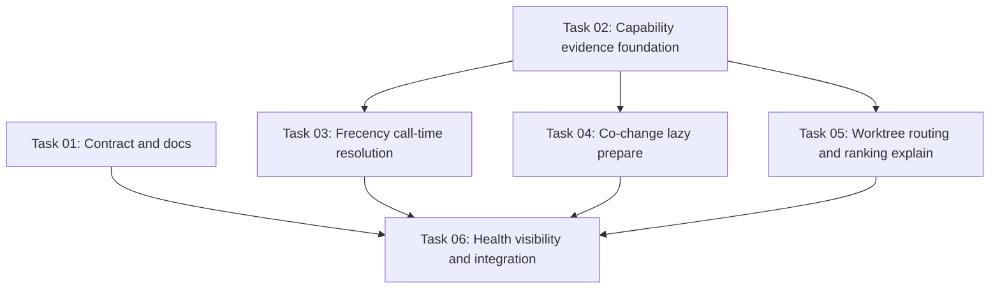

# Call-Time Capability Resolution + Derived Store Policy Prompt Pack

Date: 2026-05-16
Status: task prompt pack, not implementation
Intended runner: `/goal docs/plans/2026-05-16-call-time-capability-resolution/<task-file>.md`

## Purpose

This prompt pack turns the capability-router ideation brief into executable native `/goal` tasks. The work is intentionally scoped to one authoritative in-process SymForge index with call-time capability resolution and lazy/advisory derived stores. It does not ask agents to build a multi-process router, multi-tenant process swarm, or broad generic scoped-index system.

The product contract for this effort is simple:

```text
If a tool call requests an advertised capability, SymForge must apply it, prepare it and say so, explain why it is unavailable, or explain that policy disabled it.
```

Silent process-environment prerequisites are not acceptable for normal requested behavior.

## Source Material

Agents executing these tasks should read at least:

- `AGENTS.md`
- `README.md`
- `docs/ideas/2026-05-16-capability-router-scoped-index-ideation-brief.md`
- `docs/ideas/2026-05-16-call-time-capability-resolution-goal-task-authoring-prompt.md`
- `docs/plans/2026-05-15-symforge-post-h-roadmap.md`
- `.codex/get-shit-done/templates/phase-prompt.md`
- `.codex/get-shit-done/workflows/execute-plan.md`

Treat GSD materials as planning references. The generated task files are native `/goal` prompts first.

## Requirements

- `CCR-1`: Requested capabilities are honored at call time or return explicit unavailable/disabled evidence.
- `CCR-2`: Env vars are policy/default overrides, not silent feature gates for normal requested behavior.
- `CCR-3`: Frecency has safe default bump collection and deterministic `rank_by="frecency"` behavior.
- `CCR-4`: Co-change ranking uses lazy bounded preparation or clear fallback evidence on first use.
- `CCR-5`: Worktree routing works from `working_directory` without requiring `SYMFORGE_WORKTREE_AWARE=1`, unless policy disables it.
- `CCR-6`: Ranking debug information is available via call-time request without requiring `SYMFORGE_DEBUG_RANKING=1`.
- `CCR-7`: Health/capability visibility reports enabled, disabled, unavailable, preparing, ready, stale, and fallback states where relevant.
- `CCR-8`: Documentation explains env vars as operational policy knobs, including disable/default-on/persistence semantics.
- `CCR-9`: Tests prove call-time behavior for requested capabilities with env vars unset.
- `CCR-10`: The design preserves local-first, in-process read-path performance and avoids startup-heavy derived-store work.

## Execution Order

Run the tasks in this order unless repo inspection proves a safer sequencing.

```text
Wave 1
  Task 01: contract and docs
  Task 02: capability evidence foundation

Wave 2
  Task 03: frecency call-time resolution
  Task 04: co-change lazy prepare

Wave 3
  Task 05: worktree routing and ranking explain

Wave 4
  Task 06: health visibility and integration
```

Task 01 and Task 02 are disjoint enough to run in parallel if reviewers are comfortable. Task 03 and Task 04 both touch `src/protocol/tools.rs`; if two agents run them, merge Task 02 first and coordinate the `search_files` handler changes carefully. Task 05 should run after Task 03 and Task 04 because it extends the same public `search_files` response surface. Task 06 should run last.

## Dependency Graph



## Task Files

1. `/goal docs/plans/2026-05-16-call-time-capability-resolution/call_time_capability_resolution_task01_contract_and_docs.md`
2. `/goal docs/plans/2026-05-16-call-time-capability-resolution/call_time_capability_resolution_task02_capability_evidence_foundation.md`
3. `/goal docs/plans/2026-05-16-call-time-capability-resolution/call_time_capability_resolution_task03_frecency_call_time_resolution.md`
4. `/goal docs/plans/2026-05-16-call-time-capability-resolution/call_time_capability_resolution_task04_cochange_lazy_prepare.md`
5. `/goal docs/plans/2026-05-16-call-time-capability-resolution/call_time_capability_resolution_task05_worktree_and_debug_explain.md`
6. `/goal docs/plans/2026-05-16-call-time-capability-resolution/call_time_capability_resolution_task06_health_visibility_and_integration.md`

## Ownership Summary

| Task | Primary files | Primary tests |
| --- | --- | --- |
| 01 | `docs/decisions/0016-call-time-capability-resolution.md`, `README.md`, `docs/plans/2026-05-15-symforge-post-h-roadmap.md` | documentation grep checks |
| 02 | `src/capability/mod.rs`, `src/capability/state.rs`, `src/capability/policy.rs`, `src/lib.rs`, `src/protocol/format.rs` | `tests/capability_evidence.rs` |
| 03 | `src/live_index/frecency.rs`, `src/live_index/persist.rs`, `src/protocol/tools.rs`, `src/protocol/format.rs` | `tests/frecency_ranking.rs`, `tests/call_time_frecency.rs`, `tests/edit_hook_behavior.rs` |
| 04 | `src/live_index/coupling/lifecycle.rs`, `src/live_index/store.rs`, `src/protocol/tools.rs`, `src/protocol/format.rs` | `tests/cochange_fusion.rs`, `tests/call_time_cochange.rs`, `tests/coupling_refresh_generation_fence.rs` |
| 05 | `src/worktree.rs`, `src/protocol/edit_hooks.rs`, `src/protocol/tools.rs`, `src/protocol/format.rs`, `src/live_index/search.rs` | `tests/worktree_awareness.rs`, `tests/edit_hook_behavior.rs`, `tests/search_files_ranking_debug.rs` |
| 06 | `src/protocol/tools.rs`, `src/protocol/mod.rs`, `src/daemon.rs`, `src/protocol/format.rs`, `README.md` | `tests/capability_status_integration.rs`, `tests/schema_roundtrip.rs` |

If implementation discovers an extra required file, the agent must record it in the progress log and explain why it was necessary.

## Non-Goals

- No cloud service.
- No external control plane.
- No replacement of `LiveIndex` as the source of truth.
- No multi-process or multi-index router in this slice.
- No broad generic `scope` parameter in the first slice.
- No silent write rerouting.
- No default non-deterministic search behavior unless the caller explicitly requested adaptive ranking.

## Validation For This Prompt Pack

After editing the task files, run:

```powershell
git diff --check
rg -n "TODO|TBD|CCR-X|path/to/file|\[Specific|\[final outcome|example file path" docs\plans\2026-05-16-call-time-capability-resolution -g "!README.md"
```

The `rg` command must return no placeholder matches.

## Final Implementation Gate For The Whole Pack

The whole call-time capability effort should not be considered complete until:

- `rank_by="frecency"` with env vars unset either applies frecency evidence or returns explicit no-history/policy evidence.
- `rank_by="path+cochange"` with env vars unset either uses an existing store, starts bounded lazy prepare, or returns explicit unavailable/preparing evidence.
- Edit tools honor validated `working_directory` without requiring `SYMFORGE_WORKTREE_AWARE=1`, unless policy disables it.
- Ranking diagnostics can be requested by call-time parameter.
- Health or an equivalent status surface reports capability state.
- Full verification passes: focused tests, `cargo check`, `cargo test --all-targets -- --test-threads=1`, and `cargo build --release` when release-facing behavior changes.
