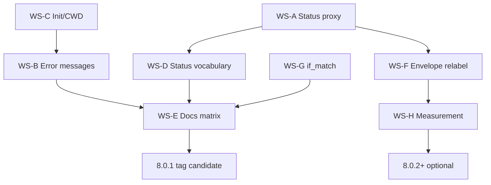

# SymForge v8 Trust Remediation — Advisory Effort Document

**Status:** Advice only — no implementation mandate in this file  
**Audience:** Implementing agent / maintainer on `feat/010-v8-trust-remediation` (or successor)  
**Date:** 2026-06-17  
**Scope:** Consolidate all June 2026 review findings into one remediation program  
**Goal:** Make SymForge **trustworthy to LLMs and robust for users** without rewriting the v8 architecture

---

## 1. How to use this document

This is **guidance**, not a spec kit task list. The implementing agent should:

1. Read the **source reviews** (§2) and **finding registry** (§3).
2. Pick workstreams in **phase order** (§5); do not start Phase 2 honesty relabeling before Phase 1 index/status truth — agents will still hit dead-end errors.
3. For each work item, choose an **approach option** (§6) based on time budget and product stance (*honest-heuristic now* vs *real predictor later*).
4. Close each item with **acceptance checks** (§7) and update **`docs/stel-assumptions.md`** where assumptions move (PARTIAL → VALIDATED or new OPEN).
5. **Do not** re-litigate items marked FIXED in `external-review-remediation-2026-06-17.md` unless a regression test fails.

If a finding here conflicts with `docs/stel-assumptions.md` phase gates, **the assumptions register wins for “what is proven”**; this doc wins for **“what to fix for agent trust.”**

---

## 2. Source review index

| Document | Role |
|----------|------|
| [`stel-v8-skeptic-audit-2026-06-17.md`](./stel-v8-skeptic-audit-2026-06-17.md) | Deepest STEL/economics/status audit; C1–C3, H1–H4, live contradictions |
| [`skeptical-senior-review-2026-06-17.md`](./skeptical-senior-review-2026-06-17.md) | Compact-surface dead-end, init/CWD, doc drift, dogfood evidence |
| [`external-review-remediation-2026-06-17.md`](./external-review-remediation-2026-06-17.md) | **Already fixed** security/operator items (do not redo) |
| [`specs/004-v8-operator-serve/review-findings-2026-06-16.md`](../specs/004-v8-operator-serve/review-findings-2026-06-16.md) | Operator spine; P1-A/B resolved; P3-A/B/C deferred |
| [`007-review-focus-2026-06-17.md`](./007-review-focus-2026-06-17.md) | Intelligence ports; fusion-empty fixed; footer sentinel sync |
| [`v8-architecture-review-codex-resume.md`](./v8-architecture-review-codex-resume.md) | Layering rationale; init allow-list undermines STEL |
| [`agent-review-plan-2026-06-17.md`](./agent-review-plan-2026-06-17.md) | Orchestration template for future verification passes |
| [`docs/stel-assumptions.md`](../stel-assumptions.md) | Canonical proof state (A-001…A-032) |

**Golden replay baseline:** `cargo test --test stel_golden_replay` → 6/6 pass; 3 tests skip without `tests/fixtures/phase0-corpus/` clone.

---

## 3. Consolidated finding registry

Crosswalk IDs unify reviews. Severity is **agent-trust** severity, not CVE severity.

| ID | Sev | Title | Primary sources | Status |
|----|-----|-------|-----------------|--------|
| **TR-01** | P0 | `status` reads empty proxy index while tools serve from daemon index | C3, P0-2 | OPEN |
| **TR-02** | P0 | Compact surface tells agents to call `index_folder` (blocked on default surface) | P0-1 | OPEN |
| **TR-03** | P0 | Cold start: MCP sessions with `index_ready: false` / wrong CWD / no root | P0-2, init | OPEN |
| **TR-04** | P0 | Token economics uses hardcoded 400/800; envelope claims “saved” while ledger shows loss | C1, C2, H1 | OPEN |
| **TR-05** | P0 | `session_net_vs_manual` is gross tokens, mislabeled as net savings | H2 | OPEN |
| **TR-06** | P0 | `if_match` checked pre-flight only; write path can TOCTOU-clobber | H1 | OPEN |
| **TR-07** | P1 | README / AGENTS.md / wiki still say “32 canonical tools” as default | P1-1 | OPEN |
| **TR-08** | P1 | `symforge init` allow-lists 32+ legacy tools not on compact wire | P1-1, H5 | OPEN |
| **TR-09** | P1 | Public claims outrun assumptions register (A-011, A-015, A-016 OPEN at 8.0) | P1-2 | OPEN |
| **TR-10** | P1 | `status` literals (`l*_active`, `handler_*`, `deferred:`) overstate or contradict reality | P1-3, M1, L4 | OPEN |
| **TR-11** | P2 | Envelope shows positive `session_net` on `decision: reject` | H1 (skeptical) | OPEN |
| **TR-12** | P2 | A-009 “VALIDATED” vs 3 magic-string multi-hop fixtures | H3 | OPEN (doc) |
| **TR-13** | P2 | Golden replay checks route shape, not `expected_equiv` | H4 | OPEN |
| **TR-14** | P2 | `symforge_edit` apply contract vs module “deferred” doc | H3 (skeptical) | OPEN |
| **TR-15** | P2 | Daemon IPC vs external MCP contract undocumented for operators | H4, P2-4 | DOC |
| **TR-16** | P3 | Assumptions register duplicate tables (A-005 OPEN vs VALIDATED) | M1 | OPEN |
| **TR-17** | P3 | Durable ledger: `unavailable` vs `disabled` vs `disabled (open failed)` | M5 | OPEN |
| **TR-18** | P3 | Ledger retention, migration forward guard, rmcp pin (004 P3-A/B/C) | 004 review | DEFERRED |
| **TR-19** | — | Security batch (Origin, compact gate, key redaction, ledger drain) | external remediation | **FIXED** |
| **TR-20** | — | Find-fusion empty union → `EmptyResult` | external remediation | **FIXED** |

---

## 4. North star (definition of done)

Remediation is **complete enough to promote v8 default MCP** when all of the following hold:

1. **Observable truth:** After a successful `symforge` query, `status` reports the **same** index counts the query used (daemon-proxy regression test).
2. **Recoverable cold start:** Fresh MCP attach to a repo reaches `index_ready: true` **or** returns a compact-surface error that names **only callable** recovery steps.
3. **Honest economics:** Envelope fields distinguish `heuristic` vs `measured`; no field named `saved` or `net` unless the formula matches the label (or field is renamed).
4. **Safe apply:** `symforge_edit apply:true` with `if_match` cannot succeed if on-disk body diverged after pre-flight (test with concurrent write simulation).
5. **Aligned docs:** README + AGENTS.md + init allow-lists describe **compact-3 default**; legacy 32-tool surface documented as opt-out.
6. **Capability matrix published:** One page mapping features → assumption IDs → Implemented / Heuristic / Observational / Deferred.
7. **CI green:** Full repo gate per `CLAUDE.md`; golden replay passes; new regression tests for TR-01, TR-02, TR-06.

Partial completion is acceptable for **8.0.1** if TR-01–TR-03 and TR-07–TR-10 ship first; TR-04–TR-06 can follow in **8.0.2** only if economics relabeling ships before any “token savings” marketing.

---

## 5. Phased delivery (recommended)

```text
Phase 1 — Truth & recovery (agent can use the tool)
  WS-A Status/index proxy
  WS-B Compact cold-start & error messages
  WS-C Init / onboarding / CWD

Phase 2 — Honest surfaces (agent can trust labels)
  WS-D Status vocabulary & deferred list
  WS-E Public docs & capability matrix
  WS-F Envelope & ledger field honesty (relabel before recalibrate)

Phase 3 — Safety & measurement (agent can mutate safely; team can prove claims)
  WS-G if_match write-path enforcement
  WS-H Predictor grounding OR explicit heuristic mode
  WS-I Golden replay & assumption register cleanup

Phase 4 — Operator & deferred hardening (optional 8.1)
  WS-J Operator docs, ledger retention, P3 items
```

**Rule:** Do not ship Phase 2 README “token-efficient” language until Phase 2F relabeling lands, or you repeat TR-09.

---

## 6. Workstream advice

### WS-A — Status/index truth (TR-01)

**Problem:** `status_stel_tool` reads `self.index` on the daemon-proxy front-end; proxied tools use the daemon’s warm index. Live: explore works, `index_files: 0`.

**Approach options (pick one):**

| Option | Effort | Pros | Cons |
|--------|--------|------|------|
| **A1 — Proxy `status` to daemon** | Medium | Single source of truth; matches explore | Requires new daemon RPC arm + `proxy_tool_call("status", …)` |
| **A2 — Reuse proxied `health` / `health_compact` fields** | Low–medium | Health already aggregates index facts | Compact surface blocks legacy `health*` unless you embed subset in `status` |
| **A3 — Populate front-end index in proxy mode** | High | Local reads stay fast | Duplicates daemon state; sync hazard |

**Recommendation:** **A1** first, with **A2** as fallback for index counts only (not full health payload).

**Touch:** `src/protocol/tools.rs` (`status_stel_tool`), `src/protocol/mod.rs` (`proxy_tool_call`), `src/daemon.rs` (`execute_tool_call`), tests mirroring `test_get_repo_map` daemon-proxy patterns.

**Acceptance:** Integration test: daemon-proxy server, successful `symforge` serve, then `status` → `index_files > 0`, `index_ready: true`.

---

### WS-B — Compact recovery & error messages (TR-02, TR-03)

**Problem:** `format.rs` index-not-loaded message references `index_folder`; compact gate rejects it.

**Approach options:**

| Option | Effort | Pros | Cons |
|--------|--------|------|------|
| **B1 — Fix root cause: auto-index before first tool** | Medium | Best UX; no new surface | Daemon/CWD/init must be fixed (WS-C) |
| **B2 — Compact-safe bootstrap via `symforge intent=meta`** | Medium | Keeps 3-tool surface | New routing + docs |
| **B3 — Surface-aware error strings** | Low | Fast; stops dead-end loop | Doesn’t index by itself |
| **B4 — Expose `index_folder` on compact** | Low | Minimal code | Violates STEL surface doctrine; re-expands schema story |

**Recommendation:** **B1 + B3** together. **Avoid B4** unless product explicitly abandons compact-3 purity.

**B3 message guidance (compact surface):**

- If index empty and auto-index will run: *“Index loading; retry symforge or call status.”*
- If auto-index disabled: *“Index empty. Operator: set SYMFORGE_AUTO_INDEX=1 and restart, or SYMFORGE_SURFACE=full for index_folder.”*
- Never mention a tool name not in `COMPACT_TOOL_NAMES` without naming the env opt-out.

**Touch:** `src/protocol/format.rs`, `src/stel/edit_apply.rs`, STEL chain failure footers in `src/protocol/tools.rs`, `src/main.rs` (`local_empty_reason` → expose via `status` full detail).

---

### WS-C — Init, onboarding, CWD (TR-03, TR-08)

**Problem:** Claude Desktop wrapper `cd`s to `%USERPROFILE%`; MCP env `{}`; allow-lists grant nonexistent tools.

**Advice:**

1. **`symforge init`** should write MCP `env` with documented keys, e.g.:
   - `SYMFORGE_SURFACE=compact` (explicit, even if default)
   - Optional `SYMFORGE_PROJECT_ROOT` or pass `--root` in args where client supports it
   - Platform policy: document why Linux Codex gets `SYMFORGE_NO_DAEMON=1` and Windows does not
2. **Desktop wrapper:** cd to configured workspace (init prompt) or project root discovered at init time — not `%USERPROFILE%`.
3. **Allow-lists:** Replace `SYMFORGE_TOOL_NAMES` default with compact-3 names + `status`; move legacy list to a **`--surface full`** init path or separate “legacy client profile.”
4. **Branch `feat/009-operator-setup-wizard`:** If setup wizard lands, it should become the **single** source of env + root + surface — avoid duplicating init logic.

**Acceptance:** Init integration test: after `init --client codex` in temp repo, simulated MCP env discovers project root; dogfood `status` shows non-zero files without manual `index_folder`.

---

### WS-D — Status vocabulary (TR-10, TR-11)

**Problem:** Unconditional `l4_ledger: active` while `durable_ledger: unavailable`; frozen `DEFERRED_ITEMS` string.

**Advice — replace boolean “active” with enumerated states:**

```text
l4_ledger: in_memory | in_memory+durable | unavailable
handler_symforge_edit: preview_only | preview_and_apply
calibration: observational_insufficient | observational | tuned
index_state: ready | empty | loading | degraded
empty_index_reason: <mirror startup local_empty_reason>
deferred: <computed from feature flags, not const string>
```

**Touch:** `src/stel/status.rs`, `StelStatusContext` construction in `tools.rs`, update compact/full golden strings in tests.

**Do not:** Remove the deferred concept — it is one of the honest parts; make it **accurate**.

---

### WS-E — Public docs & capability matrix (TR-07, TR-09)

**Deliverables (docs only, but blocking for trust):**

1. **`docs/v8-capability-matrix.md`** (new) — table:

   | Capability | Shipped code | Measured (assumption) | Agent-facing tool |
   |------------|--------------|------------------------|-------------------|
   | Compact-3 surface | Yes | A-005 VALIDATED | symforge, status, symforge_edit |
   | Token predictor ±20% | Heuristic constants | A-011 OPEN | envelope `predicted` |
   | … | … | … | … |

2. **README.md** — Lead with compact-3; move 32-tool table under “Full surface (`SYMFORGE_SURFACE=full`)”.
3. **AGENTS.md** + **CLAUDE.md** — Same split; point agents to `status` before bulk symforge.
4. **CHANGELOG** — Note doc alignment (not a semver break).

**Tone rule:** Use *“heuristic economics (observational)”* not *“proven token savings”* until A-011 closes.

---

### WS-F — Envelope & ledger honesty (TR-04, TR-05, TR-11)

**Two product stances — pick explicitly:**

#### Stance F-Short (recommended for 8.0.1)

**Relabel, don’t recalibrate yet.**

- Rename envelope fields: `estimated_saved_vs_manual_heuristic`, `session_tokens_served` (not `session_net_vs_manual`).
- Prefix body when `decision != serve`: `economics: observational_heuristic; not_served`.
- Ledger DB columns: `estimated_response_tokens`, `assumed_manual_baseline` until real tokenizer lands (TR M4).
- `calibration:` thread real `summarize_calibration` state, not hardcoded `"pending"` (`handler.rs`).
- Update `docs/stel-assumptions.md`: A-011 remains OPEN but **surfaces no longer imply validation**.

#### Stance F-Long (8.0.2+ / 8.1)

**Ground predictor in index.**

- Populate `IndexRef.raw_chars` in `planner.rs` from live index for path-scoped plans.
- Derive `est_response_tokens` from bytes/lines + tool-specific caps (start with explore/search_text).
- Re-run sf-bench subset; move A-011 toward PARTIAL with artifact path.

**Critical:** Stance F-Long without F-Short first **extends the lie window**. Do F-Short first even if F-Long is planned.

**C2 economics gate:** Until predictor is real, consider:

- Narrowing `SERVE_MARGIN` test to use **post-hoc** caps only, or
- Documenting that L2 gate is **nominal** and serve-always for non-P-FF rows (honest status line: `l2_economics: pass_through_heuristic`).

---

### WS-G — `if_match` write safety (TR-06)

**Problem:** Pre-flight under `read()` lock; `replace_symbol_body` re-resolves from disk without `if_match`.

**Approach options:**

| Option | Effort | Notes |
|--------|--------|-------|
| **G1 — Re-check immediately before `atomic_write_file`** | Medium | Minimal API change; keep delegation |
| **G2 — STEL handler owns splice+write** | Higher | Strongest guarantee; less reuse of edit_tools |
| **G3 — Pass validated body hash into edit_tools** | Medium | Single hash compare at write |

**Recommendation:** **G1 + test** with temp file mutated between pre-flight and write (must fail apply).

**Also:** Tee snapshot remains best-effort (L2 in skeptic audit); document in tool description — do not claim “transactional undo.”

---

### WS-H — Measurement & assumptions (TR-12, TR-13, TR-16)

**Advice:**

1. **Demote A-009** in `stel-assumptions.md` to **PARTIAL (3 fixture strings; general planner deferred)** — align with `status` `multi_step_planner` deferred.
2. **Golden replay:** Either implement `expected_equiv` assertion against pinned golden bodies, or remove field from JSONL to stop implying measurement.
3. **Clone phase0 corpora** into CI (or document mandatory submodule) so skipped tests run in CI.
4. **Deduplicate assumptions register** — one row per A-ID; generate Phase 0 evidence links from JSON if needed.

**Do not:** Mark A-008 “95% trajectory” VALIDATED without `compare-results.js` + numeric artifact.

---

### WS-I — Operator & deferred (TR-15, TR-17, TR-18)

**Doc-only (quick):**

- Operator guide section: **External MCP contract** = stdio/`/mcp` `call_tool` + compact gate. **Internal** = daemon hook IPC (full tools OK).
- Distinguish `durable_ledger: unavailable` (stdio/embed) vs `disabled (reason)` (serve open failed).

**Deferred (8.1):** P3-A migration guard, P3-B retention, P3-C rmcp pin — track in `live-code-backlog.md`; don’t block 8.0.1.

---

## 7. Verification gates (mandatory before merge)

Run after **each phase**, not only at end:

```bash
cargo fmt --check
cargo clippy --all-targets -- -D warnings
cargo check --all-targets
cargo test --all-targets -- --test-threads=1
cargo build --release
cargo check --no-default-features --features embed
cd npm && npm test   # if MCP/npm touched
```

**New tests to add (minimum):**

| Test | Covers |
|------|--------|
| `status_index_matches_daemon_proxy_after_symforge_serve` | TR-01 |
| `compact_surface_index_not_loaded_message_never_mentions_blocked_tools` | TR-02 |
| `symforge_edit_if_match_rejected_after_concurrent_disk_change` | TR-06 |
| `envelope_reject_does_not_claim_net_savings` (or renamed fields) | TR-11 |
| `init_compact_allow_list_matches_list_tools` | TR-08 |
| `surface_default_compact` (extend existing) | regression TR-19 |

**Dogfood checklist (manual, deployed binary):**

1. Reconnect MCP; `status` compact → note index fields.
2. `symforge` orient query → succeeds.
3. `status` full → index counts **match** step 2.
4. `symforge_edit` preview on known symbol → envelope honest.
5. Compare envelope `session_*` field names to capability matrix.

---

## 8. Sequencing & dependencies



**Parallelizable:** WS-C (init) and WS-A (daemon status) in parallel by different owners; WS-E (docs) can start after WS-D field names are frozen.

**Blockers:** WS-F Stance F-Long **depends on** WS-A (need real index bytes in planner).

---

## 9. Effort sizing (rough, advisory)

| Phase | Workstreams | Person-days (1 senior Rust) | Risk |
|-------|-------------|----------------------------|------|
| 1 | A + B + C | 4–7 | Daemon RPC design |
| 2 | D + E + F-short | 3–5 | Doc churn across wiki |
| 3 | G + H | 5–10 | Predictor scope creep |
| 4 | I | 1–2 doc; 3–5 if P3 code | Low urgency |

**Total to “agent-trust MVP” (Phases 1–2):** ~1–2 weeks focused.  
**Total including predictor + golden equiv (Phase 3):** +2–3 weeks.

---

## 10. What NOT to do

1. **Do not** revert compact-3 default or re-expose 32 tools on the wire “to fix indexing.”
2. **Do not** mark A-011/A-015/A-016 VALIDATED because labels improved — relabeling ≠ validation.
3. **Do not** gate daemon hook IPC on compact surface (breaks dogfooding; see TR-19 doc path).
4. **Do not** run a README “token savings” campaign until WS-F-short ships.
5. **Do not** conflate **8.0 architecture ship** with **economics proof ship** — the assumptions register already separates these; keep it that way.
6. **Do not** fix TR-01 by hiding index fields from compact `status` — that trades one lie for another.

---

## 11. Suggested branch / spec structure (for implementing agent)

Optional structure — not prescriptive:

```text
feat/010-v8-trust-remediation
├── Phase 1 commits (WS-A,B,C) — "fix(status): proxy index facts in daemon mode"
├── Phase 2 commits (WS-D,E,F-short) — "docs: v8 capability matrix; relabel envelope"
├── Phase 3 commits (WS-G,H) — "fix(edit): enforce if_match at write"
└── specs/010-v8-trust-remediation/  (if using Spec Kit: plan.md + tasks.md mirroring §5–§6)
```

Merge strategy: **stacked PRs per phase** or single PR with phase labels in commit messages — maintainer preference.

Release: **8.0.1** after Phase 1+2; **8.0.2** after Phase 3 if predictor/heuristic split needs time.

---

## 12. Success metrics (post-remediation)

| Metric | Before | Target |
|--------|--------|--------|
| Live `status` index vs served query | Contradictory (0 vs N) | Always consistent |
| Compact error mentions blocked tools | Yes (`index_folder`) | Never |
| Envelope field mislabel incidents | `session_net_vs_manual` | Renamed or formula-correct |
| README default surface | 32 tools | Compact-3 |
| Open TR-critical items | 6 P0-class | 0 |
| A-011 status | OPEN (hidden by UI) | OPEN (explicit in matrix) or PARTIAL with artifact |

---

## 13. Closing advice

The v8 rework’s **architecture bet is defensible**; the **trust debt is in the presentation layer** — status, envelope, errors, init, and public docs — not in LiveIndex, auth, or ledger engineering.

The cheapest high-leverage move is **make every LLM-visible string either true or explicitly labeled heuristic**. The most dangerous lingering bug is **TR-01 (status vs daemon index)** because it teaches agents the tool is broken even when it works, and **TR-06 (`if_match`)** because it teaches agents a safety guarantee that is not kept.

Prioritize **truth → recovery → labels → safety → measurement**. The implementing agent has full reports; this document is the map, not the territory.

---

*Advisory document only. No code changes implied by this file.*
