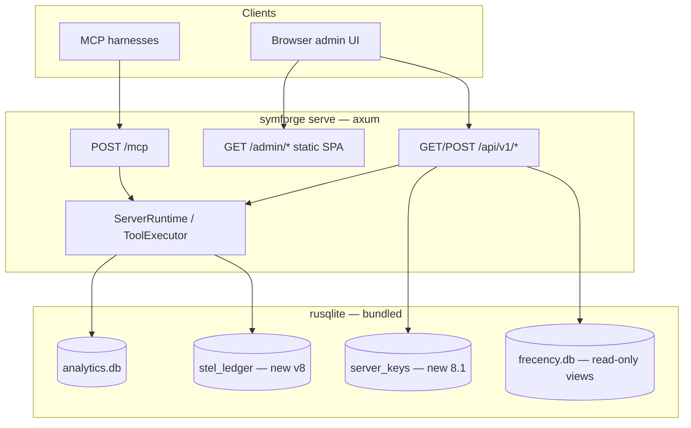

# SymForge v8 — Admin web UI (planning)

**Status:** PLANNED — not blocking Phase 0 or 8.0  
**Branch:** `v8/stel-architecture`  
**Companion:** [`v8-master-plan.md`](v8-master-plan.md) · [`ideation.md`](ideation.md) · [`v8-gap-closure-plan.md`](v8-gap-closure-plan.md)

---

## Why capture this now

v8 is not only an MCP protocol change — it is a **deployable server product**. Operators need to see economics proof, index health, and credentials without reading MCP responses or CLI JSON. Planning the admin UI **up front** keeps one process, one auth story, and one SQLite stack — instead of bolting on a dashboard after `symforge serve` ships.

**Not in scope:** multi-tenant SaaS, OAuth/SSO, billing (see [`ideation.md`](ideation.md) non-goals).

---

## Where it fits in the release map

| Release | Admin / ops surface | Notes |
|---------|---------------------|-------|
| **7.x (today)** | CLI only (`symforge analytics …`); sidecar `GET /health` JSON; daemon REST | Fragmented; no unified UI |
| **8.0.0** | **`symforge_status` MCP tool** + CLI | Agent-facing battery headline; **no web UI yet** |
| **8.1.0** | **`symforge serve`** + **admin UI MVP** on same axum server | MCP `/mcp` + `/admin` + JSON API |
| **8.2+ (optional)** | Dashboard polish, charts, export UX | After H6/H8 green; not gated |

```text
Phase 0   → harness + golden file (no UI)
Phase 1–3 → STEL + L4 ledger schema in SQLite (data layer for future dashboard)
Phase 4   → symforge serve + admin MVP ships with 8.1.0
```

---

## Architecture (one process)



**Invariant:** Admin routes use the **same** `ServerRuntime` as MCP (G-034) — no duplicate tool dispatch or index handles.

---

## Existing SQLite (reuse, don’t duplicate)

| Store | Path | Today | Admin use |
|-------|------|-------|-----------|
| Analytics | `.symforge/analytics.db` | `analytics_tool_calls` — bytes, tokens, duration, outcome | Tool activity panel |
| Frecency | `.symforge/frecency.db` | File bump scores | Index/search health (read-only) |
| Coupling | coupling store | Co-change evidence | Optional “search quality” panel |
| **STEL ledger** | `.symforge/stel_ledger.db` *(planned)* | Per-row economics events (L4) | **Battery dashboard** — `session_net_accepted`, bypass rate |
| **Server config** | server-local or `.symforge/server.db` *(planned)* | API keys (hashed), bind policy, retention | Settings panel |

Rusqlite is already a dependency (`bundled` feature). Extend schemas with migrations; do not add Postgres/Redis for v8.

---

## Admin UI MVP (8.1 — Phase 4.7)

Ship with **`symforge serve`**, not before.

| Panel | Data source | Operator action |
|-------|-------------|-----------------|
| **Economics battery** | `stel_ledger_events` + cached compare-results rollup | View H1–H8 snapshot, session net |
| **Live session** | In-memory session registry + ledger tail | See active MCP sessions |
| **Projects / repos** | ProjectRegistry (from daemon merge) | List indexed roots, symbol/file counts, reindex trigger |
| **Index health** | LiveIndex published state + watcher | Status, last error, checkpoint |
| **Tool activity** | `analytics_tool_calls` aggregates | Top tools, outcome classes |
| **Settings** | `server_keys` + env | Rotate MCP API key, optional admin key, surface mode, retention |

**Frontend:** static assets embedded in binary (`rust-embed` / `include_dir`) or `--admin-static DIR`. Prefer small SPA or HTMX — **no separate Node server**.

**Auth:**

- `Authorization: Bearer` on `/api/v1/*` and `/admin` (separate **admin** scope optional).
- Default bind **loopback**; non-loopback requires explicit flag + warning in UI (G-033).
- Retire unauthenticated standalone sidecar HTTP when unified server lands.

---

## JSON API sketch (Phase 4)

| Method | Path | Purpose |
|--------|------|---------|
| GET | `/health` | Liveness (minimal; may stay public) |
| GET | `/api/v1/stats/summary` | Ledger + analytics rollup |
| GET | `/api/v1/stats/gates` | Last compare-results gate pass/fail |
| GET | `/api/v1/projects` | Indexed projects |
| POST | `/api/v1/projects/{id}/reindex` | Trigger reindex (governor-gated) |
| GET | `/api/v1/sessions` | Open MCP sessions |
| GET | `/api/v1/settings` | Redacted config |
| POST | `/api/v1/keys/rotate` | New MCP key (local operator only) |

CLI may call the same endpoints later (`symforge stats --url …`) — API first, UI second.

---

## Phase-by-phase coding dependencies

| Phase | Admin-related work | Blocks UI? |
|-------|-------------------|------------|
| **0** | None | — |
| **1** | Optional: measure schema bytes script (A-005) | No |
| **2** | Controller emits structured trust envelope (feeds ledger) | No |
| **3** | **`StelLedgerEvent` → rusqlite** (L4); `symforge_status` = battery headline | **Yes — data model** |
| **4.1–4.3** | `symforge serve`, ServerRuntime merge, auth model | **Yes — transport + auth** |
| **4.7** | Admin static + `/api/v1/*` routes | Ships 8.1 MVP |
| **8.2+** | Charts, export CSV, dark mode, i18n | No |

**Rule:** Do not show hook `TokenStats` as v8 economics in the UI (G-NEW-4). Dashboard reads **ledger rows** only.

---

## Gap register

| ID | Gap | Closure | Phase |
|----|-----|---------|-------|
| **G-037** | No operator web UI | Admin MVP on `symforge serve` | 4.7 / 8.1 |
| **G-038** | No `stel_ledger` SQLite schema | Migration in L4 (Phase 3) | 3 |
| **G-039** | No product API-key store | Hashed keys in server DB; `init --url` | 4.4 |

Depends on: **G-020** (serve), **G-034** (ServerRuntime), **G-033** (sidecar auth).

---

## Assumptions (register when implementing)

| ID | Assumption | Validate |
|----|------------|----------|
| **A-040** | Operators want local web UI, not CLI-only, when running `symforge serve` | 2-user smoke on loopback |
| **A-041** | Embedded static UI keeps deploy one-binary | Cross-platform serve test |
| **A-042** | Ledger SQLite query latency OK for dashboard refresh (<100ms on 10k rows) | Benchmark on dev machine |

Add to [`stel-assumptions.md`](stel-assumptions.md) when Phase 4 planning starts — not blocking Phase 0.

---

## Decision log

| Date | Decision |
|------|----------|
| 2026-06-12 | Admin web UI planned for **8.1** with `symforge serve`; rusqlite-backed; single-tenant local ops; MVP in Phase 4.7 after L4 ledger exists |

---

*Update this doc when admin scope or phase order changes; link from ideation decision log.*
