# SymForge v8 — Architecture diagrams (external review pack)

**Purpose:** Self-contained visual reference for humans and external LLMs.  
**Start here first:** [`v8-bootstrap.md`](v8-bootstrap.md) — full session brief. This file is the **diagram supplement**.

**Related specs:** [`ideation.md`](ideation.md) · [`v8-gap-closure-plan.md`](v8-gap-closure-plan.md) · [`stel-schema.md`](stel-schema.md)

---

## 0. One-page context (read this first)

**SymForge** is a local-first **code-intelligence MCP server**: live symbol index (19 languages), search, reference tracing, structural edits, trust-labeled responses.

**v8 paradigm shift:**

| Old (7.x) | New (v8) |
|-----------|------------|
| 32 MCP tools always in `tools/list` (~62 KB schema) | **3 public tools** ≤ 5 KB (`symforge`, `symforge_edit`, `symforge_status`) |
| Agent picks tools; pays schema tax every session | **STEL** routes internally in **one MCP call** |
| Silent truncation / inflated health metrics | **Trust envelope** + honest **bypass** when SymForge would cost more than manual |
| stdio-only, daemon + sidecar sprawl | **8.1:** unified **`symforge serve`** + URL + API key (Streamable HTTP) |

**North star:** Every **accepted serve** call beats competent manual (`grep` + ~50-line read) **or** SymForge returns an explicit **BYPASS** (use Read/grep). Measured by harness gates **H1–H8** — not by beating 7.21.1 scores.

---

## 1. End-state system (SymForge 8.1)

What we are building when complete.

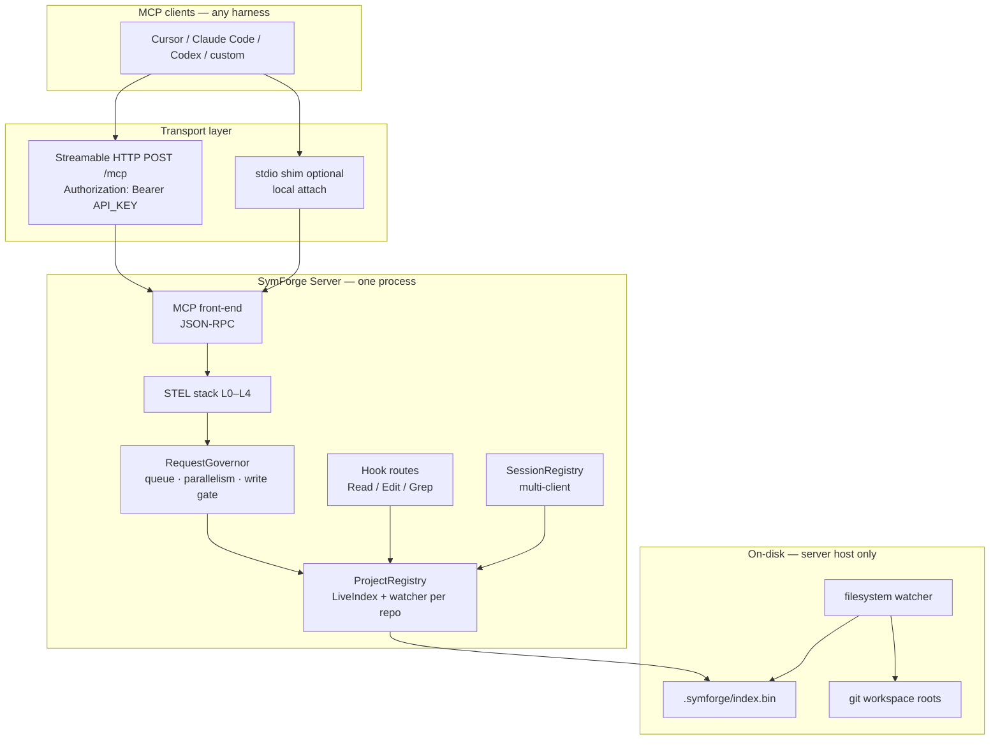

**Invariant:** Index and repo live on the **same machine** as the server. Remote clients attach over the network; they do not remote-index arbitrary paths.

---

## 2. STEL — SymForge Tool Execution Layers

Internal intelligence stack inside the server. **Only L0 is visible in compact MCP `tools/list`.**

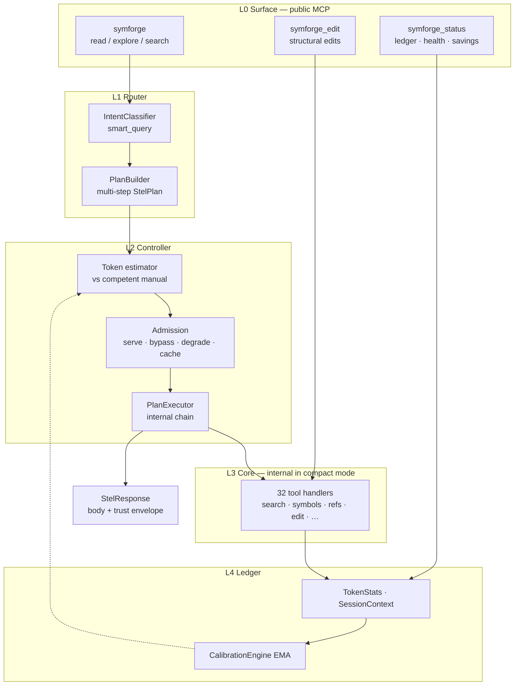

---

## 3. Single MCP call — request lifecycle

One `symforge` call = full L1→L4 pipeline (target **H5:** ≤1 MCP round-trip per task).

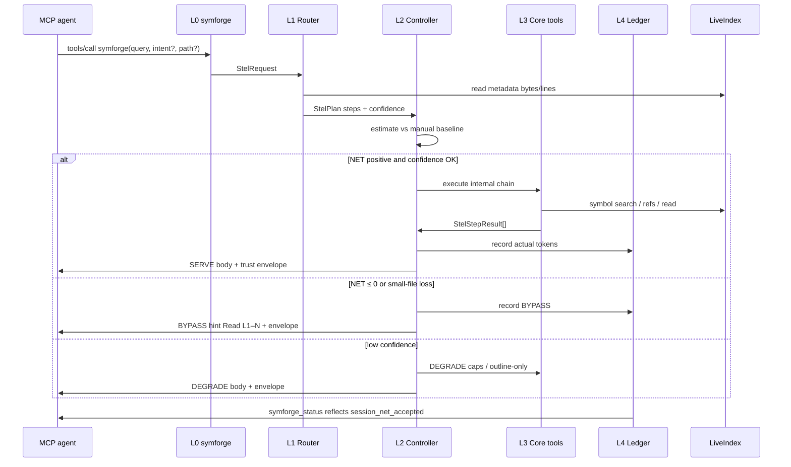

---

## 4. Controller admission — decision logic (L2)

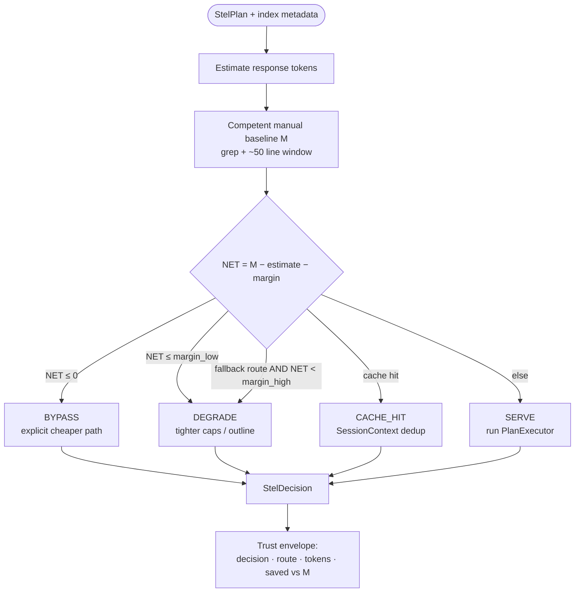

**Bypass success** = honest economics, not a failed answer. **BYPASS rows excluded from H6 equivalence denominator.**

---

## 5. MCP surface — compact vs internal

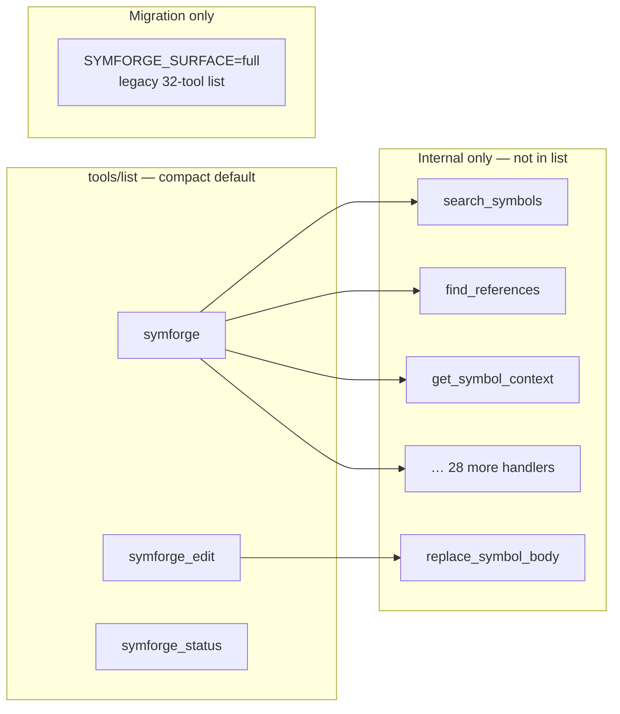

**H1 gate:** JSON schema for visible tools ≤ **5,000 bytes**.

---

## 6. Server runtime — multi-project, multi-session

Evolution of today’s daemon into unified server (8.1).

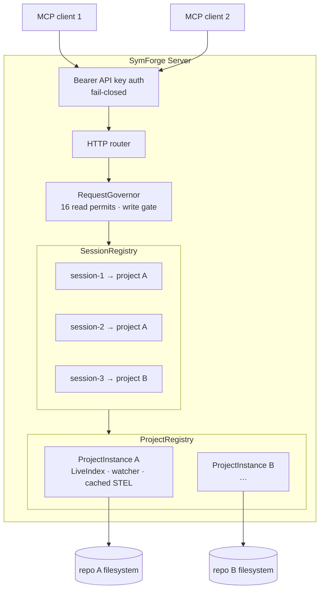

---

## 7. Deployment topologies

### 7a. SymForge 8.0 — development / local

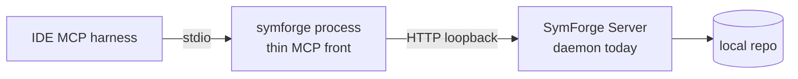

### 7b. SymForge 8.1 — recommendable attach

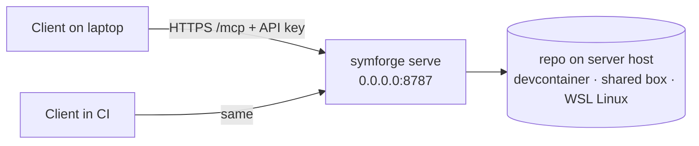

**Config shape (any harness):**

```json
{
  "mcpServers": {
    "symforge": {
      "type": "streamable-http",
      "url": "http://HOST:8787/mcp",
      "headers": { "Authorization": "Bearer YOUR_API_KEY" }
    }
  }
}
```

---

## 8. Release roadmap — what ships when

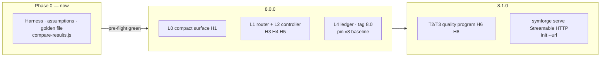

| Release | Transport | Gates |
|---------|-----------|-------|
| **8.0.0** | stdio MCP | H1–H5, H7 |
| **8.1.0** | + Streamable HTTP | H6, H8, deploy |

---

## 9. Proof pipeline — how we know v8 wins

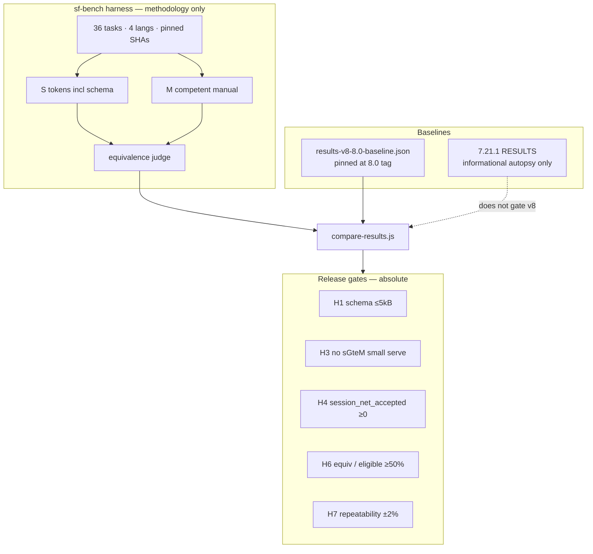

---

## 10. Paradigm comparison — 7.x vs v8

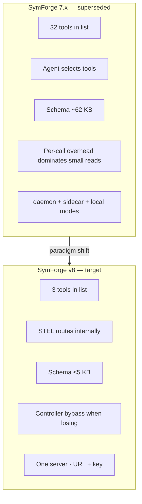

---

## 11. Trust envelope — what every response exposes

```mermaid
flowchart LR
  subgraph response [StelResponse]
    BODY[Answer body or BYPASS hint]
    ENV[Trust envelope]
  end

  subgraph env_fields [Envelope fields]
    R[route / intent]
    C[confidence exact|inferred|fallback]
    D[decision serve|bypass|degrade|cache]
    TS[tokens served]
    SM[saved vs competent manual M]
    EQ[equivalence note if sampled]
  end

  ENV --> env_fields
  BODY --> Agent[MCP agent can cite economics]
  ENV --> Agent
  env_fields --> STATUS[symforge_status session ledger]
```

---

## 12. Data flow — index and edits

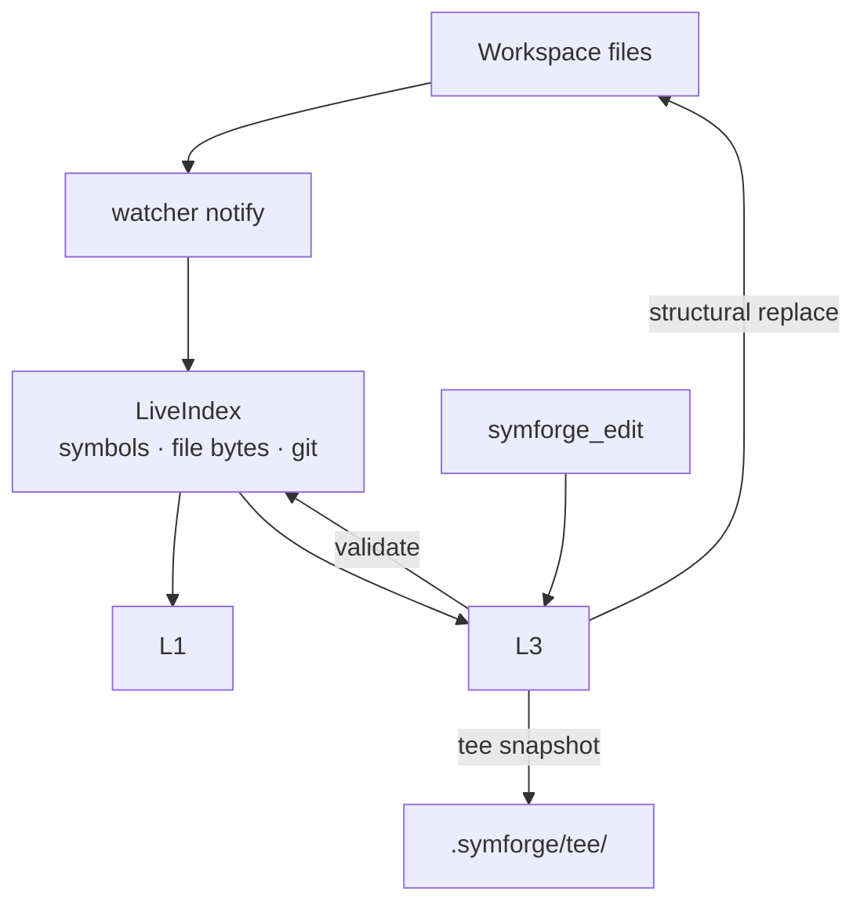

---

## 13. Assumption & phase gate flow

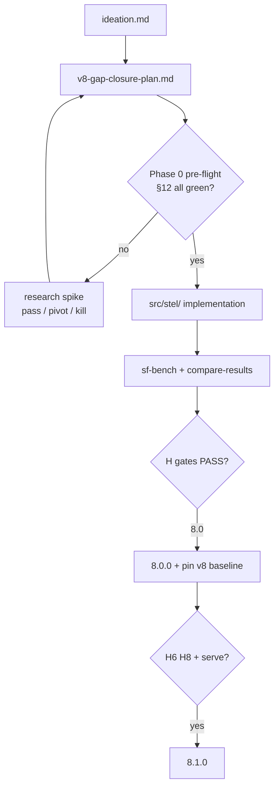

---

## 14. Component map — design to code (proposed)

| Diagram region | Existing code (7.x) | v8 module (proposed) |
|----------------|---------------------|----------------------|
| LiveIndex + watcher | `live_index/`, `watcher/` | unchanged |
| 32 core handlers | `protocol/tools.rs` | L3 internal |
| Router seed | `protocol/smart_query.rs` | `stel/router.rs` |
| ask + envelope | `tools.rs` ask | L0 `symforge` |
| Token baselines | `protocol/format.rs` | L2 controller |
| TokenStats | `sidecar/`, session | L4 ledger |
| Daemon + governor | `daemon.rs`, `sidecar/governor.rs` | unified server |
| MCP stdio | `main.rs` rmcp | 8.0 default |
| Streamable HTTP | *not implemented* | 8.1 `serve` + rmcp |

---

## 15. Questions for external reviewers

Use these when asking another LLM to critique the design:

1. **Controller:** Is bypass-as-success sufficient for agent workflows, or do agents ignore BYPASS hints and retry SymForge (retry loop tax)?
2. **H6 vs economics:** With BYPASS excluded from equivalence, is 50% on eligible rows the right bar for 8.1?
3. **Compact surface:** Is 3 tools optimal vs 1–2 meta-tools (assumption A-019)?
4. **Schema accounting:** Is ÷50 amortization in the harness misleading for real Cursor sessions (A-006)?
5. **T2/T3:** Is reference completeness an index problem, sidecar grep problem, or formatter problem — which diagram layer owns the fix?
6. **Serve topology:** Any security or ops gap in Bearer-key + Streamable HTTP on LAN without TLS?
7. **Missing diagram:** What aspect of this architecture is still under-specified?

---

*Document version: 2026-06-12 · amend when architecture changes; keep diagrams in sync with [`stel-schema.md`](stel-schema.md).*
