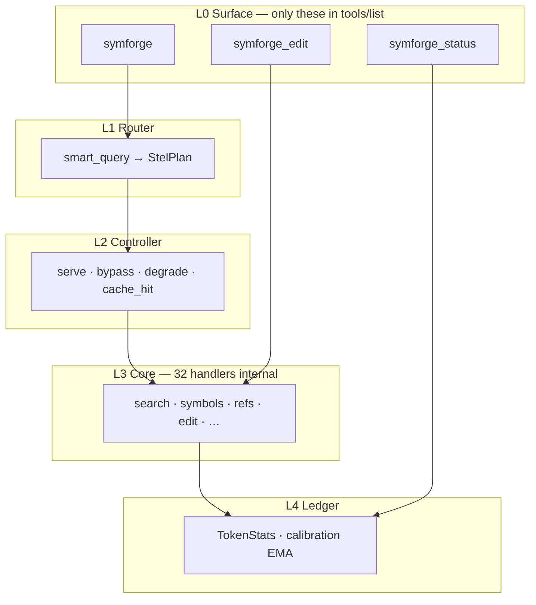
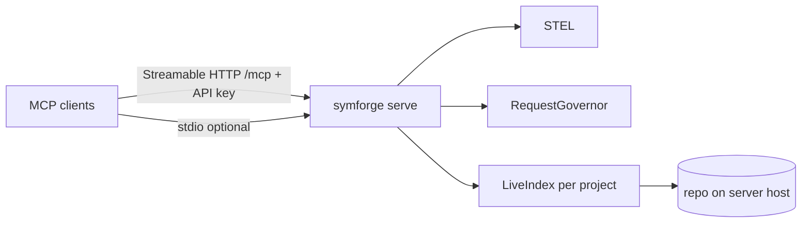
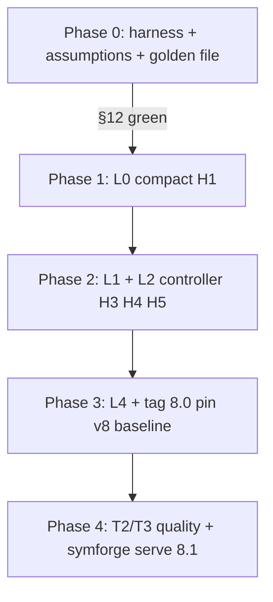

# SymForge v8 — Bootstrap brief (START HERE)

> **Use this file as the single entry point** when briefing an external LLM, reviewer, or contributor.  
> Branch: `v8/stel-architecture` · Current shipped version: **7.21.1** · Target: **8.0.0** → **8.1.0**  
> Status: **PRE-IMPLEMENTATION** — design + docs complete; `src/stel/` blocked until pre-flight green.

---

## Instructions for the reviewing LLM

You are reviewing **SymForge v8**, a major paradigm shift for a Rust code-intelligence MCP server. Your job:

1. **Use branch `v8/stel-architecture`** — v8 docs and the gap analysis assume this branch. `main` may still be 7.x-only; do not review from default branch without checking.
2. **Read this document fully** — it is the session memory for the v8 effort.
3. **If you have repo access**, checkout that branch, then inspect the code paths in [§10 Code inspection checklist](#10-code-inspection-checklist) and compare to [§4 Gap: design vs today](#4-gap-design-vs-today).
4. **Read linked docs in [§11 Document library](#11-document-library)** for depth (schema types, gap closure, diagrams).
5. **Answer or challenge** the questions in [§13 Reviewer questions](#13-reviewer-questions).
6. **Do not treat 7.x benchmark scores as v8 success criteria** — see [§2 Paradigm shift](#2-paradigm-shift).

**What we want from you:** blind spots, contradictions, under-specified flows, feasibility risks, and concrete suggestions — especially where the existing codebase must change to achieve the north star.

---

## 1. Mission (why v8 exists)

**SymForge** helps AI coding agents understand and edit codebases via MCP. It maintains a **live symbol index** (tree-sitter, 19 languages), symbol-aware search, reference tracing, structural edits, and trust-labeled responses.

**v8 exists because the old product fails its own promise on token economics:**

- **7.x** exposes **32 MCP tools** (~62 KB JSON schema) — agents pay a large fixed tax before any useful payload.
- Many calls **cost more tokens than competent manual** (`grep` + ~50-line read window) or **under-answer** vs manual (SYMFORGE-LESS).
- Multiple runtimes (stdio MCP + daemon + sidecar + local fallback) confuse deploy and duplicate work.

**v8 goal:** A product people **deploy easily**, **attach from any MCP harness** (URL + API key), and **recommend** because every session shows **honest net token savings** — or SymForge **steps aside** with a real cheaper alternative.

**Not a goal:** enterprise monetization, OAuth/SSO, semantic-search marketing, beating 7.21.1 benchmark scores.

---

## 2. Paradigm shift

| Dimension | SymForge 7.x (today) | SymForge v8 (target) |
|-----------|----------------------|----------------------|
| MCP surface | 32 tools always in `tools/list` | **3 tools** ≤ 5 KB: `symforge`, `symforge_edit`, `symforge_status` |
| Agent workflow | Agent picks from 32 tools | Agent calls **`symforge`**; **STEL** routes internally |
| Economics | Often loses on small files / schema tax | **Controller**: serve, bypass, degrade, cache |
| Trust | Health metrics historically optimistic | **Trust envelope** on every response; ledger = battery headline |
| Deploy | stdio spawn + daemon + sidecar | **8.1:** `symforge serve` + Streamable HTTP `/mcp` + Bearer key |
| Proof | Ad hoc claims | Gates **H1–H8** on sf-bench harness (methodology, not 7.x scores) |
| Baseline | N/A | Pin **`results-v8-8.0-baseline.json` at 8.0 tag**; regressions = v8 vs v8 |

**7.x sf-bench results** (`E:\project\sf-bench\RESULTS.md` if present) are an **autopsy** of the old paradigm only. They explain motivation; they **do not gate v8**.

---

## 3. North star (non-negotiable)

```text
Every ACCEPTED SERVE call:
  answer equivalent to competent manual AND tokens(S) ≤ tokens(M)
  OR explicit BYPASS → cheaper real path (Read / grep)

Session headline: session_net_accepted = Σ(M − S) over accepted serve rows ≥ 0
BYPASS rows: success for economics, excluded from H6 equivalence denominator
Never count SYMFORGE-LESS or sGteM as wins
```

**Competent manual (M):** grep/find + read ~50 lines (same comparator in product and sf-bench).  
**Tokens (S):** response payload + MCP schema cost (see harness spec in gap-closure plan).

---

## 4. Gap: design vs today

### 4.1 What already exists (reuse, do not rewrite)

| Capability | Location | Notes |
|------------|----------|-------|
| Live index + watcher | `src/live_index/`, `src/watcher/` | Core moat |
| 32 MCP tool handlers | `src/protocol/tools.rs` | Become **L3 internal** in compact mode |
| NL router seed | `src/protocol/smart_query.rs` | Becomes **L1** |
| `ask` + trust patterns | `src/protocol/tools.rs` | Seed for **L0 `symforge`** |
| Token baselines | `src/protocol/format.rs` | `competent_manual_baseline_chars`, windowed read |
| TokenStats / session | `src/sidecar/`, session modules | **L4 ledger** seed |
| Multi-project daemon | `src/daemon.rs` | Proto **unified server** |
| Request governor | `src/sidecar/governor.rs` | Queue, parallelism, write gate |
| HTTP sidecar (hooks) | `src/sidecar/` | Merge into server in 8.1 |
| MCP stdio only | `src/main.rs` → `transport::stdio()` | 8.0 default |
| Cross-platform | Rust + npm releases | Win / Linux / macOS / WSL |

### 4.2 What v8 adds (NOT in codebase yet)

| Component | Planned path | Release |
|-----------|--------------|---------|
| STEL types + layers | `src/stel/` per `stel-schema.md` | 8.0 |
| Compact 3-tool surface | L0 surface registry | 8.0 (**H1**) |
| Savings controller | `stel/controller.rs` | 8.0 (**H3, H4**) |
| Plan builder (multi-step) | `stel/router.rs` | 8.0 (**H5**) |
| `symforge_status` ledger = battery | L4 | 8.0 |
| Golden trajectory replay | `routes.golden.jsonl` | 8.0 (**H2**) |
| `compare-results.js` | sf-bench or CI | Phase 0 |
| Streamable HTTP `/mcp` | `symforge serve` + rmcp | 8.1 (**A-020**) |
| `symforge init --url` | `src/cli/init.rs` | 8.1 |

**Blocker:** `src/stel/` must not start until Phase 0 pre-flight **§12A** is green — see [`v8-gap-closure-plan.md`](v8-gap-closure-plan.md) §12.

---

## 5. Architecture (STEL + server)

### 5.1 STEL layers (SymForge Tool Execution Layers)



**One `symforge` MCP call** runs L1→L2→L3→L4 in a **single round-trip** (gate **H5**).

### 5.2 End-state server (8.1)



**Invariant:** Index lives on the machine that holds the files. Remote attach ≠ remote filesystem indexing.

**Full diagram set (13 views):** [`v8-architecture-diagrams.md`](v8-architecture-diagrams.md)

---

## 6. Releases

| Release | Ships | MCP transport | Gates |
|---------|-------|---------------|-------|
| **8.0.0** | STEL, compact surface, controller, ledger | stdio | **H1–H5, H7** |
| **8.1.0** | Reference quality program, unified server | + Streamable HTTP | **H6, H8**, deploy, **O1–O8** |

### Gate summary

| ID | Requirement |
|----|-------------|
| **H1** | Compact `tools/list` ≤ **5,000 B** |
| **H2** | Golden trajectory pass ≥ **95%** |
| **H3** | Small-file accepted serve: **0** sGteM |
| **H4** | **`session_net_accepted` ≥ 0** |
| **H5** | ≤ **1** MCP call per single-chain task |
| **H6** | Equiv / eligible rows ≥ **50%** (BYPASS excluded) |
| **H7** | Repeatability ± **2%** on session_net_accepted |
| **H8** | Per-language: zero accepted serve losses |

Normative definitions: [`stel-architecture.md`](stel-architecture.md)

---

## 7. Execution model



**Rules:**

- **Assumption before code** — every belief in [`stel-assumptions.md`](stel-assumptions.md); INVALIDATED → research spike (pass/pivot/kill), not “ship anyway”.
- **Measured superiority** — inferior designs axed after battery proof; no dual stacks.
- **Implementation order** — schema first: [`stel-schema.md`](stel-schema.md) S1–S7 (compact surface **before** controller battery).

**Binding checklist:** [`v8-gap-closure-plan.md`](v8-gap-closure-plan.md) — every known gap has pass/pivot/kill.

**Phase summary:** [`v8-master-plan.md`](v8-master-plan.md)

---

## 8. Deploy target (8.1)

**Server:**

```bash
symforge serve --listen 0.0.0.0:8787 --api-key sf_…
```

**Operator (same process):** `http://127.0.0.1:8787/admin` — stats, projects, API keys ([`v8-admin-ui.md`](v8-admin-ui.md)).

**Any MCP harness:**

```json
{
  "mcpServers": {
    "symforge": {
      "type": "streamable-http",
      "url": "http://HOST:8787/mcp",
      "headers": { "Authorization": "Bearer sf_…" }
    }
  }
}
```

Platforms: Windows, Linux, macOS, WSL (Linux binary). Today: loopback daemon only; Streamable HTTP **not implemented** (`rmcp` has `transport-io` only).

**Full product surface map:** [`ideation.md`](ideation.md) § Product surfaces · admin [`v8-admin-ui.md`](v8-admin-ui.md) · AAP [`v8-aap-integration.md`](v8-aap-integration.md).

---

## 9. Key decisions (decision log)

| Date | Decision |
|------|----------|
| 2026-06-12 | Token savings vs competent manual is the **only** product headline; bypass is success |
| 2026-06-12 | Not optimizing for enterprise monetization |
| 2026-06-12 | Remote attach = Streamable HTTP + API key; index on server host |
| 2026-06-12 | Consolidate daemon + sidecar → one server (when battery validates) |
| 2026-06-12 | Phase 0 before `src/stel/` |
| 2026-06-12 | Adversarial review: **8.0** = economics, **8.1** = quality + serve; H4 = accepted-only |
| 2026-06-12 | **7.x bench informational**; v8 pins own baseline at 8.0 tag |

Full log: [`ideation.md`](ideation.md)

---

## 10. Code inspection checklist

Inspect these to validate “gap vs reality” claims:

| Priority | Path | Look for |
|----------|------|----------|
| **P0** | `src/main.rs` | stdio-only MCP; daemon vs local vs sidecar spawn |
| **P0** | `src/daemon.rs` | ProjectInstance, sessions, auth, HTTP tool proxy |
| **P0** | `src/protocol/tools.rs` | 32 tools, `ask`, edit handlers, proxy to daemon |
| **P0** | `src/protocol/smart_query.rs` | L1 router seed, QueryIntent |
| **P0** | `src/protocol/format.rs` | Competent manual baseline, trust footers |
| **P1** | `src/sidecar/governor.rs` | Concurrency / write gate |
| **P1** | `src/live_index/` | Index structure, symbol storage |
| **P1** | `src/cli/init.rs` | Client MCP config generation (stdio today) |
| **P1** | `Cargo.toml` | `rmcp` features — no streamable HTTP server yet |
| **P2** | `src/stel/` | **Should not exist yet** (pre-flight) |

**External harness (optional sibling repo):** `E:\project\sf-bench\` — battery driver, not part of symforge crate.

---

## 11. Document library (read order)

Read after this bootstrap when you need depth:

| Order | Document | Contents |
|-------|----------|----------|
| 1 | **`v8-bootstrap.md`** (this file) | Whole-session orientation |
| 2 | [`ideation.md`](ideation.md) | Vision, principles, non-goals, decisions |
| 3 | [`v8-gap-closure-plan.md`](v8-gap-closure-plan.md) | **Binding** gaps, spikes, harness specs, §12 pre-flight |
| 4 | [`v8-master-plan.md`](v8-master-plan.md) | Phased roadmap, adopt/defer |
| 5 | [`stel-architecture.md`](stel-architecture.md) | STEL charter, gates, engineering rules |
| 6 | [`stel-schema.md`](stel-schema.md) | **Normative types**, controller algorithm, S1–S7 order |
| 7 | [`stel-assumptions.md`](stel-assumptions.md) | A-001..A-032 assumption register |
| 8 | [`v8-architecture-diagrams.md`](v8-architecture-diagrams.md) | 13 mermaid diagrams + reviewer prompts |
| 9 | [`v8-admin-ui.md`](v8-admin-ui.md) | **Committed 8.1** — admin, onboarding, harness hub (**O1–O8**) |
| 10 | [`v8-aap-integration.md`](v8-aap-integration.md) | **Committed** — AAP embed path + admin presets (`E:\project\Agent_Army_Professionals`) |
| 11 | [`README.md`](README.md) | Doc index + phase crosswalk |

---

## 12. Assumption register (summary)

All start **OPEN** until validated with pinned artifacts. Blocking Phase 1 examples:

- **A-001..A-004** — harness trust (repeatability, manual M, equiv judge)
- **A-019** — compact-3 vs meta-tool (Phase 0.8 A/B before locking L0)
- **A-005, A-025** — H1 schema ≤5 KB including edit tool

Full table: [`stel-assumptions.md`](stel-assumptions.md)

---

## 13. Reviewer questions

Please address explicitly:

1. **Controller / bypass:** Will agents follow BYPASS hints, or retry SymForge and burn tokens?
2. **STEL layering:** Is L0/L1/L2 split right, or over-engineered vs 1–2 meta-tools?
3. **Reference tracing (T2/T3):** Which layer owns the fix — index, sidecar grep, or formatter? Realistic path to H6 50%?
4. **Compact edit schema:** Can structural edits fit ≤1.5 KB JSON Schema, or must edits merge into `symforge`?
5. **Daemon → server merge:** Risks in merging sidecar + dropping local mode?
6. **Streamable HTTP:** Missing pieces in rmcp/axum integration?
7. **Proof harness:** Is `session_net_accepted` + eligible H6 denominator the right accounting?
8. **Biggest gap** between this design and `src/` that we have not documented?

---

## 14. Suggested prompt (copy-paste)

```text
You are reviewing SymForge v8.

BRANCH (do this first — required):
  All v8 design docs and the gap register live on branch v8/stel-architecture.
  main/default may still reflect 7.21.1 without these docs — do not review from the wrong branch.

  If you have the repo:
    git fetch origin
    git checkout v8/stel-architecture
    git pull
    git branch --show-current   # must print: v8/stel-architecture

  If you only have pasted files, confirm they came from v8/stel-architecture
  (especially docs/v8-bootstrap.md and docs/v8-gap-closure-plan.md).

READ (in order):
  1. docs/v8-bootstrap.md — full session brief (this file)
  2. Code paths in §10 of that file
  3. Linked specs in §11 as needed (v8-gap-closure-plan.md, stel-schema.md, …)

TASK:
  Challenge the architecture, find gaps between design and implementation,
  and answer §13. Be concrete: file paths, failure modes, and alternatives.

CONSTRAINTS:
  7.x benchmark scores are informational only; v8 gates are absolute (H1–H8).
  src/stel/ should not exist yet — if it does, note which pre-flight items in
  v8-gap-closure-plan.md §12A were skipped.
```

---

*Bootstrap version: 2026-06-12 · Update this file when direction changes; keep §11 links valid.*
