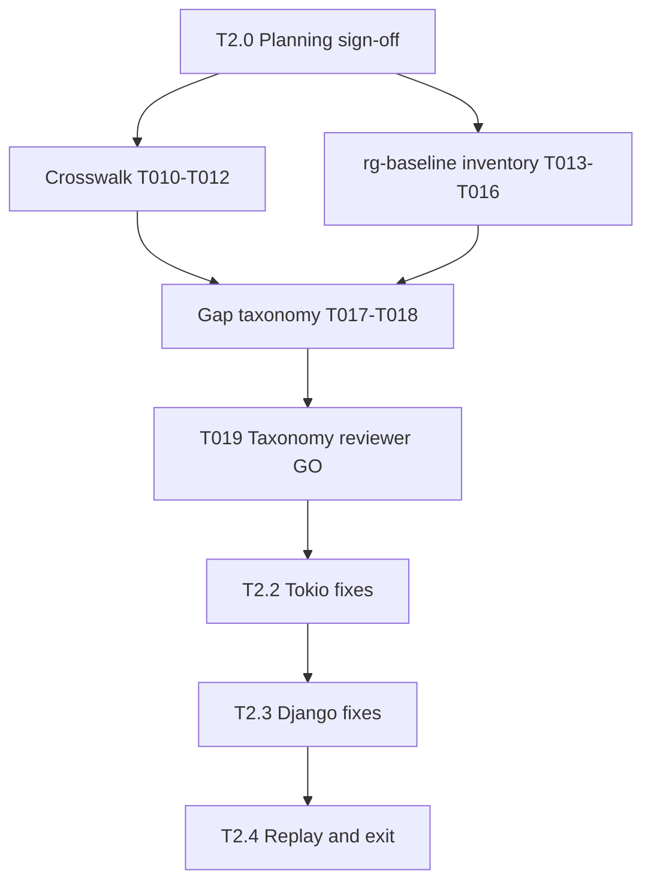

# Tasks: SymForge 8.1 Index-Recall Program (T2)

**Input**: Design documents from `specs/003-81-index-recall/`

**Prerequisites**: [plan.md](./plan.md) (required), [spec.md](./spec.md) (required), [research.md](./research.md), [data-model.md](./data-model.md)

**Baseline**: Phase 2 closed on `main` — A-029 **PIVOT** (0/4 T2 equiv); **P-T2** bypass-only registered; see [`docs/phase2-stel-checkpoint.md`](../../docs/phase2-stel-checkpoint.md) and [`docs/research/A-029-t2-spike.md`](../../docs/research/A-029-t2-spike.md).

**Binding program**: [`docs/v8-gap-closure-plan.md`](../../docs/v8-gap-closure-plan.md) §6.1 Program T2 (find references).

**Scope**: Close the index reference-recall gap hypothesized in §6.1 (markdown paths, benches, cross-file text) so A-029 T2 replay can reach the ≥2/4 PASS threshold **or** retain P-T2 with truthful evidence. **Not in scope:** B-RESULTS / §8.7, persistence / SQLite, EMA→L2, H6–H8 gate closure, new compact MCP tools, T3 outline program (§6.2), deploy/admin (Phase 4).

## Format: `[ID] [P?] [Story] Description`

- **[P]**: Can run in parallel (different files, no dependencies)
- **[Story]**: User story from `spec.md` (US1–US5)
- **GATE**: Hard stop — downstream tasks forbidden until checkpoint passes

---

## Outcome rules (T2.4 replay — binding)

Replay uses the existing A-029 method: 4 T2 tasks in [`tests/fixtures/a029-t2/tasks.jsonl`](../../tests/fixtures/a029-t2/tasks.jsonl), compact surface, rg baseline file recall vs cited paths, PASS threshold **≥2/4** equiv per [`src/stel/a029.rs`](../../src/stel/a029.rs) `A029_T2_PASS_THRESHOLD`.

| Replay equiv count | A-029 status | Golden / policy action |
|--------------------|--------------|-------------------------|
| **0/4** | **PIVOT retained** | All four T2 reference rows remain **bypass** + `eligible_h6=false`; P-T2 unchanged |
| **1/4** | **PARTIAL** | No automatic restoration of any row; document per-row gap; P-T2 retained unless spec-amended |
| **≥2/4** | **VALIDATED** | Per-row restoration **only** for rows that independently meet equiv threshold; each restored row requires **independent reviewer sign-off** before `expected_decision=serve` + `eligible_h6=true` |

**Machine vs program verdict (T2.4):** [`src/stel/a029.rs`](../../src/stel/a029.rs) emits machine verdicts **Pass / Pivot / Kill** only. Program-level outcome rules in the table above add finer labels on replay/exit:

- **0/4** → **PIVOT retained** (machine: `A029Verdict::Pivot`)
- **1/4** → **PARTIAL** — a program-level replay/exit label layered over machine `A029Verdict::Pivot`; document per-row gap in exit artifacts
- **≥2/4** → **VALIDATED** (machine: `A029Verdict::Pass`)

Do **not** require or imply adding `A029Verdict::Partial` unless a later implementation plan explicitly amends machine verdict types.

**Hard rule:** Do **not** record A-029 **PASS** in `docs/stel-assumptions.md` or exit docs unless replay meets ≥2/4 equiv on refreshed [`docs/research/a029-t2-results.json`](../../docs/research/a029-t2-results.json).

---

## T2.0 — Planning & sign-off (first)

**Purpose**: Pin inputs, scope guards, and independent spec approval before any gap audit or code work.

- [ ] T001 Record Spec Kit inputs (spec, plan, contract paths) and Phase 2 handoff links in `docs/research/81-index-recall-evidence-index.md`
- [ ] T002 Copy §6.1 Program T2 rows and G-029 acceptance criteria from [`docs/v8-gap-closure-plan.md`](../../docs/v8-gap-closure-plan.md) into traceability table in `docs/research/81-index-recall-evidence-index.md`
- [ ] T003 Add scope guard to `docs/research/81-index-recall-evidence-index.md`: forbid B-RESULTS, persistence, EMA→L2, H6–H8 closure, new compact MCP tools, and **any `src/**` runtime change before T2.1 taxonomy sign-off (T019)**
- [ ] T004 [P] Link A-029 PIVOT baseline (`docs/research/a029-t2-results.json`, `docs/research/A-029-t2-spike.md`) and P-T2 policy text in evidence index
- [ ] T005 [P] Create independent reviewer sign-off template (GO / NO-GO, evidence producer, reviewer identity, taxonomy gate checklist) in `docs/research/81-index-recall-review-signoff.md`
- [ ] T006 Reviewer sign-off on `specs/003-81-index-recall/spec.md` (independent from implementer) — record GO or NO-GO in `docs/research/81-index-recall-review-signoff.md`
- [ ] T007 Open milestone branch `cursor/81-index-recall-0ef7` from green `main`

**Checkpoint**: Spec approved; scope guards explicit; branch created; **no T2.1 work until T006 GO**.

---

## T2.1 — Gap audit (docs / evidence only)

**Purpose**: Produce auditable gap evidence and an accepted taxonomy **before** any recall implementation. **GATE: no `src/**` edits until T019 taxonomy sign-off GO.**

### T2.1a — Crosswalk (before taxonomy)

- [ ] T010 [US1] Review Phase 2 → 8.1 handoff: A-029 PIVOT, P-T2, deferred recall work — record in `docs/research/81-t2-crosswalk.md`
- [ ] T011 [P] [US1] Crosswalk golden T2 rows (`docs/fixtures/routes.golden.jsonl` `*/t4_refs`) vs A-029 external tasks (`tests/fixtures/a029-t2/tasks.jsonl`); document ID mapping and policy scope in `docs/research/81-t2-crosswalk.md`
- [ ] T012 [P] [US1] Crosswalk index ref pipeline touchpoints (`src/live_index/query.rs`, parsing, discovery) to §6.1 hypothesis classes — link only, no code changes — in `docs/research/81-t2-crosswalk.md`

**Checkpoint**: Crosswalk doc complete; maps program scope to existing artifacts.

### T2.1b — rg-baseline inventory (before taxonomy)

- [ ] T013 [US2] Clone tokio + django corpora per [`tests/fixtures/a029-t2/README.md`](../../tests/fixtures/a029-t2/README.md); record SHAs in `docs/research/81-t2-rg-baseline-inventory.md`
- [ ] T014 [US2] For each of 4 T2 tasks, capture rg baseline file sets (same rules as [`scripts/a029-t2-spike.cjs`](../../scripts/a029-t2-spike.cjs) `baselineReferencePaths`): path counts, extension breakdown, top missing-path prefixes — in `docs/research/81-t2-rg-baseline-inventory.md`
- [ ] T015 [P] [US2] For each task, run compact `find_references` (or document read-only query export) and record cited-path sets vs rg baseline — **measurement only**, no index fixes — in `docs/research/81-t2-rg-baseline-inventory.md`
- [ ] T016 [US2] Compute per-task recall table (baseline_paths, matched_paths, recall %) and diff “rg-only” paths into candidate buckets (markdown, benches, tests, imports, other) in `docs/research/81-t2-rg-baseline-inventory.md`

**Checkpoint**: rg-baseline inventory complete for all 4 tasks; reproducible commands recorded.

### T2.1c — Gap taxonomy & reviewer sign-off (before implementation)

- [ ] T017 [US3] Draft gap taxonomy doc: root-cause class → evidence row → proposed fix surface (parser / indexer / query) → acceptance test — in `docs/research/81-t2-gap-taxonomy.md`
- [ ] T018 [P] [US3] Map each taxonomy row to §6.1 hypothesis (markdown, benches, cross-file text) with estimated recall lift; flag out-of-scope or P-T2-only rows explicitly
- [ ] T019 [US3] **GATE** Independent taxonomy reviewer sign-off (GO / NO-GO) in `docs/research/81-t2-taxonomy-review-signoff.md` — must cite T010–T018 artifacts; **NO-GO blocks all T2.2/T2.3 implementation**

**Checkpoint**: Taxonomy accepted by independent reviewer. **Stop rule:** Any T2.2/T2.3 task touching `src/**` before T019 GO is out of scope.

---

## T2.2 — Tokio recall fixes (implementation)

**Purpose**: Implement taxonomy-approved missing source classes for tokio T2 tasks. **Requires T019 GO.**

- [ ] T030 [US4] Implement taxonomy rows assigned to tokio / Rust ref capture (e.g. markdown paths, bench imports, cross-module text) in approved modules — primary: `src/live_index/query.rs`, `src/parsing/**` as taxonomy directs
- [ ] T031 [US4] Add or extend unit / integration tests proving new ref sources for tokio symbols (`spawn`, `block_on`) without regressing in-repo golden `t4_refs` rows
- [ ] T032 [US4] Re-index tokio corpus; re-run recall measurement for `tokio/t2_spawn` and `tokio/t2_block_on`; record before/after in `docs/research/81-t2-tokio-recall-evidence.md`
- [ ] T033 [P] [US4] `cargo fmt --check`, `cargo clippy --all-targets -- -D warnings`, `cargo test --all-targets -- --test-threads=1` green on branch

**Checkpoint**: Tokio tasks show measurable recall lift vs T2.1 inventory; no claim of full A-029 PASS until T2.4 replay.

---

## T2.3 — Django recall fixes (implementation)

**Purpose**: Repeat taxonomy-approved fixes for django T2 tasks. **Requires T019 GO and T2.2 learnings stable.**

- [ ] T040 [US4] Implement taxonomy rows assigned to django / Python ref capture in approved modules (same gate: no rows marked P-T2-only or out-of-scope)
- [ ] T041 [US4] Add or extend tests for django symbols (`QuerySet`, `Model`) ref capture
- [ ] T042 [US4] Re-index django corpus; re-run recall for `django/t2_queryset` and `django/t2_model`; record before/after in `docs/research/81-t2-django-recall-evidence.md`
- [ ] T043 [P] [US4] CI-equivalent Rust checks green after django slice

**Checkpoint**: Django tasks measured; ready for full A-029 replay battery.

---

## T2.4 — Replay, policy reconsideration, A-029 update, exit (last)

**Purpose**: Authoritative replay, outcome-rule enforcement, assumption register update, program exit record.

- [ ] T050 [US5] Run full A-029 replay: `node scripts/a029-t2-spike.cjs` → refresh `docs/research/a029-t2-results.json`; archive prior PIVOT artifact path in evidence index
- [ ] T051 [US5] Apply outcome rules table (0/4 → PIVOT retained; 1/4 → PARTIAL; ≥2/4 → VALIDATED); record machine verdict via `evaluate_a029_verdict` in `src/stel/a029.rs` and program-level label (see outcome table — PARTIAL at 1/4 is not a new enum variant) in `docs/research/81-index-recall-replay-summary.md`
- [ ] T052 [US5] **P-T2 reconsideration**: if 0/4 or 1/4, confirm P-T2 retained and all four T2 reference rows stay bypass + `eligible_h6=false`; if ≥2/4, list **only** equiv rows eligible for restoration — in replay summary
- [ ] T053 [US5] If ≥2/4: per-row golden restoration proposal for equiv rows only; **independent reviewer sign-off required** before editing `docs/fixtures/routes.golden.jsonl` or sf-bench golden — document in `docs/research/81-t2-golden-restoration-signoff.md`
- [ ] T054 [P] [US5] Update `docs/research/A-029-t2-spike.md` with replay date, commit, equiv count, machine verdict (Pass/Pivot/Kill), and program-level outcome (PIVOT retained / PARTIAL / VALIDATED — PARTIAL at 1/4 overlays Pivot; do not add `A029Verdict::Partial` unless spec-amended)
- [ ] T055 [US5] Update A-029 verdict row in `docs/stel-assumptions.md` — **PASS forbidden unless T051 shows ≥2/4 equiv**
- [ ] T056 [P] [US5] Update `docs/research/81-index-recall-evidence-index.md` with final artifact links
- [ ] T057 [US5] Write program exit summary `docs/research/81-index-recall-exit.md`: scope audit (no B-RESULTS / persistence / EMA→L2 / H6–H8 / new MCP tools), replay outcome, P-T2 status, next program pointer (§6.2 T3 if still open)
- [ ] T058 [US5] Milestone reviewer sign-off on exit summary in `docs/research/81-index-recall-review-signoff.md`
- [ ] T059 [US5] Merge milestone branch to `main` after T058 GO

**Checkpoint**: Truthful A-029 status recorded; P-T2 policy matches outcome rules; exit doc complete.

---

## Explicitly excluded tasks (do not add without spec amendment)

- B-RESULTS / RESULTS.md §8.7 closure (A-024)
- SQLite / durable STEL ledger (Phase 3)
- Calibration EMA → L2 auto-tuning (Phase 3, A-016)
- H6 / H7 / H8 gate closure or eligible-set denominator finalization (Phase 4 / §6.4)
- New compact MCP tools or compact-3 surface expansion
- T3 outline program (§6.2): formatter fixes, T3-small bypass policy, T3 battery
- `symforge serve` / HTTP transport (Phase 4)
- Runtime STEL planner/controller changes unrelated to index ref capture
- Claiming A-029 PASS without T2.4 replay ≥2/4 equiv

---

## Dependencies & execution order

```text
T001–T007 (T2.0 planning/sign-off)
  → T010–T012 (crosswalk) — before taxonomy
  → T013–T016 (rg-baseline inventory) — before taxonomy; may overlap T010–T012 after T013 corpora ready
  → T017–T019 (gap taxonomy + reviewer GO) — GATE for all src/ work
  → T030–T033 (T2.2 tokio) — blocked until T019 GO
  → T040–T043 (T2.3 django) — blocked until T019 GO; after T2.2 stable
  → T050–T059 (T2.4 replay + exit) — last; T053–T055 depend on T051 outcome
```



---

## Parallel opportunities

- T004 baseline links ∥ T005 sign-off template (after T001)
- T011 golden crosswalk ∥ T012 pipeline crosswalk (after T010)
- T015 cited-path capture ∥ T014 extension breakdown per repo (after T013)
- T018 taxonomy mapping ∥ T017 draft (same doc, sequential merge)
- T033 tokio CI ∥ T032 evidence write-up (after T030–T031)
- T054 A-029 spike doc ∥ T056 evidence index (after T051 verdict known)

---

## Implementation strategy

1. **Planning slice (T2.0 only)**: T001–T007 — spec + scope guards; no audit yet.
2. **Evidence slice (T2.1)**: T010–T019 — crosswalk → rg inventory → taxonomy → **sign-off GATE**; zero `src/**` changes.
3. **Tokio slice (T2.2)**: T030–T033 — first implementation tranche per accepted taxonomy.
4. **Django slice (T2.3)**: T040–T043 — second tranche; same taxonomy discipline.
5. **Exit slice (T2.4)**: T050–T059 — replay drives verdict; golden restoration only with ≥2/4 + per-row reviewer GO.

**Stop rules**

- T019 NO-GO → halt implementation; amend taxonomy or spec before T2.2.
- Replay 0/4 → retain PIVOT; do not restore golden T2 rows.
- Replay 1/4 → PARTIAL only; no automatic golden restoration.
- Replay ≥2/4 → restore **equiv rows only** after independent sign-off (T053).
