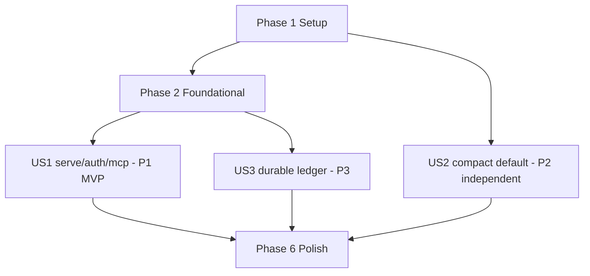

# Tasks: SymForge Operator Server Spine (v8 8.1)

**Feature dir**: `specs/004-v8-operator-serve/`
**Inputs**: [plan.md](./plan.md), [spec.md](./spec.md), [research.md](./research.md), [data-model.md](./data-model.md), [contracts/](./contracts/), [quickstart.md](./quickstart.md)
**Baseline**: `main` @ `e38afe0` (7.27.0). Work on `main`, uncommitted, under autonomous goal.

**Verification gates (every implementation phase ends green)**: `cargo fmt --check`, `cargo check`, `cargo clippy --all-targets -- -D warnings`, `cargo test --all-targets -- --test-threads=1`, `cargo build --release`. 8.x-only runtime behavior is verified via `cargo run -- serve` + HTTP client + cargo tests — NOT via the npm-pinned MCP daemon.

## Format: `[ID] [P?] [Story?] Description with file path`
- **[P]**: parallelizable (different files, no incomplete-task dependency)
- **[USn]**: user story from spec.md (US1 serve+auth, US2 compact-default, US3 durable ledger)
- **GATE**: hard stop until the checkpoint passes

---

## Phase 1: Setup

- [x] T001 [P] Confirmed (2026-06-16): rmcp 1.1.0 **has** a server-side streamable-http transport. Feature flag `transport-streamable-http-server`; API `rmcp::transport::streamable_http_server::{StreamableHttpService, StreamableHttpServerConfig}` + `session::local::LocalSessionManager`; constructor `StreamableHttpService::new(service_factory, session_manager, config)` (implements `tower::Service`, mounts as axum route). Identical in lockfile-resolved 1.7.0. No hand-rolled fallback needed. Recorded in `research.md` §R1.
- [x] T002 Enabled `transport-streamable-http-server` on the `rmcp` dep (alongside `transport-io`) under the `server` feature in `Cargo.toml`; `cargo check` resolves clean (rmcp 1.7.0, +sse-stream/tokio-stream/uuid transitive deps).
- [x] T003 [P] Added `#[cfg(feature = "server")] pub mod server;` to `src/lib.rs`; created `src/server/{mod.rs,serve.rs,auth.rs,mcp_http.rs}` (`mcp_http.rs` is a documented scaffold recording the verified rmcp API for US1/T013).
- [x] T004 [P] Created `src/cli/serve.rs` (`ServeCliArgs` → `server::serve::ServeArgs`); registered `Serve(serve::ServeCliArgs)` in the clap `Commands` enum in `src/cli/mod.rs` (flags `--listen` default `127.0.0.1:8787`, `--api-key`, `--api-key-env`) + 2 parse tests.
- [x] T005 Routed `serve` in `src/main.rs` via new `run_serve` (multi-thread tokio runtime, `init_tracing`, calls `server::serve::run`). `run` resolves the key, computes loopback, and enforces refuse-to-start before any bind; prints a "not yet fully implemented" notice and returns `Ok(())` (the `/mcp` mount is US1).

**Checkpoint**: `cargo check` + `cargo fmt --check` green with scaffolds in place.

---

## Phase 2: Foundational (blocks US1; hosts US3 store) — NO story label

- [x] T006 Implemented `AuthConfig` in `src/server/auth.rs`: `api_key: Option<String>`, `requires_auth(is_loopback)`, `verify(presented)` (constant-time), `refuse_to_start(is_loopback)`. `subtle` is only a transitive dep (not declared); used a small self-contained constant-time byte compare (`constant_time_eq`) — no new dep, unit-tested against equal/differing/length-mismatch vectors. Added `AuthStartupError` (thiserror).
- [x] T007 [P] Unit tests in `src/server/auth.rs` `#[cfg(test)]`: key-set wrong/empty fail + correct passes; no-key+loopback no auth required; no-key+non-loopback requires_auth true AND refuse_to_start errors; plus constant-time-compare vectors.
- [x] T008 `cargo test --lib server::auth` → 8 auth tests pass (run as part of `cargo test --lib server::` → 19 pass, 0 fail).
- [x] T009 Implemented `ServerRuntime` in `src/server/mod.rs`: owns `SharedIndex`, `Arc<protocol::SymForgeServer>` (the existing in-process dispatcher — the real type behind the plan's `McpServer` name), `Arc<sidecar::governor::RequestGovernor>`, `AuthConfig`, `Option<crate::stel::ledger_store::StelLedgerStore>` (real type, already landed). Constructor `build_runtime(index, protocol, governor, auth, ledger_store)`.
- [x] T010 Added `ServerRuntime::dispatch_tool_call(tool_name, params) -> Result<rmcp::model::CallToolResult, rmcp::ErrorData>` delegating to `SymForgeServer::dispatch_tool_result_for_tests` — the statused dispatch entry that routes to the **same handler methods** the live `tool_router` invokes (no logic fork), returning the identical `CallToolResult` shape stdio produces. Tests assert Ok + non-empty content for `status` and a structured InvalidRequest for an unknown tool on an in-memory index. Full live-`tool_router` parity battery is completed in US1/T018.
- [x] T011 [P] Added `bind_listener(addr) -> io::Result<TcpListener>` in `src/server/serve.rs` mirroring the socket2 + `SO_REUSEADDR` pattern from `sidecar::server::spawn_sidecar` (honors the operator-chosen port; `:0` for tests). Test binds an ephemeral loopback port and asserts a concrete OS-assigned port.
- [x] T012 **GATE** Embed isolation verified: `cargo check --no-default-features --features embed` compiles; `cargo tree --no-default-features --features embed | grep -Ei "axum|rmcp"` → no matches (grep exit 1). Recorded in `quickstart.md` Scenario 6. No leak — all server code behind `#[cfg(feature = "server")]`.

**Checkpoint**: runtime + auth foundation compiles; embed build clean; dispatch parity helper in place.

---

## Phase 3: US1 — Serve over IP with Bearer auth (Priority P1) 🎯 MVP

**Goal**: `symforge serve` exposes `/mcp` over Streamable HTTP, secure-by-default, results equivalent to stdio.
**Independent test**: attach to `http://HOST:PORT/mcp` with a Bearer key from a second client; `tools/list` + a `tools/call` match stdio for the same repo; non-loopback no-key refuses; bad key → 401.

- [x] T013 [US1] Done. `src/server/mcp_http.rs` mounts rmcp's `StreamableHttpService` (stateless + `json_response`, documented) as axum route `POST /mcp` via `build_mcp_router`; the `service_factory` clones the shared `SymForgeServer` (derives `Clone`, shares all `Arc` state) → one dispatch path, no fork. `allowed_hosts` extends rmcp's loopback DNS-rebinding defaults with the operator bind host. 2 unit tests.
- [x] T014 [US1] Done. `src/server/auth.rs::require_bearer` (axum `from_fn_with_state` middleware) extracts `Authorization: Bearer` (case-insensitive scheme, `parse_bearer`), enforces `AuthConfig` constant-time `verify`, returns `401` on missing/invalid when auth is required, passes through on no-key+loopback. `apply_bearer_auth(router, state)` layers it. 2 parse-unit tests.
- [x] T015 [US1] Done. `serve::run` resolves key, computes loopback, refuse-to-start before bind, loads the index (`load_serve_index`), builds `ServerRuntime` (`build_serve_runtime`, opens `StelLedgerStore` under the data dir — degrades to Disabled on failure), mounts `/mcp` + auth layer, prints `http://HOST:PORT/mcp` to stdout, runs `axum::serve` with Ctrl+C graceful shutdown.
- [x] T016 [US1] Done. `cli/serve.rs` flags flow through `into_serve_args()` → `serve::run`; `main.rs::run_serve` maps `ServeError::Startup` (refuse-to-start) to `std::process::exit(2)`, other errors to anyhow (exit 1).
- [x] T017 [P] [US1] Done. `tests/serve_auth.rs` (5 tests, reqwest on `127.0.0.1:0`): (a) non-loopback+no-key → `ServeError::Startup`; (b) missing Bearer → 401; (c) wrong Bearer → 401; (d) correct Bearer → success (not 401); plus no-key+loopback skips auth. All pass.
- [x] T018 [P] [US1] Done. `tests/serve_http_attach.rs`: `tools/list` over `/mcp` equals the in-process `list_tools` surface; `status` `tools/call` over `/mcp` byte-equals `ServerRuntime::dispatch_tool_call("status",…)` for the same index (parity, FR-005/SC-006). Full multi-message `initialize` handshake not scripted — stateless transport mode serves each call directly (documented honestly in the test header).
- [x] T019 [US1] Done. A P-FF whole-file query through the `symforge` facade returns the machine-readable bypass envelope (`--- bypass payload ---` + serialized `StelBypassBody` JSON: `action=host_read`/`path`/`reason=policy=P-FF`), asserted over `/mcp` AND at dispatch (corpus-free, deterministic). Reuses the existing `src/stel` bypass envelope — no new signal invented.
- [x] T020 [US1] **GATE** Done. `cargo fmt --check` clean; `cargo check` clean; `cargo clippy --all-targets -- -D warnings` clean; `cargo test --all-targets -- --test-threads=1` → 2803 passed, 0 failed, 5 ignored; `cargo build --release` ok. Embed isolation: `cargo check --no-default-features --features embed` clean (all server code behind `#[cfg(feature="server")]`).

**Checkpoint**: US1 independently shippable — a remote harness attaches authenticated and gets stdio-parity results.

---

## Phase 4: US2 — Compact-3 default surface (Priority P2) — independent

**Goal**: default `tools/list` = compact-3; `SYMFORGE_SURFACE=full` restores legacy.
**Independent test**: no env → 3 tools; `=full` → legacy surface.

- [ ] T021 [P] [US2] Write failing conformance test `tests/surface_default_compact.rs`: with `SYMFORGE_SURFACE` unset, the resolved profile is `Compact` and the advertised tool list has exactly 3 tools; with `=full`, the legacy surface returns. (Drive `surface_profile_from_env` / the tools/list builder directly to avoid env races — set/clear within the test, single-threaded.)
- [ ] T022 [US2] Change the default arm of `surface_profile_from_env` in `src/protocol/surface_probe.rs` from `SurfaceProfile::Full` to `SurfaceProfile::Compact`; keep `full`/`meta`/`compact` explicit values.
- [x] T023 [US2] Done. No test re-pointing needed: conformance (`tests/conformance.rs`) asserts the **registered** router via `tool_definitions()` (not the env-driven advertised surface), STEL integration tests already set their surface explicitly, and `serve_http_attach` compares advertised names against the active profile dynamically. Full suite confirmed green at 2805/2805 immediately after the flip — zero failures to repair. `SYMFORGE_TOOL_NAMES` is the init allowlist (surface-agnostic) — unaffected.
- [x] T024 [US2] **GATE** Done. `cargo test --all-targets -- --test-threads=1` green (2809 passed, 0 failed, 5 ignored perf/AAP smokes). Release note added at `docs/v8-release-notes.md` documenting the compact-3 default flip + `SYMFORGE_SURFACE=full` opt-out (release-please-managed `CHANGELOG.md` left unedited per its embed-only preamble convention).

**Checkpoint**: US2 independently shippable on stdio AND `/mcp`.

---

## Phase 5: US3 — Durable economics ledger (Priority P3) — independent store

**Goal**: STEL ledger persists to SQLite; survives restart; degrades honestly.
**Independent test**: record N events, reopen store → N rows, totals equal; unopenable store → serving continues.

- [x] T025 [US3] Confirmed `StelLedgerEvent` real fields (`ts_ms`, `plan_id`, `surface`, `intent`, `decision`, `tools_called: Vec<String>`, `predicted_response_tokens`, `actual_response_tokens`, `manual_baseline_tokens`, `net_vs_manual`, `route_confidence`, `pff_bypass`, `cache_hit`, `degrade_flags`). Real column set diverges from the data-model draft: `tool` → `tools_called_json` (struct has a Vec, not a singular tool); `accepted`/`eligible_h6` kept as reserved NULL columns (not yet on the event — computed in T028/T029); extra real fields (`surface`, `predicted_response_tokens`, `route_confidence`, `pff_bypass`, `cache_hit`, `degrade_flags_json`) included. **T025-residual DONE: `data-model.md` `stel_ledger_events` table replaced with the real implemented columns (incl. the `stel_ledger_meta` schema-version table note); docs now match `src/stel/ledger_store.rs`.**
- [x] T026 [P] [US3] Tests written in `#[cfg(test)]` of `ledger_store.rs` (11 tests): open_in_memory schema-at-version, migrate idempotent, record+recent rows, summary net total, multi-session counts, file persist+reopen preserves rows, recent limit caps, bypass/degrade flag storage, Disabled record no-op + summary unavailable. **All 11 pass.**
- [x] T027 [US3] Implemented `src/stel/ledger_store.rs` (469 lines): `enum StelLedgerStore { Sqlite(SqliteStelLedgerStore), Disabled }` mirroring `src/analytics/store.rs` (open / open_in_memory / migrate / schema_version / record / recent / summary); table `stel_ledger_events` (WAL + busy timeout; dedicated `stel-ledger.db` in SymForge data dir; indices on session_id, ts_ms). Registered `#[cfg(feature="server")] pub mod ledger_store;` in `src/stel/mod.rs`. Gates: fmt clean, check ok, clippy `-D warnings` clean.
- [x] T028 [US3] Done. Write-through threaded via an optional `Arc<StelLedgerStore>` on `SymForgeServer` (`#[cfg(feature="server")]` field + `with_stel_ledger_store` builder). `finalize_symforge_with_ledger` (the sole call site that appends to the in-memory `SessionLedger`) calls `persist_ledger_event_durably(&event)` AFTER the in-memory push; that helper no-ops on `None`/`Disabled` and `StelLedgerStore::record` logs-and-continues on error (never fails the request, FR-011). Compile-time no-op on stdio/embed (`not(feature="server")` variant). New integration test `serve_invocation_writes_through_to_durable_store` proves exactly one durable row per serve invocation (no double-count). `capture_ledger` stays pure (event builder); the durable write lives at the single existing in-memory write site — one ledger path.
- [x] T029 [US3] Done. `ServerRuntime` already held the store (T009); `build_serve_runtime` now opens the store FIRST and shares the SAME handle into both the dispatcher (write-through) and the runtime. `status` surfaces a `durable_ledger: events=N net_vs_manual=M sessions=K` line via a new `DurableLedgerSummary` POD on `StelStatusContext` + `with_durable_ledger`, populated from `StelLedgerStore::summary()` (no-op `None`/"unavailable" on stdio/embed). Restart-survival observable: write-through + `summary()` read verified together by the new integration test.
- [ ] T030 [US3] **GATE** repo gates green; validate quickstart Scenario 5 (restart preserves ledger rows).

**Checkpoint**: US3 independently shippable; economics durable.

---

## Phase 6: Polish & cross-cutting

- [ ] T031 [P] Run `/speckit-analyze` (or manual cross-artifact check) to confirm spec ↔ plan ↔ tasks consistency for 004.
- [ ] T032 [P] Update `docs/v8-gap-closure-plan.md` status for G-020/G-022/G-033/G-034/G-035/G-038: link this feature + evidence; mark the closed gaps.
- [ ] T033 [P] Add `docs/stel-server.md` (serve flags, security notes — loopback vs IP + key, WSL networking) per the ideation "Next elaboration" checklist.
- [ ] T034 Full quickstart validation pass (Scenarios 1-6) on a release build; record evidence (commands + observed output) in a short `specs/004-v8-operator-serve/validation.md`.
- [ ] T035 **GATE** Final: all repo gates green on a clean `cargo build --release`; embed build clean; no economics double-count across transports (parity test green). Do NOT push/PR-merge without explicit human approval (commit to a review branch, then stop).

---

## Dependencies & order

```text
Phase 1 Setup (T001-T005)
  → Phase 2 Foundational (T006-T012)  [GATE T012 embed-clean]
      → Phase 3 US1 serve+auth+/mcp (T013-T020)  [P1, MVP]
US2 (T021-T024) is independent of US1/US2 foundational — can run any time after Phase 1 (only touches surface_probe + tests).
US3 (T025-T030) needs the store type (T027) before ServerRuntime finalizes (T009/T029); store itself is standalone.
  → Phase 6 Polish (T031-T035)  [GATE T035 final]
```



## Parallel opportunities
- T001 ∥ T003 ∥ T004 (different files) after deciding the feature flag.
- US2 (T021-T024) can proceed fully in parallel with US1 — different files (`surface_probe.rs` vs `server/**`), only a shared final test-gate.
- T017 ∥ T018 (separate test files) within US1.
- Polish T031/T032/T033 are mutually parallel.

## Implementation strategy
1. **MVP = Phase 1 + Phase 2 + US1**: a secure, IP-attachable `/mcp` with stdio parity. Shippable alone.
2. **US2** (compact default) is the smallest, lowest-risk slice — can land first to de-risk the test-fixture blast radius early.
3. **US3** (durable ledger) lands the data backbone the future admin GUI (feature 006) reads.
4. Resource note: serialize heavy `cargo build`/`clippy` runs; do not fan out compile-heavy work concurrently.

## Out of scope (later features — see spec.md)
Operator GUI (005/006: G-037/039/042), onboarding hub (G-040/041), AAP panel (G-043/044). This feature only upholds the embed-isolation invariant (G-045); its dedicated audit is later.
