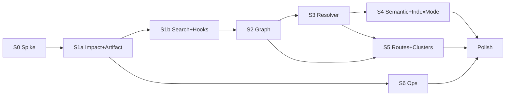

# Parallelism & Dependencies — Program 015

**Use with**: [agent-workload.md](./agent-workload.md) (wave caps) · [tasks.md](../tasks.md) (work units)

**Legend**

| Symbol | Meaning |
|--------|---------|
| **→** | Must finish before start |
| **⇢** | Can overlap (different files/agents; coordinate at STOP) |
| **∥** | Safe parallel (no shared mutable design lock) |

---

## Program-level gates (hard sequential)

```text
PROG ─→ S0 [P] ─→ S0 [C][V] ──GO──→ S1a ─→ S1b ─→ S2 ─→ S3 ─→ S4
                                              ↘ S5 (after S2 + S3 rec)
                                              ↘ S6 (after S1a min)
```

| Gate | Blocks |
|------|--------|
| **S0 GO** (research.md) | All S1a+ `[C]` |
| **S1a ship** (8.10.0) | S1b `[C]` (rank uses live graph from impact path) |
| **S1b ship** (8.10.1) | S2 `[C]` recommended (dogfood quick wins first) |
| **S2 graph stable** | S3 `[C]` feed resolved → graph; S5 clusters |
| **S3 Rust benchmark ≥60%** | S3 TS wave; S5 route+handler linking |
| **S4 Deep/IndexMode** | Full semantic index runs |

---

## Sprint 0 — internal

| Track | Tasks | Parallel? |
|-------|-------|-----------|
| A Graph | C-S0-001 → C-S0-002 | Sequential |
| B Artifact | C-S0-003 | **∥** Track A after C-S0-001 (different files) |
| C Resolver | C-S0-004 → C-S0-005 | **∥** Track A/B |
| V | V-S0-* | After all [C] |

```text
C-S0-001 ─→ C-S0-002 ─┐
                      ├──→ V-S0-*
C-S0-003 ─────────────┤
C-S0-004 ─→ C-S0-005 ─┘
```

---

## Sprint 1a — internal

| Track | Tasks | Notes |
|-------|-------|-------|
| Impact | C-S1A-001 → 002 → 003 → 004 | **Strict chain** |
| Artifact | C-S1A-005 → 006 | **∥** Impact after C-S1A-001 (git.rs done); best after C-S1A-002 if same agent |
| Register | C-S1A-007 | After 003 (tool exists) |

**Parallel opportunity (2 agents)**:

- **Agent 1**: C-S1A-001 → 002 → 003 → 004  
- **Agent 2**: wait C-S1A-001 → then C-S1A-005 → 006 (persist path)

**Planning [P]**: P-S1A-001..008 **∥** P-S1A-009..012 only if contracts (003–005) frozen first.

---

## Sprint 1b — internal

| Track | Tasks | Parallel? |
|-------|-------|-----------|
| Rank | C-S1B-001 → 002 | Sequential |
| Pagination | C-S1B-003 | **∥** Rank (format.rs vs search.rs) |
| Hooks | C-S1B-004 | **∥** Pagination; touches sidecar — isolate agent |

**Wait**: S1a Wave 3 complete (graph + `detect_impact` live).

---

## Sprint 2 — internal

| Track | Tasks | Parallel? |
|-------|-------|-----------|
| Graph engine | C-S2-001 → 002 | Sequential |
| Trace | C-S2-003 → 004 | After 001 |
| Cypher | C-S2-005a → 005b → 006 | After 001; **005a ∥** trace if 2 agents |

**Parallel (2 agents) after C-S2-001**:

- **Agent 1**: C-S2-002 → 003 → 004  
- **Agent 2**: C-S2-005a → 005b → 006  

---

## Sprint 3 — internal

| Track | Tasks | Parallel? |
|-------|-------|-----------|
| Rust | C-S3-001 → 002 | **Sequential**; gate TS on Rust ≥60% |
| TS | C-S3-003 | After Rust 001 |
| Wire | C-S3-004 → 005 → 006 | Sequential; 005 optional branch on PD-01 |

**No parallel Rust + TS** in same wave (shared `parsing/resolver/`).

**Planning**: P-S3-001..009 (Rust) **∥** P-S3-003..004 (TS read) only — no `[C]` until P-S3-011 gate.

---

## Sprint 4 / 5 / 6 — cross-track

| Sprint | Parallel tracks | Wait for |
|--------|-----------------|----------|
| **S4** | C-S4-001 semantic **∥** P-S4-007 IndexMode design | S2 graph; S3 for best edges |
| **S5** | C-S5-001 routes **⇢** C-S5-002 clusters (clusters need graph) | S2 + S3 rec |
| **S6** | Wave 3 ADR **∥** Wave 4 CLI (separate agents) | S1a tools registered |

**S5 ⇢ S4**: Can **plan** in parallel; **ship** S5 after S2 graph (+ S3 for handler resolution).

---

## Cross-sprint parallel (multi-agent program)

Safe overlaps when staffing allows:

| Lane A | Lane B | Condition |
|--------|--------|-----------|
| S1b `[P]` | S2 `[P]` | Different specs; **do not** start S2 `[C]` until S1a graph shipped |
| S4 `[P]` | S5 `[P]` | OK |
| S6 `[P]` ADR/diag | S5 `[C]` routes | OK if different owners |
| 012 Phase 3 | S2+ `[C]` | Coordinate `project` param — 012 owns daemon |
| PB parity backlog research | S6 `[V]` | OK (read-only) |

**Never parallel**:

- Two agents on same **Wave** `[C]` touching `protocol/tools.rs`  
- S3 TS `[C]` before Rust gate  
- `[C]` before sprint **Planning Gate**  
- Snapshot v5 (C-S3-005) while PD-01 open  

---

## Agent dispatch cheat sheet

```text
1. Read gate row for sprint — blocked?
2. Pick ONE wave from tasks.md
3. Check this file — any ∥ track free for a second agent?
4. STOP at wave boundary; update code-evidence if touch points changed
```

---

## Mermaid (sprint sequence)



## Review

Update this file when a sprint adds `[C]` tasks or file-touch overlap — re-check **Never parallel** list.
